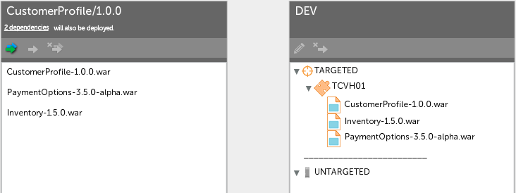

XL Deploy allows you to define dependencies among different versions of different applications. When you set up the deployment of an application, XL Deploy automatically includes the correct versions of other applications that it depends on. You define dependencies at the *deployment package* level.

This is an example of an advanced scenario with multiple applications that depend on one another.

## Sample applications and versions

Assume that you have three applications called CustomerProfile, Inventory, and PaymentOptions. Their versions and dependencies are as follows:

{:.table .table-striped}
| Application name | Version | Depends on... |
| ---------------| ------| ------------|
| CustomerProfile  | 1.0.0 | Inventory [1.0.0,2.0.0) |
| Inventory        | 1.5.0 | ShoppingCart [3.0.0,3.5.0] |
|                  | 2.0.0 | ShoppingCart [3.0.0,3.5.0] |
| PaymentOptions   | 3.0.0 | No dependencies |
|                  | 3.5.0-alpha | No dependencies |

When using the application dependency feature, XL Deploy requires you to use the Semantic Versioning (SemVer) scheme for your deployment packages. For information about this scheme, refer to:

* [Application dependencies in XL Deploy](/xl-deploy/concept/application-dependencies-in-xl-deploy.html#versioning-requirements)
* [SemVer 2.0.0 documentation](http://semver.org/)

## Set up the deployment

### Using the default GUI

To set up a deployment of the latest version of CustomerProfile, hover over the deployment package, click , and then select **Deploy**.  XL Deploy automatically adds the deployables from the dependent deployment packages.

### Using the legacy GUI

You can set up a deployment of the latest version of CustomerProfile by dragging it to the Deployment Workspace. XL Deploy automatically adds the deployables from the dependent deployment packages.

**Tip:** Hover the mouse pointer over a deployable to see the deployment package it belongs to.

### How dependent application versions are selected

This is how XL Deploy selected the right application versions:

1. **CustomerProfile 1.0.0**: This is the latest version of CustomerProfile, so XL Deploy selected it when you clicked  and selected **Deploy**.

2. **Inventory 1.5.0**: CustomerProfile 1.0.0 depends on Inventory [1.0.0,2.0.0), so XL Deploy selects the highest version between 1.0.0 and 2.0.0, *excluding* 2.0.0.

3. **PaymentOptions 3.5.0-alpha**: Inventory 1.5.0 depends on PaymentOptions [3.0.0,3.5.0], so XL Deploy selects the highest version between 3.0.0 and 3.5.0.

    In SemVer, a hyphenated version number such as 3.5.0-alpha indicates a pre-release version, which has a [lower precedence](http://semver.org/#spec-item-11) than a normal version. This is why the range [3.0.0,3.5.0] *includes* 3.5.0-alpha, while [3.0.0,3.5.0) would *exclude* it.

For detailed information about version selection, refer to [How XL Deploy checks application dependencies](/xl-deploy/concept/how-xl-deploy-checks-application-dependencies.html).

## Updating a deployed application

### Using the default GUI

This applies to XL Deploy version 6.2.0 and higher.

You can easily update a deployed application to a new version. For example, to update the Inventory application to version 1.9.0, you would:

1. Under **Environments** in the Explorer, click  next to Inventory 1.5.0 and select **Update**.
2. In the list of deployment packages, locate Inventory 1.9.0 and then click **Continue**.
3. Click **Deploy** to start executing the plan.

This deployment is possible because Inventory 1.9.0 satisfies the CustomerProfile dependency on Inventory [1.0.0,2.0.0). Updating Inventory to a version such as 2.1.0 is not possible, because 2.1.0 does not satisfy the dependency.

### Using the legacy GUI

You can easily update a deployed application to a new version. For example, to update the Inventory application to version 1.9.0, you would:

1. Under **Environments** in the Deployment Workspace, right-click Inventory 1.5.0 and select **Update**.
2. Under **Packages**, locate Inventory 1.9.0 and drag it to the left side of the deployment workspace.
3. Click **Execute** to execute the deployment.

This deployment is possible because Inventory 1.9.0 satisfies the CustomerProfile dependency on Inventory [1.0.0,2.0.0). Updating Inventory to a version such as 2.1.0 is not possible, because 2.1.0 does not satisfy the dependency.
