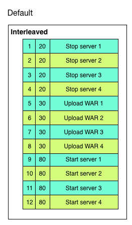
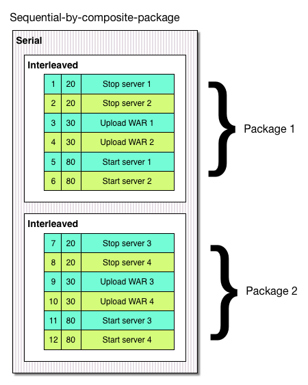

You can specify multiple [orchestrators](/xl-deploy/concept/types-of-orchestrators-in-xl-deploy.html) per deployment to achieve complex use cases. When using multiple orchestrators:

* **Order matters.** The order in which multiple orchestrators are specified will affect final execution plan. The first orchestrator in the list will be applied first.

* **Recursion.** In general, orchestrators create execution plans represented as trees. For example, the `parallel-by-composite-package` orchestrator creates a parallel block with interleaved blocks per each member of the composite package as its leaves. The subsequent orchestrator uses the execution plan of the preceding orchestrator and scans it for interleaved blocks. As soon as it finds one, it will apply its rules independently of each interleaved block. As a consequence, the execution tree becomes deeper.

* **Two are enough.** Specifying just two orchestrators should cover almost all use cases.

## Example with multiple orchestrators

In this example, a composite package must be deployed to an environment that consists of many multiple containers. Also, each member of the package must only be deployed when the previous member has been deployed. To decrease the deployment time, each member has to be deployed in parallel to the containers.

The solution is to use two orchestrators: `sequential-by-composite-package` and `parallel-by-container`.

Let's show step by step how the orchestrators are being applied and how the execution plan changes on the way.

Deploying a composite package to an environment with multiple containers will require steps that might look like this:

As soon as the `sequential-by-composite-package` orchestrator is applied to that list the execution plan will look like this:

As a final stage of orchestration, the `parallel-by-container` orchestrator is applied to all interleaved blocks separately and the final result will be like this:

