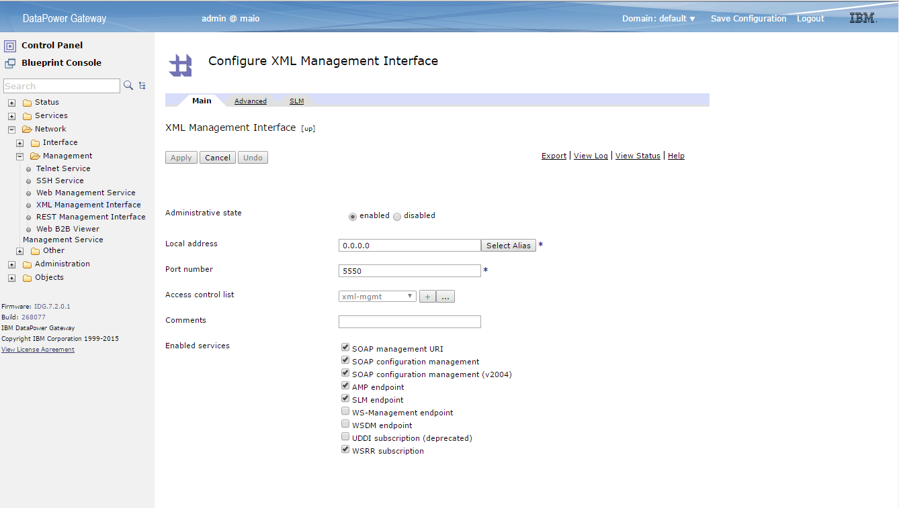
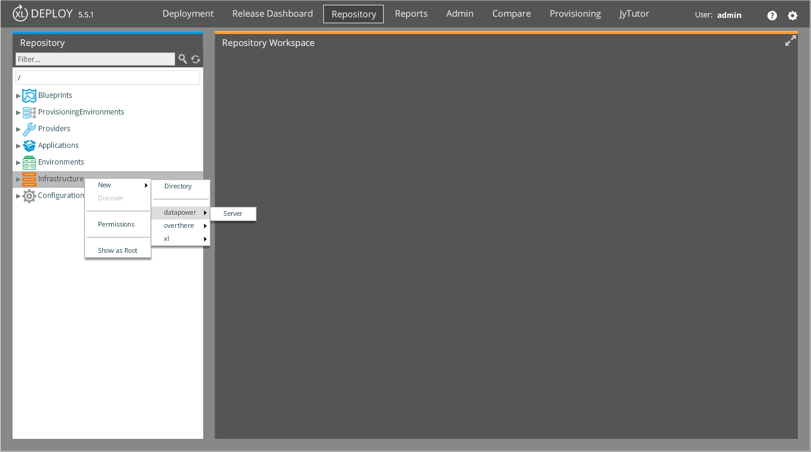

The DataPower plugin for XL Deploy allows you to manage the configuration of an IBM DataPower Gateway appliance. You can provide a configuration file in XML or ZIP format, import it in your DataPower appliance, and persist the configuration for a selected domain.

For information about the configuration items (CIs) that the DataPower plugin provides, refer to the [DataPower Plugin Reference](/xl-deploy-xld-datapower-plugin/latest/dataPowerPluginManual.html).

## Requirements

* IBM DataPower Gateway 7.2
* The XML Management Interface on the appliance must be enabled and accessible by the XL Deploy server

## Enabling the XML Management Interface

To enable the XML Management Interface of your DataPower device:

1. Log in to the default domain on the DataPower device using an administrator account.
2. From the navigation bar, choose **Network** > **Management** > **XML Management Interface**. A configuration window appears:

    

3. Ensure that the **Administrative state** is set to **enabled** and that the other parameters are correct.

    Your appliance should now be accessible on the chosen address and port.

## Creating a DataPower server CI

The `datapower.Server` configuration item (CI) models a DataPower domain instance running on a host. To create this CI in XL Deploy:

1. Click **Repository** in the top bar.
1. Right-click **Infrastructure** and select **New** > **datapower** > **Server**.

    

1. In the **Name** box, enter a unique name for the server.
1. In the **Hostname** and **Port** boxes, enter the server address and the port on which the XML Management Interface is configured to respond.
1. In the **Domain Name** box, enter the domain to which you are referring.
1. In the **Username** and **Password** boxes, enter the credentials of an account that has sufficient permissions to perform the desired operation.
1. In the **Disable SSL Verification** box, mark it in case you want to ignore the verification of SSL certificate.

    

## Creating a DataPower configuration CI

You can deploy a configuration to a DataPower appliance as either:

* An XML file (`datapower.ConfigurationXml` CI type)
* A ZIP file (`datapower.ConfigurationZip` CI type)

The properties of the CI types are the same.

If objects defined on the DataPower device do not match the objects in the configuration file and **Overwrite Objects** is set to "true", then the objects on the device will be overwritten; otherwise, the objects will be skipped.

Similarly, if files defined on the DataPower device do not match files on the DataPower device and **Overwrite Files** is set to "true", then the files on the device will be overwritten with the files provided in the import.

In case you wish to deploy by using a specific policy, specify the name of it in the **Deployment Policy** box. In case nothing is specified, none will be passed as the default value.

## Deploy the configuration

When you deploy a configuration XML or ZIP file to the DataPower server, you will see two steps in the deployment plan:

1. The configuration will be imported
1. The new configuration will be persisted for the configured domain

## Importing a file

You can import a file from your package into the DataPower appliance with the `datapower.FileSpec` CI type. You must specify the file name and location in the **File Name** box. Ensure that the casing is correct, as the DataPower appliance file system is case-sensitive and the upload will fail in the case of incorrect case.

### Sample DAR manifest

This is a sample of a deployment package (DAR) manifest snippet that defines a `datapower.ConfigurationZipSpec` resource CI:

    <datapower.ConfigurationZipSpec name="ZipConfig" file="ZipConfig/exportConfig.zip">
      <scanPlaceholders>true</scanPlaceholders>
    </datapower.ConfigurationZipSpec>

For the file upload, specify the following resource:

    <datapower.FileSpec name="FileUploadTest" file="FileUploadTest/config1.png">
      <fileName>image:///configFileExample.png</fileName>
    </datapower.FileSpec>
