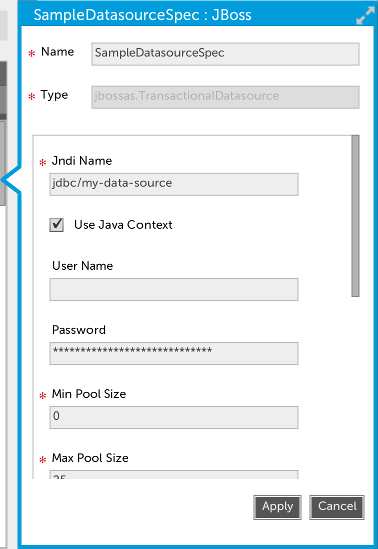

**Note:** A version of this topic is available for [XL Deploy 4.5.x and earlier](/xl-deploy/4.5.x/how-password-properties-and-encrypted-dictionaries-combine-4.5.html).

In XL Deploy's [type system](/xl-deploy/concept/key-xl-deploy-concepts.html#type-system), any property defined as [`password="true"`](/xl-deploy/how-to/customizing-the-xl-deploy-type-system.html#synthetic-properties) is stored in the [repository](/xl-deploy/concept/the-xl-deploy-repository.html) in encrypted form (AES-256) and appears as `******` in the user interface. The `password="true"` setting usually applies to properties called "password", but you can define _any_ property as secure in this way.

In the case of secure properties of [deployable items](/xl-deploy/concept/key-xl-deploy-concepts.html#deployables)—such as the password for a datasource spec or similar piece of configuration—the value is usually _not_ set directly on the deployable, because it varies across target environments.

You can handle a secure property by setting the property on the deployable to a [placeholder](/xl-deploy/how-to/using-placeholders-in-xl-deploy.html) such as `{{my.datasource.password}}`. When the deployable is mapped to a specific target environment, XL Deploy resolves the placeholder using [dictionaries](/xl-deploy/concept/key-xl-deploy-concepts.html#dictionaries) that are linked to the environment. XL Deploy selects the first value that it finds for the `my.datasource.password` key.

In XL Deploy, a dictionary can contain:

* "Regular" key/value pairs that are intended to store non-sensitive values
* Encrypted key/value pairs that are intended to store sensitive data such as passwords

In a regular dictionary entry, the key and value are both stored in plain text and are visible anyone with [read access](/xl-deploy/concept/overview-of-security-in-xl-deploy.html#permissions) to the dictionary [configuration item](/xl-deploy/concept/key-xl-deploy-concepts.html#configuration-items-cis).

In an encrypted dictionary entry, the key is treated as plain text, but the value is treated in the same way as `password="true"` properties: it is hidden in the UI and stored in encrypted form in the repository.

## How do properties and dictionaries work together?

There are four possible combinations of properties and dictionary entries. Let's examine what happens in each case. Assuming we have:

* A deployable with two properties:
    * A normal property called _username_
    * A password property called _password_
* Two entries in a dictionary:
    * The regular entry `my.username = scott`
    * The encrypted entry `my.password = tiger`

### Normal property, regular dictionary entry

The deployable contains `username = {{my.username}}`. XL Deploy resolves this property, resulting in `username = scott` on the corresponding [item to be deployed](/xl-deploy/concept/key-xl-deploy-concepts.html#deployeds).

### Secret property, encrypted dictionary entry

The deployable contains `password = {{my.password}}`. XL Deploy resolves this property, resulting in `password = tiger`. In the UI, the value only appears in encrypted form, so we only see `password = *****`.

This screenshot shows the resolved properties with `username = {{my.username}}` and `password = {{my.password}}`:

### Secret property, regular dictionary entry

The deployable contains `password = {{my.username}}`. XL Deploy resolve this property to `password = scott`, which is not a security problem (`tiger` was _already_ a visible value because it is stored in a regular dictionary entry). However, it will probably fail, because the password is incorrect.

### Normal property, encrypted dictionary entry

The deployable contains `username = {{my.password}}`. XL Deploy will **not** resolve this property, because that would leak the password. Instead, it will leave the `username` value blank. If `username` is a required property, this will cause an immediate validation error when XL Deploy attempts to generate the deployment plan.

This screenshot shows the resolved properties with `password = {{my.username}}` (the value is not visible because passwords are obscured) and `username = {{my.password}}` (blank because it is a normal property attempting to use a value stored in an encrypted dictionary entry):

## Why don't the values that I entered in an encrypted dictionary entry appear in normal properties?

As described above, XL Deploy will not resolve a _normal_ property that is set to a placeholder stored in an _encrypted_ dictionary entry. This protects the value of the placeholder, so it is not visible if someone attempts to reference them in a normal property of a deployable (accidentally or otherwise).

## How can I prevent users from storing sensitive data where they shouldn't?

XL Deploy cannot determine which key in a dictionary "should" have a secret value. Therefore, there is no default validation that attempts to prevent users from entering a value that should be secure into a regular dictionary (for example, entering `my.password` as a regular entry instead of an encrypted entry).

If there is a convention that you can follow in your organization—for example, all keys that contain "password" should have secret values and should _not_ be stored in regular entries—then you can [define a validation rule](/xl-deploy/how-to/create-a-custom-validation-rule.html) on regular dictionary entries to enforce this convention.

Of course, we highly recommend that you set up [security in XL Deploy](/xl-deploy/concept/overview-of-security-in-xl-deploy.html) so that all dictionaries—regular and encrypted—can only be viewed by the relevant people and teams. This means that, even if you accidentally store a value that should be secret in a regular dictionary, the number of users who could see the value is limited.
