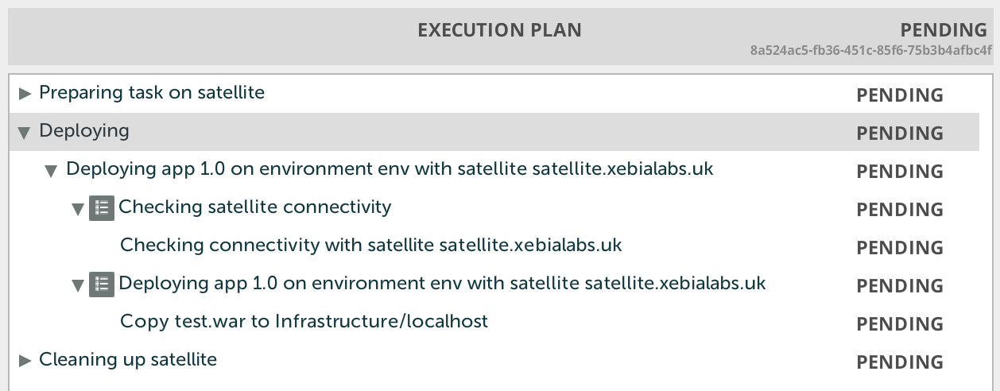

In XL Deploy, each block at the root level of a deployment plan is called a *phase*. If your deployment plan does not require any satellite servers, it will probably have one phase. If XL Deploy requires at least one satellite server to complete the deployment, the plan will contain additional phases to prepare and clean up the satellite servers.

## Satellite preparation

Satellite preparation occurs at the beginning of the deployment plan. It contains steps that will:

1. Verify that the required satellites are running
2. Verify that all plugins are synchronized between XL Deploy and the required satellites
3. Transfer the required files (artifacts), once per satellite

Satellite setup is done in parallel.

## Deployment phase

Just before deployment, XL Deploy will verify the connection with the satellites. In the deployment plan, you can see the blocks of steps that are executed from a satellite.

In the following example, the deployment to the **env** environment will be executed with satellite **satellite.xebialabs.uk**. After XL Deploy checks the connection, it will deploy the **test.war** file from **satellite.xebialabs.uk** to **localhost**.

**Note:** XL Deploy versions 5.5.x and earlier do not support rolling back a deployment to satellites.

## Satellite cleanup phase

The final phase of the deployment ensures that temporary files are removed from the working directories on the satellite servers.

Because cleaning up temporary files is not related to a successful or failed deployment, XL Deploy will always try to execute the cleanup phase when you cancel a task.
