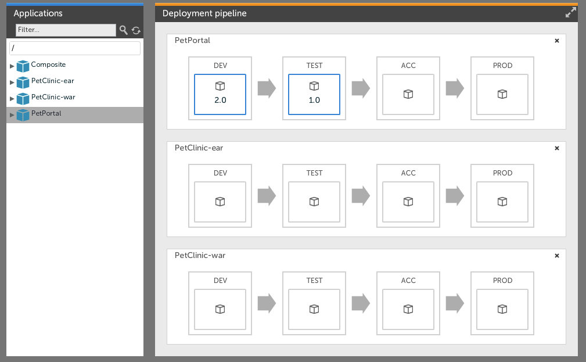

Most organizations have a process around releasing software to their environments. Typically, application versions are promoted to a number of environments before being released to production. In each environment, the application version is integrated or tested before being allowed to progress to the next stage. XL Deploy includes a release dashboard to help you get insight into this process.

## Set up the release dashboard

Before using the release dashboard, you need to define a deployment pipeline, deployment checklists, and checklist items.

**Important:** The release dashboard view is available only in the legacy GUI. For more information about the deployment pipeline, refer to [Using the deployment pipeline view](/xl-deploy/how-to/using-the-deployment-pipeline.html).

### Define a deployment pipeline

A deployment pipeline is the sequence of environments to which an application is deployed during its lifecycle. Each application can be configured with its own deployment pipeline. An application version starts in the first environment and is promoted to each of the following environments in turn. It is also possible for a particular version to be deployed to multiple environments at once.

A common example of such a pipeline is:  _Development_, _Testing_, _Acceptance_ and _Production_. If this deployment pipeline was associated with the PetClinic application, then version 1.0 of PetClinic would be deployed to the Development environment first, then to the Testing environment, and so on.

You need to define a deployment pipeline for every application that you want to see in the release dashboard. For information about defining a deployment pipeline, refer to [Create a deployment pipeline](/xl-deploy/how-to/create-a-deployment-pipeline.html).

### Define deployment checklists and checklist items

To ensure the quality of a deployment pipeline, you can optionally associate environments in the pipeline with a checklist that each deployment package must satisfy before being deployed to the environment. Some examples of checklist items are:

* Have release notes been included in the deployment package?
* Has the application version been performance tested?
* Is there a change ticket number associated with the deployment?
* Has the business owner signed off on the deployment?

XL Deploy supports checkboxes and text fields as checklist items. A checkbox condition is met if it is checked. A text field condition is met if it is not empty.

For information about defining checklists, refer to [Create a deployment checklist](/xl-deploy/how-to/create-a-deployment-checklist.html).

## Use the release dashboard

On the release dashboard, you can:

* Click an application to view its [deployment pipeline](/xl-deploy/how-to/create-a-deployment-pipeline.html) and the version that is installed in each environment
* Click an application version (that is, a deployment package) to view its position in the deployment pipeline
* Click an environment in an application version's pipeline to:
    * Check off items in the [deployment checklist](/xl-deploy/how-to/create-a-deployment-checklist.html) (if the environment has a checklist)
    * Deploy the selected version to the environment

## Release dashboard security

A user's [permissions](/xl-deploy/concept/roles-and-permissions-in-xl-deploy.html#permissions) determine what they can do with the release dashboard:

* The values for deployment checklist items are stored on the [deployment package (`udm.Version`) configuration item](/xl-deploy/how-to/create-a-deployment-checklist.html#define-checklist-items-in-syntheticxml). Therefore, users with `repo#edit` permission on the deployment package can check off items on the checklist.
* When viewing a deployment pipeline, the user can only see the environments that he or she can access. For example, if a user has access to the DEV and TEST environments, he or she will only see those environments in a pipeline that includes the DEV, TEST, ACC, and PROD environments.
* Normal deployment permissions (`deploy#initial`, `deploy#upgrade`) apply when a deployment is initiated from the release dashboard.

You can also specify roles for specific checks in a deployment checklist; refer to [Create a deployment checklist](/xl-deploy/how-to/create-a-deployment-checklist.html#assign-security-roles-to-checks) for more information.
