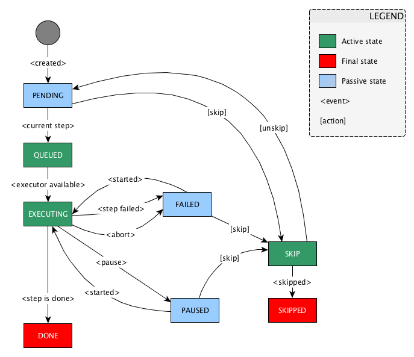

A *step* is a concrete action to be performed to accomplish a task. All steps for a particular deployment are grouped together in a _steplist_.

XL Deploy includes many step implementations for common actions. Steps are contributed by plugins, based on the deployment that is being performed. Middleware-specific steps are contributed by the plugins.

The following are examples of steps:

* Copy file `/foo/bar` to `host1`, directory `/bar/baz`
* Install `petclinic.ear` on the WebSphere Application Server on `was1`
* Restart the Apache HTTP server on `web1`

You can perform actions on steps, but most interaction with the step will be done by the task itself.

You can mark a step to be skipped by the task. When the task is executing and the skipped step becomes the current step, the task will skip the step without executing it. The step will be marked _skipped_, and the next step in line will be executed.

**Note:** A step can only be skipped when the step is _pending_, _failed_, or _paused_.

## Step states

In XL Deploy 6.0.0 and later, a step can go through the following states:

In earlier versions of XL Deploy, a step can go through the following states:

## Steplist

A steplist is a sequential list of _steps_ that are contributed by one or more _plugins_ when a deployment is being planned.

All steps in a steplist are ordered in a manner similar to `/etc/init.d` scripts in Unix, with low-order steps being executed before higher-order steps. XL Deploy predefines the following orders for ease of use:

* 0 = PRE_FLIGHT
* 10 = STOP_ARTIFACTS
* 20 = STOP_CONTAINERS
* 30 = UNDEPLOY_ARTIFACTS
* 40 = DESTROY_RESOURCES
* 60 = CREATE_RESOURCES
* 70 = DEPLOY_ARTIFACTS
* 80 = START_CONTAINERS
* 90 = START_ARTIFACTS
* 100 = POST_FLIGHT

### Steplist order for cloud and container plugins

This is an alternative set of ordering steps for cloud and container plugins.

{:.table .table-striped}
| Destroy | Create |
| ------| -----|
| 41-49 | 51-59 = resource group / project / namespace |
| 21-40 | 60-79 = low level resources -> network/storage/secrets/registry |
| | 61 = create subnet |
| | 62 = wait for subnet |
| | 63 = create network interface |
| 29 | 70 = upload files/binaries/blobs |
| 22 | 78 = billing definition |  
| 11-20 | 80-89 = vm / container / container scheduler / function resources |
| 1-10 | 90-99 = run provisioners |
| 0 | 100 |

The basic rules:

* Assign the same order for items that can be created in parallel (network/storage)
* Wait steps should be incremented + 1 in according to their create step
* Destroy = 100 create
* Modify similar to create
* Do not use 50 because does not have a symmetrical value
* 0 and 100 are reserved
