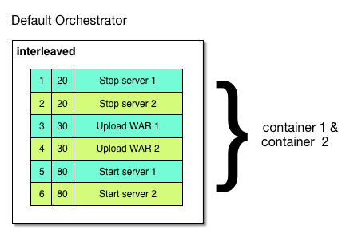
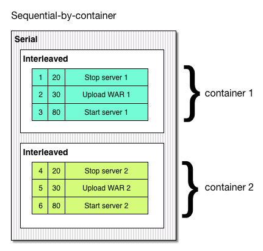
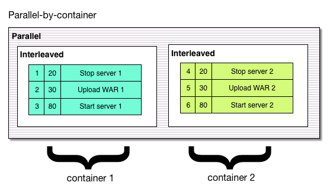
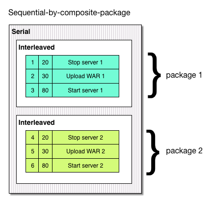
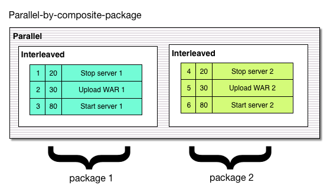
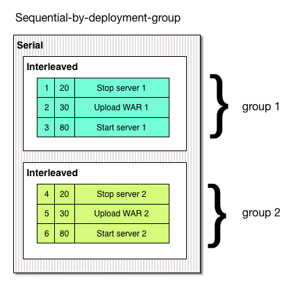
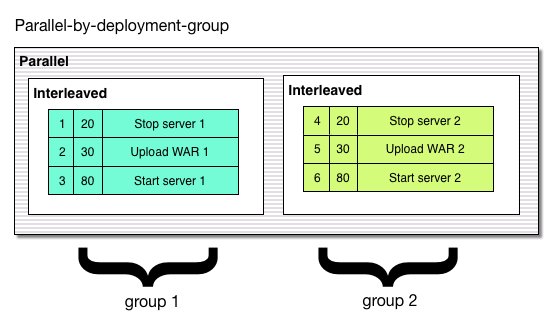

In XL Deploy, an orchestrator combines the steps for individual component changes into an overall deployment or provisioning workflow. Orchestrators are also responsible for deciding which parts of the deployment or provisioning plan are executed sequentially or in parallel. You can [combine multiple orchestrators](/xl-deploy/concept/combining-multiple-orchestrators.html) for more complex workflows.

**Note:** For orchestrators that specify an order, the order is reversed for undeployment.

This topic describes orchestrators that are available for deployment plans. For examples of deployment plans using different orchestrators, refer to [Examples of orchestrators in XL Deploy](/xl-deploy/concept/examples-of-orchestrators-in-xl-deploy.html#by-deployment-group-orchestrators).

For information about orchestrators and provisioning plans, refer to [Using orchestrators with provisioning](/xl-deploy/how-to/using-orchestrators-with-provisioning.html).

## Default orchestrator

The default orchestrator "interleaves" all individual component changes by running all steps of a given [order](https://docs.xebialabs.com/xl-deploy/concept/steps-and-steplists-in-xl-deploy.html#steplist) for all components. This results in an overall workflow that first stops all containers, then removes all old components, then adds the new ones, and so on.

## *By container* orchestrators

*By container* orchestrators group steps that deal with the same container together, enabling deployments across a farm of middleware.

* `sequential-by-container` will deploy to all containers sequentially. The order of deployment is defined by alphabetic order of the containers' names.
* `parallel-by-container` will deploy to all containers in parallel.

## *By composite package* orchestrators

*By composite package* orchestrators group steps per contained package together.

* `sequential-by-composite-package` will deploy member packages of a composite package sequentially. The order of the member packages in the composite package is preserved.
* `parallel-by-composite-package` will deploy member packages of a composite package in parallel.

**Tip:** You can use the `sequential-by-composite-package` or `parallel-by-composite-package` orchestrator with a composite package that has other composite packages nested inside. When XL Deploy creates the interleaved sub-plans, it will flatten the composite packages and maintain the order of the deployment package members.

## *By deployment group* orchestrators

*By deployment group* orchestrators use the **deployment group** property of a middleware container to group steps for all containers that are assigned the same deployment group.

All component changes for a given container are put in the same group, and all groups are combined into a single (sequential or parallel) deployment workflow. This allows fine-grained control over which containers are deployed to together.

* `sequential-by-deployment-group` will deploy to each member of group sequentially. The order of deployment is defined by ascending order of the deployment group property. If the property is not specified, this group will be deployed first.
* `parallel-by-deployment-group` will deploy to each member of group in parallel.

### *By deployment sub-group* orchestrators

In XL Deploy 5.0.0 and later, you can further organize deployment to middleware containers using the **deployment sub-group** and **deployment sub-sub-group** properties.

* `sequential-by-deployment-sub-group` will deploy to each member of a sub-group sequentially.
* `parallel-by-deployment-sub-group` will deploy to each member of a sub-group in parallel.
* `sequential-by-deployment-sub-sub-group` will deploy to each member of a sub-sub-group sequentially.
* `parallel-by-deployment-sub-sub-group` will deploy to each member of a sub-sub-group in parallel.

## *By deployed* orchestrators

In XL Deploy 6.0.0 and later, you can organize deployments by deployed.

* `sequential-by-deployed` will deploy all `deployeds` in the plan sequentially.
* `parallel-by-deployed` will deploy all `deployeds` in the plan in parallel.

## *By dependency* orchestrators

In XL Deploy 6.0.0 and later, you can use *by dependency* orchestrators with applications that have [dependencies](/xl-deploy/concept/application-dependencies-in-xl-deploy.html). These orchestrators group the dependencies for a given application and deploy them sequentially or in parallel.

* `sequential-by-dependency` will deploy all applications in reverse topological order, which ensures that dependent applications are deployed first.
* `parallel-by-dependency` will deploy the applications in parallel as much as possible; it groups applications by dependency, then executes the deployment in parallel for applications in the same group. This means that the effect of the orchestrator depends on the way the dependencies are defined.

