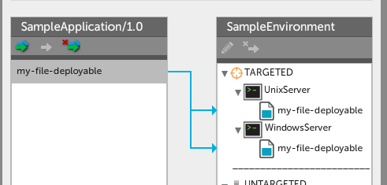

The [_XL Deploy: Understanding Packages_](https://www.youtube.com/watch?v=dqeL45WGcKU&index=5&list=PLIIv46GEoJ7ZvQd4BbzdMLaH0tc-gYyA1) video describes _deployables_—files and settings, delivered in a deployment package, that your application needs to run—and _deployeds_—the things that are actually created in your target servers as part of a deployment.

Since these two concepts are central to understanding XL Deploy, and the difference between the two can be subtle, I would like to spend a bit of time talking about them.

## What is the relationship between deployables and deployeds?

Every item that is deployed to a target system by XL Deploy—whether that's a file that is copied to a server, an SQL script that is executed against a database, or a virtual host created in a web server—comes from an item in the deployment package that is currently being deployed. In other words, each deployed has a deployable as its source. Put a different way, during a deployment each deployed is "created from" a deployable.

In that sense, a deployable can almost be considered as a "request", "template" or "specification" for the deployeds that will actually be created. The names of many types of deployables reflect this; for example, [`www.ApacheVirtualHostSpec`](/xl-deploy/5.0.x/webserverPluginManual.html#wwwapachevirtualhostspec) (note the "spec" at the end). Deployables may have a payload, such as a file or folder to be copied to the target server (XL Deploy calls these deployables _artifacts_, or may be "pure" pieces of configuration (these are called _resources_.

Note that the relationship between deployables and deployeds is one-to-many; that is, one deployable in a deployment package can be the source for many deployeds in the target environment. For example, we can copy a file in the deployment package to many target servers, creating one deployed per server.

## What are the differences between deployables and deployeds?

If we consider a deployable to be a "template" or "specification" for a deployed, it is easier to understand a key difference between the two: deployables may be "incomplete" or "less fully-specified" than the deployeds that are created from them.

For example, a deployable artifact may consist only of a file or folder payload, which contains a placeholder. When the artifact is deployed, properties such as the target path, and values for the placeholders, must be specified—but these are only required on the deployed, **not** on the deployable.

In addition, further properties will become relevant depending on which type of system the file is deployed to. For example, a file copied to a Unix server becomes a _Unix_ file, with Unix-specific attributes such as `owner` and `group`. The same file (that is, the same deployable) copied to a Windows server becomes a _Windows_ file, with Windows-specific attributes.

Also, if the file is deployed to multiple Unix servers, each deployed file may have _different_ values for a particular attribute (such as a a different target path on each server).

In general:

* The type of a deployed is different from the type of the deployable
* A deployable type can give rise to different deployed types, depending on the target system to which it is deployed
* A deployed can have more properties than its "source" deployable
* Multiple deployeds created from the same deployable can have different property values, even if they are of the same type

**The same `jee.DataSourceSpec` can become a `jbossas.NonTransactionalDatasource` on JBoss and a `tomcat.DataSource` on Tomcat.**

**The value of the `targetPath` attribute can be different for different deployeds from the same deployable**.

Back to our example file: even though we have said that properties such as the target path are required only on the **deployed** file, there may well be cases where we know _when we are packaging up our deployable_ where it needs to go. That is why the deployable file also contains a `targetPath` property (optional, not mandatory!): if set, its value will be used for all deployed files created from the deployable.

In other words:

* Properties of deployables are copied over to corresponding properties of the deployeds that are created from them
* Properties of deployeds that have no corresponding property on their source deployable (you can easily [add these properties](/xl-deploy/how-to/customize-an-existing-ci-type.html#extend-a-ci) if you need them), or for which no value is set on the source deployable, are given default values that depend on the deployed type

**Values of properties of the deployable are copied to the deployed if the property name matches. Some properties of deployeds have no corresponding properties on a deployable.**

Speaking of specifying the target path for a file to be copied up front: in a realistic scenario, it will often be the case that we don't know the entire path when we package up the deployable. For instance, we may know that the file needs to be copied to `<install-dir>/bin`—we know the `/bin` part, but `<install-dir>` may be different for each environment. We can accomplish this in XL Deploy by using a placeholder for the environment-specific part of the property; for example, `{{INSTALL_DIR}}/bin`.

This means:

* Deployables should be independent of the target environment. Where properties of a deployable need to vary per target environment, they can be specified using placeholders
* When a deployed is created from a deployable whose properties contain placeholders, these placeholders are automatically resolved to actual values defined on the target environment or container

We're almost there! Just a few further points we should discuss in relation to deployables and deployeds:

* Deployed properties are subject to [validation rules](/xl-deploy/how-to/create-a-custom-validation-rule.html), deployable properties generally are not. Because a deployable by its very nature can be incomplete, it usually does not make sense to try to validate it. After all, you only need to be sure that you have all required information at the moment that you want to _create_ something from the deployable; that is, at the moment we're creating a deployed based on that deployable.

You will notice that, in XL Deploy, most properties that are required on deployeds are not required on the corresponding deployable. They can either be supplied by [defaults](/xl-deploy/how-to/customize-an-existing-ci-type.html), or you can specify them "just in time"; that is, when [putting together the deployment specification](/xl-deploy/how-to/deploy-an-application.html). This does mean, however, that the deployment requires manual intervention, so cannot be carried out via, for example, the [Jenkins](https://wiki.jenkins-ci.org/display/JENKINS/XL+Deploy+Plugin) or [Maven](/xl-deploy/latest/xldeploy-maven-plugin) plugins).

* Deployed properties can have [various kinds](/xl-deploy/how-to/customize-an-existing-ci-type.html#extend-a-ci) (strings, numbers, and so on), but the corresponding properties on the deployables, where present, are all strings. This is because the value of a numeric property of the deployed may be environment-specific, so we will want to use a placeholder in the deployable. Because placeholders are specified as strings in XL Deploy, the property on the deployable has to be a string property for this to work.

**Properties are required on the deployed, but usually optional on the deployable. Even if a property on the deployed is a number or, as here, a Boolean, the corresponding property on the deployable is a string, so placeholders can be used. Placeholders are replaced with the appropriate values for the environment on the deployed.**

### How does XL Deploy work with deployables and deployeds?

Now that we have discussed how deployables and deployeds are related, and what the differences between the two are, let's talk briefly about how XL Deploy actually _uses_ them.

XL Deploy uses deployeds—or, more specifically, the _changes_ you ask to be made to deployeds—to figure out which steps need to be added to the deployment plan. These steps will be different depending on the type of change and the type of deployed being created/modified/removed: _creating_ a new deployed usually requires different actions from changing a property on an existing deployed (a _MODIFY_ action, in XL Deploy terminology).

Note that the steps we are talking about here depend on changes to the **deployeds**, not the deployables: after all, _these_ are the things we are trying to create, modify or remove during a deployment. Deployables can have behavior too, but this is not what is happening during a deployment plan. This is why the vast majority the out-of-the-box content in XL Deploy's plugins relates to deployeds.
