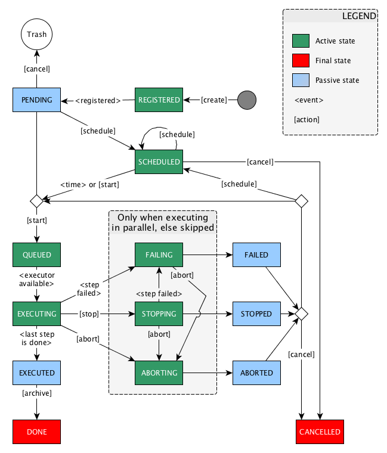

A _task_ is an activity in XL Deploy. When starting a deployment, XL Deploy will create and start a task. The task contains a list of _steps_ that must be executed to successfully complete the task. XL Deploy will execute each of the steps in turn. When all of the steps are successfully executed, the task itself is successfully executed. If one of the steps fails, the task itself is marked failed.

XL Deploy supports the following types of tasks:

* Deploy application: Deploys a package to an environment
* Update application: Updates an existing deployment of an application
* Undeploy application: Undeploys a package from an environment
* Rollback: Rolls back a deployment
* Discovery: Discovers middleware on a host
* Control task: Interacts with middleware on demand

## Task recovery

XL Deploy periodically stores a snapshot of the tasks in the system to be able to recover tasks if the server is stopped abruptly. XL Deploy will reload the tasks from the recovery file when it restarts. The tasks, deployed item configurations, and generated steps will all be recovered. Tasks that were _executing_, _failing_, _stopping_, or _aborting_ in XL Deploy when the server stopped are put in _failed_ state so you can decide whether to rerun or cancel them. Only tasks that have been _pending_, _scheduled_ or _started_ will be recovered.

## Scheduling tasks

XL Deploy allows you to schedule a task for execution at a specified later moment in time. All task types can be scheduled, including deployment tasks, control tasks and discovery tasks.

You should prepare the task like you would normally do; then, instead of starting it, you can schedule it to any given date and time in the future. To prevent mistakes, you are not able to schedule tasks in the past.

The amount of time that you can schedule a task in the future is limited by a system-specific value, though you can always schedule a task at least 3 weeks ahead.

When a task is scheduled, the task is created and the status is set to *scheduled*. It will automatically start executing when the scheduled time has passed. If there is no executor available, the task will be _queued_.

For more information, refer to [Schedule or reschedule a task](/xl-deploy/how-to/schedule-reschedule-task.html) and [Schedule a deployment](/xl-deploy/how-to/schedule-a-deployment.html).

### Scheduled time zone

XL Deploy stores the scheduled date and time using the Coordinated Universal Time (UTC) timezone; this means that, for example, log entries will show the UTC time.

When a task is scheduled in relation to your local timezone, you should pass the correct timezone with the call, then XL Deploy will convert it to UTC for you. In the XL Deploy GUI, you can enter the scheduled time in your local time zone, and it will automatically be converted.

### Scheduled tasks after server restart

When XL Deploy is restarted through a manual stop or a forced shutdown, it will automatically reschedule all scheduled tasks that are not executed yet. If the task was scheduled for execution during the downtime, it will start immediately when the server restarts.

### Archiving scheduled tasks

Scheduled tasks are not automatically archived after they have been executed, so you need to do that manually after the execution has finished.

### Failed scheduled tasks

When a scheduled task encounters an failure during execution, the task will be left in a _failed_ state. You should manually correct the problem and is then able to continue the task, or reschedule it.

### Starting a scheduled task immediately

You can start a scheduled task immediately, if required. The task is then no longer scheduled, and will start executing directly.

### Rescheduling a scheduled task

You can reschedule a task to any other given moment in the future.

### Canceling a scheduled task

A scheduled task can be cancelled. It will then be removed from the system, and the status will be stored in the task history.

## Task states

In XL Deploy 6.0.0 and later, a task can go through the following states:

In earlier versions of XL Deploy, a task can go through the following states:

You can interact with tasks as follows:

* **Start the task**. XL Deploy will try to start executing the steps associated with the task. If there is no executor available, the task will be queued. The task can be started when the task is _pending_, _failed_, _stopped_ or _aborted_. Starting a task when _scheduled_ will also unschedule the task.

* **Schedule the task**. XL Deploy will schedule the task to execute it automatically at the specified time. A task can be scheduled when the task is _pending_, _failed_, _stopped_ or _aborted_.

* **Stop the task**. XL Deploy will wait for the currently executing step(s) to finish and will then cleanly stop the task. The state of the task will become _stopping_. Note that, due to the nature of some steps, this is not always possible. For example, a step that calls an external script may hang indefinitely. A task can only be stopped when _executing_.

* **Abort the task**. XL Deploy will attempt to interrupt the currently executing step(s). The state of the task will become _aborting_. If successful, the task is marked _aborted_ and the step is marked _failed_. The task can be aborted when _executing_, _failing_ or _stopping_.

* **Cancel the task**. XL Deploy will cancel the task execution. If the task was _executing_ before, the task will be stored since it may have made changes to the middleware. If the task was _pending_ and never started, it will be removed but not stored. The task can only be cancelled when it is _pending_, _scheduled_, _failed_, _stopped_ or _aborted_.

* **Archive the task**. XL Deploy will finalize the task and store it. You must manually archive tasks; this is required so you can review the task and determine whether a rollback is required. Archiving the task can only be done when the task is _executed_.

**Tip:** You can use the [XL Deploy command-line interface (CLI)](/xl-deploy/concept/getting-started-with-the-xl-deploy-cli.html) to work with tasks.
