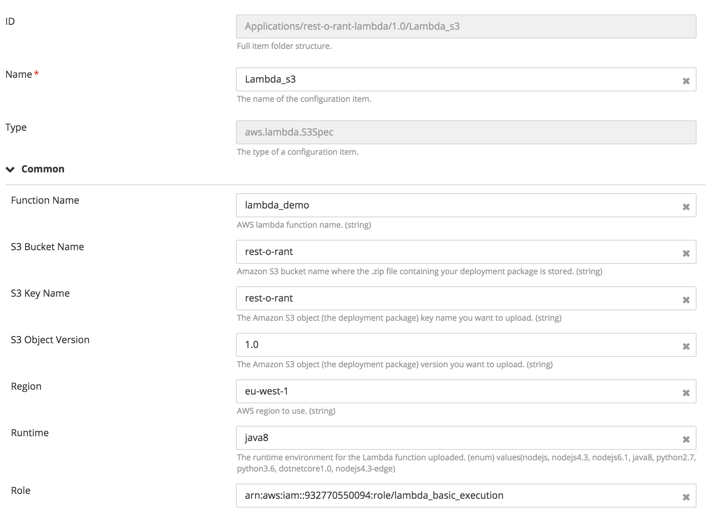
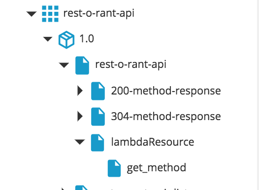
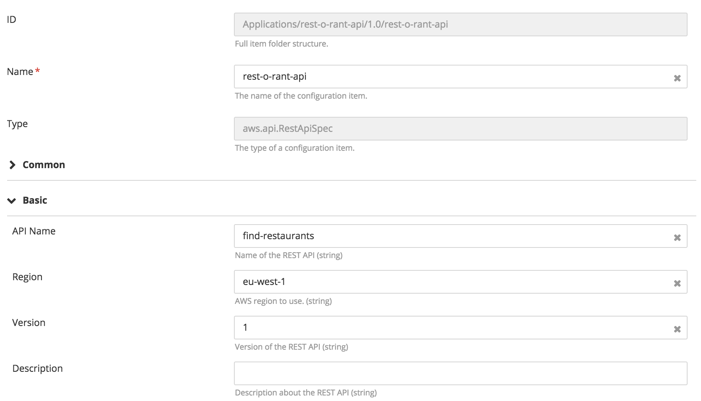

The Amazon Web Services (AWS) plugin for XL Deploy supports:

* Launching and terminating AWS Elastic Compute Cloud (EC2) and Virtual Private Cloud (VPC) instances
* Deploying applications to AWS cloud-based instances
* Using Amazon's Elastic Load Balancing feature for EC2 instances
* Creating and using Simple Storage Service (S3) buckets for file storage
* Provisioning EC2 Container Service (ECS) clusters, tasks, and services
* Using the Relational Database Service (RDS) for databases
* Using the Elastic Block Store (EBS) for persistent block storage
* Provisioning AWS Elastic Compute Cloud (EC2) instances and deploying applications to those instances
* Deploying network configurations such as Virtual Private Cloud (VPC) instances, subnets, routing tables, and network interfaces
* Deploying load balancing configurations to AWS Elastic Load Balancing (ELB)
* Deploying storage configurations such as Elastic Block Store (EBS) volumes and Simple Storage Service (S3) buckets for file storage
* Deploying content to S3 buckets
* Deploying tasks and services to ECS clusters
* Provisioning and working with EC2 Container Registry (ECR) repositories
* Provisioning and working with Relational Database Service (RDS) instances
* Deploying AWS Lambda functions
* Provisioning AWS API Gateway to invoke Lambda functions

**Note:** Prior to version 6.2.0, the plugin was called the XL Deploy EC2 plugin.

For information about AWS requirements and the configuration items (CIs) that the plugin supports, refer to the [AWS Plugin Reference](/xl-deploy-xld-aws-plugin/latest/awsPluginManual.html).

## Features

* Create virtual machines on Elastic Compute Cloud (EC2) with a specified Amazon Machine Image (AMI)
* Automatically destroy EC2 instances during undeployment
* Provision a Simple Storage Service (S3) bucket

### Attach an elastic IP address with a non-VPC EC2 instance

To create and attach an elastic IP address with a non-Virtual Private Cloud (VPC) EC2 instance:

1. Go to the **Elastic IP** tab and set **Attach Elastic IP** to `true` and **Elastic IP Domain** to `standard`.
1. A new elastic IP is created and attached to the non-VPC EC2 instance.
1. If the EC2 instance in stopped, the elastic IP is detached and is reattached by the plugin when you restart the EC2 instance.
1. Detach the elastic IP by setting the Elastic IP property to false during a MODIFY operation. Alternatively, If you perform an undeployment, the elastic IP is released.
1. If you perform an undeployment, the elastic IP is released.

### Attach an elastic IP address with VPC EC2 instance

To create and attach an elastic IP with a Virtual Private Cloud (VPC) EC2 instance:

1. Go to the **Elastic IP** tab and set **Attach Elastic IP** to `true` and **Elastic IP Domain** to `standard`.
1. A new elastic IP is created and attached to the default network interface connected to the EC2 instance at `eth0`.
1. If the EC2 instance is restarted, the elastic IP is still attached to the default network interface and does not require to be reattached.
1. You can set the **Elastic IP** property to `false` during a MODIFY operation. This will detach the elastic IP and will release it.
1. If you perform an undeployment, the elastic IP is released.

### Create AWS CloudFormation resources

With the Amazon Web Services (AWS) plugin for XL Deploy, you can create AWS CloudFormation templates and stacks.

To create a new **Stack** type embedded infrastructure CI:

1. Expand the **Infrastructure** CI list, navigate to a CI of **AWS Cloud** type, click , and select **New** > **aws** > **cloudformation** > **Stack**.
1. Specify a name for the CI and the Region.
1. Click **Save**.


To create a new **Template** type CI:

1. Expand an application from the **Applications** list, hover over a package, click , and select **New** > **aws** > **cloudformation** > **Template**.
1. Specify a name for the CI, the Json File as per AWS configuration, and the Input variables.
1. To bind the templates with output variables, configure the **Bound Templates**.
1. Click **Save**.

**Note:** You can also create the XL Deploy resources by configuring them in METADATA section.
```
"Metadata" : {"XLD::Infrastructure":[{"id":"cloud","type":"core.Directory"},{"id":"cloud/webserver","type":"overthere.SshHost","os":"UNIX","connectionType":"SFTP","address":"{Address}","port":"22","username":"admin"}],"XLD::Environments":[{"id":"cloud-dev","type":"udm.Environment","members":[{"ci ref":"Infrastructure/cloud/webserver"}]}]}
```


### Create AWS ECS resources

With the Amazon Web Services (AWS) plugin for XL Deploy, you can create cluster instances and ECS task and services. The ECS task and services are deployed over AWS cluster and run on the instances of the cluster. Amazon specifies the AMIs which are [optimized for ECS](https://docs.aws.amazon.com/AmazonECS/latest/developerguide/ecs-optimized_AMI.html).

To create a new **Cluster** type CI:

1. Expand an application from the **Applications** list, hover over a package, click , and select **New** > **aws** > **ecs** > **ClusterSpec**.
1. Specify a name for the CI, the AWS ECS Cluster Name, and the Region.


To create a new **Cluster (Container) Instance** type CI:

1. Expand an application from the **Applications** list, hover over a package, click , and select **New** > **aws** > **ecs** > **ContainerInstanceSpec**.
1. Go to **Create EC2 instances** section to configure the properties.
1. Specify a name for the CI, AWS ECS Cluster Name, AMI ID, and IAMRole.
**Note:** Container Instance is extension of the **EC2 instance** type and it supports all the properties supported by the instance type.


To create a new **ECS Service** type CI:

1. Expand an application from the **Applications** list, hover over a package, click , and select **New** > **aws** > **ecs** > **ServiceSpec**.
1. Specify a name for the CI, Task Placement Template, volumes, network mode, and the service name.
1. To configure the number of instances of a running task, enter a value for the **Desired Count** property.
1. To attach the IAM Role to the EC2 instance, specify the **IAMRole** property.
1. To configure deployment configuration, specify values for the **Maximum Percent** and **Minimum Healthy Percent** properties.
**Note:** The ECS Service contains an embedded CI for configuring **Load Balancers**  and **Container Definitions**.


To create a new **ECS Service Load Balancer** type embedded CI:
1. Expand an application from the **Applications** list, navigate to **ECS Service**, click , and select **New** > **aws** > **ecs** > **LoadBalancerSpec**.
1. Specify a name for the CI, Target Group, and the Load Balancer Name.
1. To configure the attached container configuration, specify the **Container Name** and **Container Port** properties.


To create a new **ECS Service/ Task Container** type embedded CI:
1. Expand an application from the **Applications** list, navigate to **ECS Service** or **ECS Task**, click , and select **New** > **aws** > **ecs** > **ContainerDefinitionSpec**.
1. Specify a name for the CI, Container Name and the Image Name.
1. To configure the memory limit, specify values for the **Hard Memory Limit** and **Soft Memory Limit** properties.
**Note:** The ECS Container contains an embedded CI for configuring **Mount Points** and **Port Mappings**. Mount Points are used for mounting the volume and Port Mappings for mapping the ports.


To create a new **ECS Task** type CI:

1. Expand an application from the **Applications** list, hover over a package, click , and select **New** > **aws** > **ecs** > **TaskSpec**.
1. Specify a name for the CI, Task Placement Template, volumes, and network mode.
1. To configure the number of instances of a running task, enter a value for the **Desired Count** property.
1. To attach the IAM Role to the EC2 instance, specify the **IAMRole** property.
**Note:** The ECS Service contains an embedded CI for configuring **Container Definitions**. For configuring them, refer to section **ECS Service/ Task Container**.


### Create network resources

With the Amazon Web Services (AWS) plugin for XL Deploy, you can create various network resources: VPCs, subnets, internet gateway, routing tables, and others.

To create a new **VPC** type CI:

1. Expand an application from the **Applications** list, hover over a package, click , and select **New** > **aws** > **vpc** > **VPCSpec**.
1. Specify a name for the CI, the VPC Name, the CIDR Block, and the Region.
1. To allow classic EC2 (non VPC) to be accessible through this VPC, set **Classic Link** to `true`.
1. To assign EC2 with hostname, set **DNS Support** to `true`.
1. To connect privately to other VPCs, in the **Peering Connections** section, specify IDs or VPC names in **Peer VPCs** field.
**Note:** You can specify the VPC resource ID from the AWS console or specify the Name:<vpc_name> when the VPC belongs to the package to be deployed. Connectivity across VPCs within same account is currently supported.


To create an **Internet Gateway** network resource:
1. In the **Gateway** section of the `aws.vpc.VPCSpec` CI, set the **Create Internet Gateway** property to `true`. The internet gateway is used when you require a subnet for public access.
1. You can optionally specify the name of internet gateway.


To create a new **SubnetSpec** type CI:

1. Expand an application from the **Applications** list, hover over a package, click , and select **New** > **aws** > **vpc** > **SubnetSpec**.
1. Specify a name for the CI, the VPC, the IPv4 CIDR and IPv6 CIDR, and the Region.
**Notes:**
1. The IPv4 CIDR and IPv6 CIDR represent the IP allocated to the subnet and there is always a unique subset of the target VPC.
1. A VPC can be referred to by its VPC ID if the VCP already exists on AWS, or by Name <vpn_name> if the VPC belongs to the package that is to be deployed.


To create a new **RouteTableSpec** type CI:

1. Expand an application from the **Applications** list, hover over a package, click , and select **New** > **aws** > **vpc** > **RouteTableSpec**.
1. Specify a name for the CI, the VPC, Associated Subnets, and Routes.
**Notes:**
1. A VPC can be referred to by its VPC ID if the VCP already exists on AWS, or by Name <vpn_name> if the VPC belongs to the package that is to be deployed.
1. Subnets can be referred to by their subnet ID if the subnet already exists on AWS, or by Name<subnet_name> if the subnet belongs to the package that is to be deployed.
1. You can add a route as an embedded configuration item under **Route Table** with the properties mentioned below.

* Internet Gateway
* NAT Device
* Virtual Private Gateway
* VPC Peering Connection
* ClassicLink
* VPC Endpoint
* Egress-Only Internet Gateway


### Create EC2 instances

To create a new **ec2.InstanceSpec** type CI:

1. Expand an application from the **Applications** list, hover over a package, click , and select **New** > **aws** > **ec2** > **InstanceSpec**.
1. Specify a name for the CI, the AMI name, the Region, and the Instance Type.
1. To attach the IAM Role to the EC2 instance, specify the **IAMRole** property.

**Notes:**
1. You can refer to a subnet by its subnet ID if it already exists on AWS, or by Name:<subnet_name> if the subnet belongs to the package that is to be deployed.
1. The **AWS key pair name** associates the existing key pair name with the EC2 instance to be created, used to access the EC2 instance via SSH.


### Attach a Network Interface to EC2 instances

You can attach multiple network interfaces to an EC2 instance by specifying the **Network Interface** map property. The key column is the index and the value is the network interface ID if the network interface exist on AWS, or Name:<ni-name> if the network interface belongs to the package to be deployed.


### Mounting volumes on EC2 instances

You can mount multiple volumes to an EC2 instance by specifying the **Volumes** map property. The key column is the volume ID if the volume exist on AWS, or Name:<vol-name> if the volume belongs to the package to be deployed and the value is the device name. For more details, see [Device naming in AWS documentation](https://docs.aws.amazon.com/AWSEC2/latest/UserGuide/device_naming.html).


### Creating lambda function and run it in response to HTTP requests using Amazon API Gateway.

**Creating AWS lambda function**

There are two ways to create a lambda function. The first is by providing the complete code in zip format and to use the aws.lamba.Function type, and the second is to upload the code to s3 and use the aws.lamba.Function type.

1. Create an AWS lambda function by specifying the functionName, region, runtime, role, handler.
1. A role is the Amazon Resource Name (ARN) for the IAM role which has the rights to execute a lambda function.
1. Handler is the function within your code that Lambda calls to begin execution.
1. Runtime is the runtime environment for the Lambda function uploaded e.g. python2.7, java8. etc.
1. if lambda function code is uploaded on S3 we need to provide bucketName, s3Key and s3ObjectVersion in addition to other properties.




**Creating API Gateway**

To provision an AWS API Gateway Resource on AWS Cloud choose **aws.api.RestApiSpec**

1. Create an aws.api.RestApi, specifying the apiName and region.
1. To bind a lambda function to aws.api.RestAPI you must create a aws.api.ResourceSpec.
1. Create a aws.api.ResourceSpec, specifying the path, parent, and methods.
1. Map multiple HTTP methods to aws.api.ResourceSpec using aws.api.MethodSpec.
1. To use the lambda function with the API gateway in aws.api.MethodSpec, in the Type of integration field, select AWS, and in the URI field, enter the lambda name in the following format: Name:<lambda_function_name>






