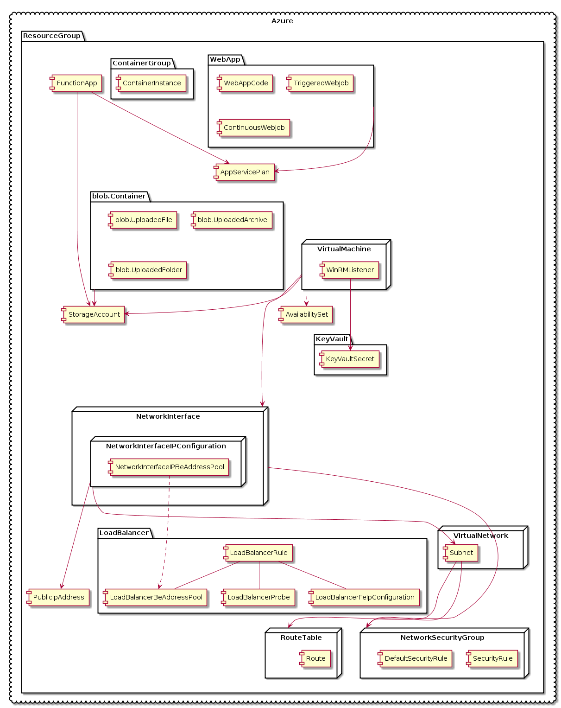

The XL Deploy Azure plugin enables XL Deploy to work with the Microsoft Azure cloud computing service. It allows you to provision Virtual Machines, Containers, and deploy FunctionApp and WebApp.

For information about requirements and the configuration items (CIs) that the Azure plugin provides, refer to the [Azure Plugin Reference](/xl-deploy-xld-azure-plugin/latest/azurePluginManual.html).

## Features

* Create resource groups and storage accounts
* Define security groups and security rules associated with them
* Setup public IP addresses
* Define virtual networks (VNet) and their route tables
* Provision virtual machines associated to their network interface (NIC) and deploy applications to those virtual machines
* Support Windows virtual machines (VMs)
* Automatically destroy machines during undeployment
* Leverage the *Blob Storage* scalable object storage for unstructured data
* Create web apps with built-in auto-scale and load balancing
* Create function apps based on an event-driven, serverless compute experience
* Run containers (ACI) without managing virtual machines
* Safeguard cryptographic keys and other secrets using Key Vault
* Configure load balancer (Layer 4 TCP and UDP) to deliver high availability and network performance to your applications
* Deploy network configurations such as virtual networks (VNets), subnets, routing tables, network interfaces, and public IP addresses
* Deploy load balancing configurations such as load balancers and availability sets
* Deploy storage configurations such as storage accounts, blob containers
* Deploy content to blob containers
* Deploy security configurations such as security groups and associate security roles with them
* Configure app service plans and deploy web apps and web jobs
* Deploy functions to Azure Functions
* Deploy container groups and containers to Azure Container Instance

This is a diagram representing all the resource types XL Deploy Azure plugin supports and their dependencies:

