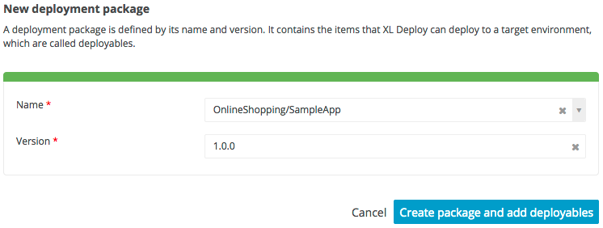
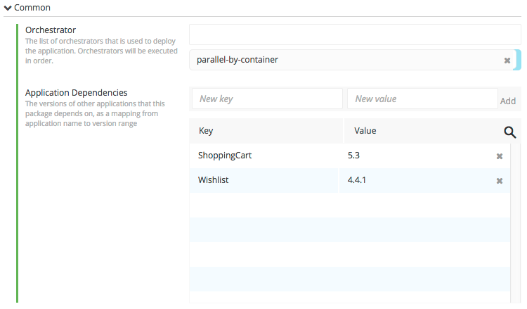

To deploy an application with XL Deploy, you must supply a deployment package. It contains the files (artifacts) and middleware resources that XL Deploy can deploy to a target environment.

You can add a deployment package to XL Deploy by creating it in the XL Deploy interface or by importing a Deployment Archive (DAR) file. A DAR file is a ZIP file with the `.dar` file extension. It contains the files and resources that make up a version of the application, as well as a manifest file (`deployit-manifest.xml`) that describes the package content.

## Create a package using the legacy GUI

To create a package in the XL Deploy legacy GUI:

1. In the top menu, click **Deployment**.
1. Click  under **Packages**.
1. Click **Create package**. The New deployment package screen appears.
1. In the **Name** box, enter the name of the application. If you want to create the package in a new or existing directory, include it in the name.
1. In the **Version** box, enter the version of the deployment package.

    

1. Click **Create package and add deployables**.
1. To add a file (artifact) to the package, click . The Add File window appears.
    1. Click **Browse** and locate the file on your computer.
    1. Optionally enter a new name for the file in the **Name** box.
    1. From the **Type** list, select the file type. For example, if it is a WAR file, you would select the `jee.War` type.
    1. Provide values for the file type properties. Required properties are marked with a red asterisk.
    1. Click **Create**. Repeat this process for all files that you want to add.

        

1. To add a middleware resource to the package, click . The Add Resource window appears.
    1. Enter the name of the resource in the **Name** box.
    1. From the **Type** list, select the resource type. For example, if it is a specification for an Apache virtual host, you would select the `www.ApacheVirtualHostSpec` type.
    1. Provide values for the resource type properties. Required properties are marked with a red asterisk.
    1. Click **Create**. Repeat this process for all resources that you want to add.

        

1. Optionally specify orchestrators for the package. Orchestrators determine the overall flow of a deployment; for example, they can control whether a package is deployed to middleware containers sequentially or in parallel.
1. Optionally set dependencies between this version and other application versions.

    

1. Click **Finish Configuring**. The Deployment screen appears. The package appears under **Packages**.

## Import a package

You can import a deployment package from an external storage location, your computer, or the XL Deploy server.

To import a package using the default GUI:

In the left pane, hover over **Applications**, click  and select **Import**. You can select one of three options:
1. From URL
    1. Enter the URL.
    1. If the URL requires authentication, enter the required user name and password.
    1. Click **Import**.
1. From your computer
    1. Click **Browse** and locate the package on your computer.
    1. Click **Import**.
1. From XL Deploy server
    1. Click in the field and select the package from the list.
    1. Click **Import**.

To import a package using the legacy GUI:

1. In the top menu, click **Deployment**.
1. Click  under **Packages**.
1. Click **Import package**.
1. To import a package from a location that is accessible via a URL:
    1. Expand **Import a deployment package from url**.
    1. Enter the URL.
    1. If the URL requires authentication, enter the required user name and password (supported in XL Deploy 5.1.0 and later).
    1. Click **Import**.
1. To import a package from your computer:
    1. Expand **Import a deployment package from disk**.
    1. Click **Browse** and locate the package on your computer.
1. To import a package from the XL Deploy server:
    1. Expand **Import deployment package from server**.
    1. Select the package from the list.
    1. Click **Import**.
1. After the import is complete, click  to close the window. The Deployment screen appears. The package appears under **Packages**.
