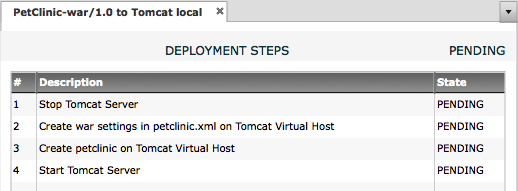
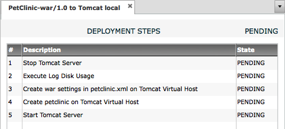
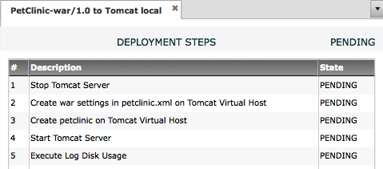
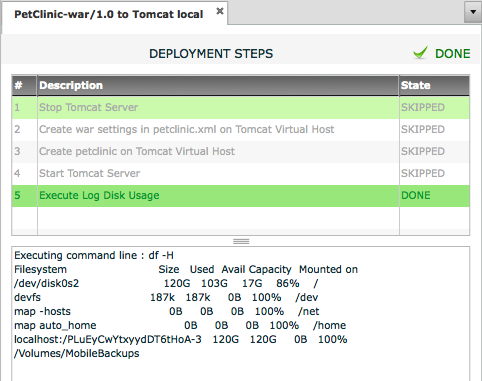

For a deployment, XL Deploy calculates the step list based on your model. But what if you want to add an extra step? There are several ways to do this. This topic will explain a simple case: executing a remote shell command on a server.

In this example we will show how to add a step to log the disk usage using the `df` command. We will do this using the [Command plugin](/xl-deploy/concept/command-plugin.html).

## When to use the Command plugin

As said, you can add a step to the step list in several ways. Choosing the command plugin has the following implications:

 * The command is part of a deployment, so the command must be mapped to the particular hosts you want to run it on.
 * The command must be independent of the environment, since the same package (and command) may be deployed to multiple environments.
 * This approach automatically scales to environments with one or more hosts (i.e. using the auto-map button, you get the disk usage of every host in the environment)

## Setup

We will assume a simple setup for the PetClinic WAR, that will be deployed to a Tomcat server. When doing a deployment, we have the following steps.

To monitor the target server's disk, we want to add a step that displays the output of the `df` command at the end of the step list.

We will add this step in three stages:

1. Use to UI to add a command to the application
2. Test and refine the command
3. Add the command to the Manifest file, so it will be packaged for subsequent versions of the application.

We will be adding the command using the Command Plugin. Make sure the `command-plugin-X.jar` is copied to the `plugins` folder of the XL Deploy Server home directory.

## Adding the command in the UI

Go to the Repository tab, find the PetClinic-war under Applications, and right-click a *version* to add a new command. Select **New** > **cmd** > **cmd.Command**.

Name the command 'Log Disk Usage' and set the command line to `df -H`.

Save the command.

## Testing and refining the command

Go to the Deployment tab and start a deployment of the version you just added the command to. In our case, that would be deploying PetClinic war 1.0 to Tomcat.

Note that the command will be mapped to an **Overthere Host**, so make sure the environment you deploy to contains the `overthere.SshHost` (or equivalent) Tomcat is running on.

When doing a deployment, we will see that the step has been added:

Don't start the deployment just yet; we want to to move the step to the end, so we will see the disk usage *after* deployment.

The steps in the step list are ordered by weight. Plugins contribute steps with order values between 0 and 100. So if we want to move the step to the end of the list, we have to change the order value to 100.

Go to the Repository tab and open the Log Disk Usage command. Change Order to '100' and save. Now redo the deployment and we will see that the step has moved:

When executing the deployment, we will see the output of the `df` command in the logs:

## Adding the command to the manifest

We did our changes in the UI, because it's easier to see what's going on and the development cycle (edit-test-refine) is faster. But now we want to make the changes more permanent, so other versions of the same application can use it as well. We do this by editing the Manifest.MF file, that is used to create the application package DAR file.

This is how the above example looks like in Manifest format:

    Name: Log Disk Usage
    CI-name: Log Disk Usage
    CI-type: cmd.Command
    CI-commandLine: df -H
    CI-order: 100

You will need to add this snippet to your Manifest, so the next time you create a DAR package, the Log Disk Usage command is included.
