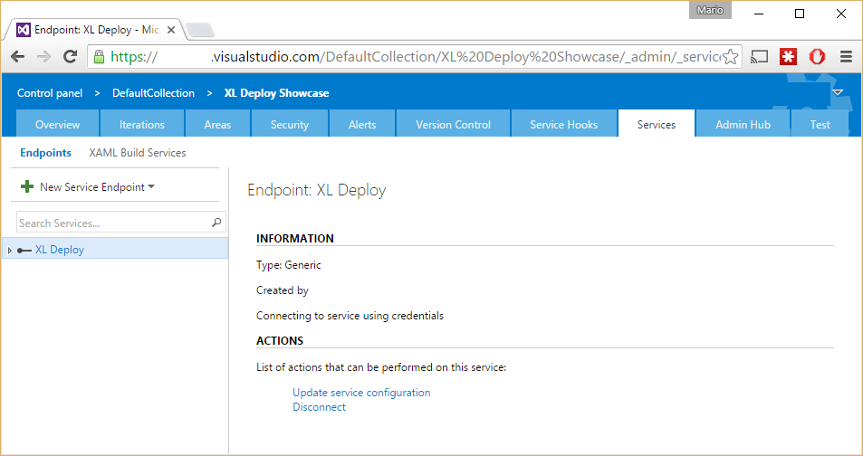
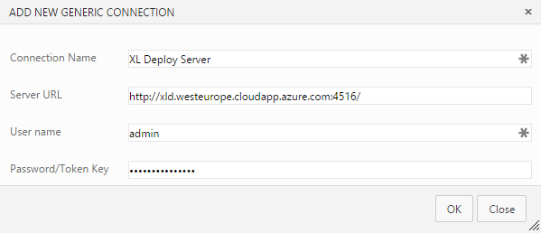

The [XL Deploy extension for Microsoft Team Foundation Server (TFS) 2015](/xl-deploy/concept/team-foundation-server-2015-plugin.html) provides automated deployment functionality through an XL Deploy build task for Microsoft TFS 2015 and Visual Studio Team Services (VSTS), which is also known as Visual Studio Online.

To get started, you must [upload the XL Deploy build task](/xl-deploy/how-to/install-a-build-task-in-tfs-2015.html) to your on-premises TFS or to your VSTS server. This task connects to XL Deploy through an endpoint. In TFS 2015 and VSTS/VSO, endpoints are managed in a common place. This means you do not have to create endpoints in build tasks multiple times, making maintenance and centralized credentials management easier.

You create endpoints on a per-project basis. To create an XL Deploy endpoint:

1. In the project control panel, go to the **Services** tab.

    

1. Click **New Service Endpoint** and choose **Generic**.

    

1. In the **Connection Name** box, enter a meaningful connection name such as *XL Deploy Server*.
1. In the **Server URL** box, enter a URL such as *http://my.xld.instance.com:4516/*. Ensure that the URL includes the correct port number.
1. In the **User name** and **Password/Token Key** boxes, enter the user name and password that should be used to authenticate with XL Deploy.
1. Click **OK**.

Now you can refer to this endpoint from an XL Deploy build task.

For more information, refer to [Introduction to the VSTS/TFS plugin](/xl-deploy/concept/team-foundation-server-2015-plugin.html).
