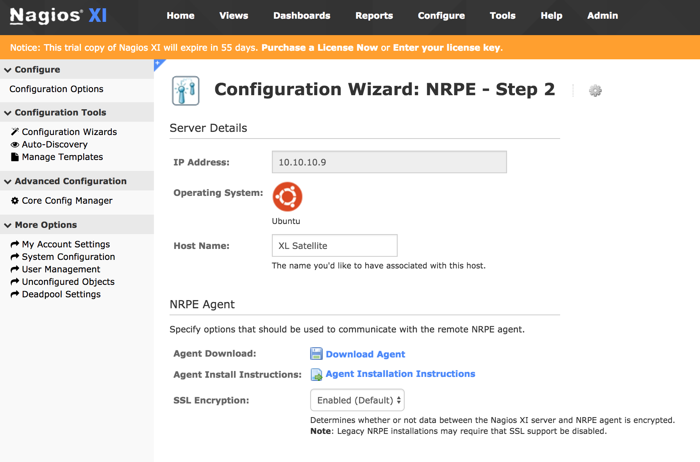

This topic provides an example showing how to configure [Nagios](https://www.nagios.org/) to pick up JMX counters from XL Satellite. Fore more information on how to setup and use JMX counters with XL Satellite, refer to [Using JMX counters for XL Satellite](/xl-deploy/how-to/using-jmx-counters-for-xl-satellite.html).

Setting up XL Satellite JMX counters with Nagios requires a Nagios Server with Web UI and the setup of a Nagios Remote Plugin Executor (NRPE) agent on the machine running the Satellite JMX agent.

## Setup the NRPE agent

* To setup the NRPE agent, follow the steps in the [Nagios documentation](https://support.nagios.com/kb/article/nrpe-how-to-install-nrpe-v3-from-source.html) corresponding to the OS of the XL Satellite server machine. To setup NRPE with SSL, follow the steps mentioned [here](https://support.nagios.com/kb/article.php?id=519).

* To verify that the installation is working on the XL Satellite machine, execute the following command from the machine running Nagios Server:

      /usr/local/nagios/libexec/check_nrpe -H <IP_ADDRESS_OF_SATELLITE_SERVER>

If the installation was successful, you should see this response:

    NRPE v3.2.1

After NRPE is successfully installed, install the `check_jmx` plugin that monitors any java `object/attribute` accessible through JMX, including the Satellite counters.

* To install the the `check_jmx` plugin, open a terminal and execute the following commands:

      cd /usr/local/nagios/libexec/
      wget -O check_jmx "https://raw.githubusercontent.com/WillPlatnick/jmxquery/master/plugin/check_jmx"
      wget -O jmxquery.jar "https://github.com/WillPlatnick/jmxquery/raw/master/plugin/jmxquery.jar"
      chmod +x *jmx*
      chown nagios:nagios *jmx*

* If the JMX agent on the XL Satellite server has SSL enabled, execute the following steps:
1. Copy the SSL `truststore` to `/usr/local/nagios/libexec/`
1. Change the permissions on `truststore` to user `nagios`:

          chmod +x <trustore_file_name>
          chown nagios:nagios <trustore_file_name>

1. Change the content of `/usr/local/nagios/libexec/check_jmx` to:

          #!/bin/sh
          #
          # Nagios plugin to monitor Java JMX (http://java.sun.com/jmx)attributes.
          #

          RDIR=`dirname $0`
          JMX_SSL_OPS='-Djavax.net.ssl.trustStore='$RDIR'/<trustore_file_name> -Djavax.net.ssl.trustStorePassword=<trustore_password>'
          java $JMX_SSL_OPS -jar $RDIR/jmxquery.jar "$@"

**Note:** Replace <trustore_file_name> and <trustore_password> with the actual values.

* Test the `check_jmx` plugin from the Nagios Server by executing this command:

      /usr/local/nagios/libexec/check_jmx -U service:jmx:rmi:///jndi/rmi://<satellite_host>:<jmx_port>/jmxrmi -O com.xebialabs.satellite.metrics:name=task.done -A Count

The sample output:

    JMX OK Count=0 | Count=0

## Configure the NRPE agent

* To execute the `check_jmx` plugin, you must define a command for this plugin in the `nrpe.cfg` file on the Satellite server. Edit the `/usr/local/nagios/etc/nrpe.cfg` file by executing the following command:

        vi /usr/local/nagios/etc/nrpe.cfg

Add the following line to the end of the file:

    command[check_jmx]=/usr/local/nagios/libexec/check_jmx $ARG1$

* Restart the NRPE service on satellite server. To restart the NRPE service, refer to the documentation for the NRPE agent installation.

* To test the check from the Nagios server, establish a terminal session to your Nagios server and execute the following command:

        /usr/local/nagios/libexec/check_nrpe -H <satellite_host> -c check_jmx -a '-U service:jmx:rmi:///jndi/rmi://<satellite_host>:<jmx_port>/jmxrmi -O com.xebialabs.satellite.metrics:name=task.done -A Count'

Make sure you replace <satellite_host> with the IP address of your Xl Satellite server.

The sample output:

      JMX OK Count=0 | Count=0

## Create the monitoring configuration in the Nagios Web UI  

* Open the Nagios Web UI, in the top menu bar, go to **Configure** > **Run a configuring wizard**, and select the NRPE wizard.

* On *Step 1*,  specify the address and the OS type of the Satellite server.

* On *Step 2*, specify the host name.

**Note:**  Skip the NRPE agent installation step because it was already done.

* In the **command args** fields, specify the following command arguments:

For **Satellite Task Done**

    '-U service:jmx:rmi:///jndi/rmi://10.10.10.9:1099/jmxrmi -O com.xebialabs.satellite.metrics:name=task.done -A Count'

For **Satellite Task Active**

    '-U service:jmx:rmi:///jndi/rmi://10.10.10.9:1099/jmxrmi -O com.xebialabs.satellite.metrics:name=task.active -A Count'

    

Click **Next** and complete the wizard by choosing the required options in Steps 3 to 5. Click **Finish** in the final step of the wizard. This creates the new hosts and service and begins monitoring.

After the wizard applies the configuration, click the **View status details** for the XL Satellite link to see the new host and service that was created.    

