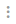

XL Deploy keeps all active tasks in the Task Monitor, which is located under the search bar at the top left of the screen.

Executed tasks are archived when you manually click **Close** or **Cancel** on the task. As of XL Deploy 6.0.0, you can define a custom task archive policy that will automatically archive tasks that are visible in the **Task Monitor**.

## Automatically archive active tasks

To automatically archive active tasks according to a policy:

1. From the side bar, click **Configuration**
2. Click , then select **New** > **Policy** > `policy.TaskArchivePolicy`.
3. In the **Name** field, enter a unique policy name.
4. In the **Days to retain tasks** field, enter the number of days that XL Deploy should retain tasks. If 0 days is specified, all active tasks are subject to archiving.    

**Note:** By default, automatic policy execution is enabled and will run according to the crontab schedule defined in the **Schedule** section. You can optionally change the crontab schedule or disable policy execution.     

**Note:** By default, successfully executed active tasks and failed tasks are archived. This can be changed from the **Common** section by toggling the **Include executed tasks** and **Include failed tasks** options.     

**Tip**: You can manually execute a task archive policy by right-clicking it and selecting **Execute job now**. To test the policy by running it without removing tasks: from the **Schedule** section, select **Dry run policy**.
