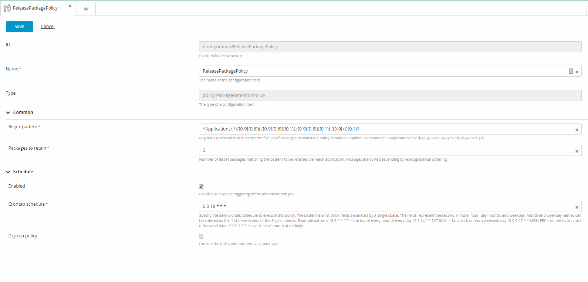

In XL Deploy 5.0.0 and later, you can create a package retention policy (`policy.PackageRetentionPolicy`) removes all deployment packages except the last N packages that match a regular expression that you define. Packages are sorted in lexicographical order.

Deployed packages are never removed by the package retention policy. If a deployed package is part of the packages identified for removal, then it will be skipped (with no impact on the other packages).

**Note**: Executing a package retention policy does not automatically reclaim disk space freed up by removing the packages. Please see [Reclaim disk space on an XL Deploy server](/xl-deploy/how-to/reclaim-disk-space-on-an-xl-deploy-server.html) for more information.

## Automatically purge deployment packages

To automatically purge old deployment packages according to a policy:

1. From the side bar, click **Configuration**
1. Click , then select **New** > **Policy** > `policy.PackageRetentionPolicy`.
1. In the **Name** field, enter a unique policy name.
1. In the **Regex pattern** field, specify a regular expression that matches the packages to which the policy should apply.
1. In the **Packages to retain** field, enter the number of deployment packages to retain per application.

**Note:** By default, automatic policy execution is enabled and will run according to the crontab scheduled defined on the **Schedule** tab. You can optionally change the crontab schedule or disable execution.

**Tip**: You can manually execute a package retention policy by right-clicking it and selecting **Execute job now**.

## Creating multiple package retention policies

You can create multiple package retention policies. For example:

**ReleasePackagePolicy**

* Regex pattern: `^Applications/.*/\d{1,8}(?:\.\d{1,6})?(?:\.\d{1,6})?(?:-\d+)?$`
* Packages to retain: 30
* Schedule: `0 0 18 * * *`

**SnapshotPackagePolicy**

* Regex pattern: `^Applications/.*/\d{1,8}(?:\.\d{1,6})?(?:\.\d{1,6})?(?:-\d+)?-SNAPSHOT$`
* Packages to retain: 10
* Schedule: `0 0 18 30 * *`

**Important:** Package retention policies are executed independently, so ensure that you define a regular expression that excludes packages that are covered by other policies.

### Example

An application has the following deployment packages:

* **1.0**
* **2.0**
* **3.0**
* **3.0-SNAPSHOT**
* **4.0**
* **5.0**

Package **1.0** is deployed to the PROD environment and **4.0** is deployed to the DEV environment.

Assuming a package retention policy that retains the last 3 packages and uses the ReleasePackagePolicy regular expression pattern defined above, the packages to be removed will be: **2.0**.
