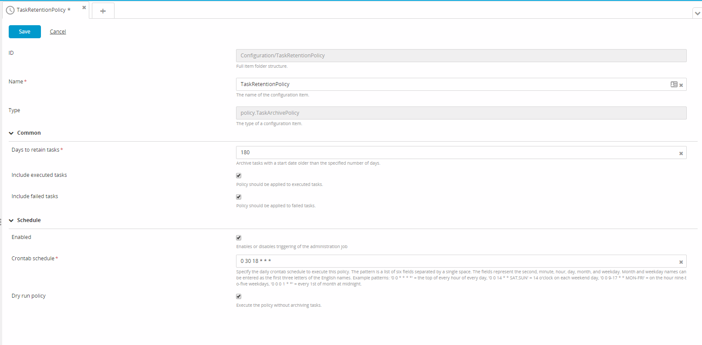

XL Deploy records and archives information about all tasks that it executes. This information is available through the statistics, graphs, and task archives on the **Reports** screen.

By default, all historical data is kept in the system indefinitely. As of XL Deploy 5.0.0, you can define a custom task retention policy if you do not want to retain an unlimited task history and/or if you want to reclaim the disk space it requires.

**Note:** The record of all tasks that started before the specified retention date will be removed from the archive and will no longer be visible in XL Deploy reports.

## Automatically purge the task archive

To automatically purge tasks according to a policy:

1. From the side bar, click **Configuration**
1. Click , then select **New** > **Policy** > `policy.TaskRetentionPolicy`.
1. In the **Name** field, enter a unique policy name.
1. In the **Days to retain tasks** field, enter the number of days that XL Deploy should retain tasks. If 0 days is specified, all active tasks are subject to archiving.    

**Note:** By default, automatic policy execution is enabled and will run according to the crontab schedule defined in the **Schedule** section. You can optionally change the crontab schedule or disable policy execution.     

**Note:** By default, purged tasks are exported to a ZIP file in `XL_DEPLOY_SERVER_HOME/exports`. You can optionally specify a different directory in the **Archive path** property on the **Export** tab.

    The property accepts `${ }` placeholders, where valid keys are CI properties with addition of `execDate` and `execTime`.

    
