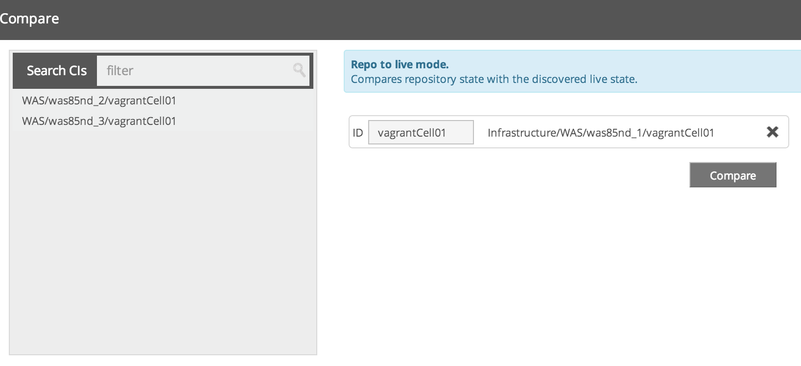

The XL Deploy Compare feature allows you to compare two or more configuration item (CI) trees. That means, in addition to comparing the chosen configuration items, it recursively traverses the CI tree and compares each CI from one tree with matching configuration items from other trees.

The Compare feature only compares discoverable CIs. You can use the CI comparison function that is available in the Repository to compare any configuration items, discoverable or not. Also, the Compare feature can compare CI trees, while the CI comparison function in the Repository can only compare CIs on a single level.

## Types of CI tree comparisons

The Compare screen supports two kinds of CI tree comparisons:

* **Live-to-live**: Compare multiple live discoverable CIs of the same type. For example, you can see how the WebSphere topology in your test environment compares to the one in your acceptance environment or production environment.

* **Repo-to-live**: Compare a discoverable CI (and its children) present in the XL Deploy repository to the one running on a physical machine and hosting your applications. This enables you to identify discrepancies between XL Deploy repository CIs and the actual ones.

## Live-to-live comparison

The live-to-live comparison *discovers* CIs and then compares the discovery results. For example, when you compare two IBM WebSphere Cells, XL Deploy first recursively discovers the two Cells (Node Managers, Application Servers, Clusters, JMS Queues, and so on), and then compares each discovered item of first Cell to the corresponding discovered CI of the second Cell.

You can compare up to four discoverable CIs at once.

To start a live-to-live comparison, select two or more discoverable configuration items from the CI selection list. This list only contains discoverable CIs, such as `was.DeploymentManager`, `wls.Domain`, and so on.

The selected CIs appear to the right of the selection list, with CIs listed in the order of selection. XL Deploy preserves the same order for showing the comparison report.

You can optionally enter custom names for each selected CI. XL Deploy uses these custom names in the comparison report, instead of the original CI names.

### Which CIs are compared?

XL Deploy always considers the discoverable CIs (the ones you select for comparison) to be comparable. When you click **Compare**, XL Deploy first discovers the selected CIs, resulting in a tree-like structure of CIs for each discovered CI. Then, XL Deploy compares each discovered item from one tree with a *comparable* item from the other trees.

XL Deploy considers two or more configuration items as comparable only when all of the following conditions are met:

 * They have the same `type`.
 * They have the same `name`.
 * They have comparable parents; that is, the conditions above recursively hold true for the parents. For example, XL Deploy will not consider a CI with ID `/root1/b/c/d` equivalent to another configuration item with ID `/root2/b/d`, even though they both have the name `d`. This is because the first CI is under `c`, while the other one is under `b`.

### Live-to-live comparison example

As an example, consider the following scenario:

 1. You selects `cell-dev` and `cell-test` CIs for comparison and click **Compare**.
 2. XL Deploy discovers `cell-dev` with discovery result `[cell-dev/server1, cell-dev/server-dev, cell-dev/cluster1]`.
 3. XL Deploy discovers `cell-test` with discovery result `[cell-test/server1, cell-test/server-test, cell-test/cluster1]`.
 4. XL Deploy compares these two lists.

Now, by following the default comparability rules (equal name and comparable parents) explained above, XL Deploy performs the following comparisons:

 * `cell-dev` is compared to `cell-test` because starting point discoverables are always comparable
 * `cell-dev/server1` is compared to `cell-test/server1` because they have equal names and comparable parents
 * `cell-dev/server-dev` is not compared because it is missing under `cell-test`
 * `cell-dev/cluster1` is compared to `cell-test/cluster1` because they have equal names and comparable parents
 * `cell-test/server-test` is not compared because it is missing under `cell-dev`

### Match expressions

XL Deploy allows you to add custom matching expressions in a file called `compare-configuration.xml`, which must be place in the XL Deploy classpath. If you change `compare-configuration.xml`, you do not need to restart the XL Deploy server.

This is a sample `compare-configuration.xml` file:


<compare-configurations>
    <compare-configuration type="was.Server">
        <match-expression>lhs.name[:lhs.name.rindex("-")] == rhs.name[:rhs.name.rindex("-")]</match-expression>
    </compare-configuration>
    <compare-configuration type="was.Cluster">
        <match-expression>lhs.name[:lhs.name.rindex("-")] == rhs.name[:rhs.name.rindex("-")]</match-expression>
    </compare-configuration>
</compare-configurations>


Note the following about `compare-configuration.xml`:

* Only one match expression per configuration item *type* is allowed.
* Match expressions are Python expressions. You can use any Python expression that will return a Boolean result (matched or not matched).
* At run time, the match expressions are evaluated against the CIs (`lhs` and `rhs`) to determine their comparability.

    You must use `lhs` and `rhs` in the expressions to refer to the CIs.

* You can access CIs' public properties using the standard dot (`.`) notation. For example, the default comparability
   condition "should have same name" can be expressed in the match expression `lhs.name == rhs.name`.

In the scenario described above, `cell-dev/server-dev` and `cell-test/server-test` were not compared because of different names. You can make them comparable by specifying a match expression such as:

    
lhs.name[:lhs.name.rindex("-")] == rhs.name[:rhs.name.rindex("-")]


This match expression checks the comparability of CIs by considering only the part of name before `-`, so `server-dev` and `server-test` become comparable.

## Repo-to-live comparison

Repo-to-live comparison compares a Repository state to the live state. For example, you can use this functionality to determine if a configuration was changed manually in the middleware without the changes being made in XL Deploy.

To start a repo-to-live comparison, select one discoverable CI from the CI selection list and click **Compare**.

XL Deploy retrieves the CI topology (the CI and its children) from the Repository, discovers the topology from its live state, and then compares the two topology trees.

Because repo-to-live only compares two states of a single topology, the match expressions described above do not apply.

## Comparison report

The comparison report appears in a tabular format with each row corresponding to a discovered CI. By default, all rows in the table are collapsed. A check mark to the right a row indicates that the CIs are the same in all compared trees, while an exclamation mark indicates that there are differences.

Click a row to see a property-by-property comparison result for the CI represented by the row.

The first column specifies the property names and the remaining columns show the property values corresponding to each discoverable configuration item. This is a sample comparison report:

Note the following:

* **Discoverables and labels**: The upper left table showing the selected configuration items and their labels.
* **Path**: The ID of a configuration item relative to the ID of its root discoverable CI.
* **Dash (-)**: The item is null or missing. For example, the Oracle JDBC Driver CI `nativepath` property under `Cell1` has no value.
* **Color and differences**: Green underscore text indicates additional characters, while red struck-through texts indicates missing characters. The first available value is used as the benchmark for the comparison. For example, in the image above, the `nativepath` value under `Cell2` is used as the benchmark.
