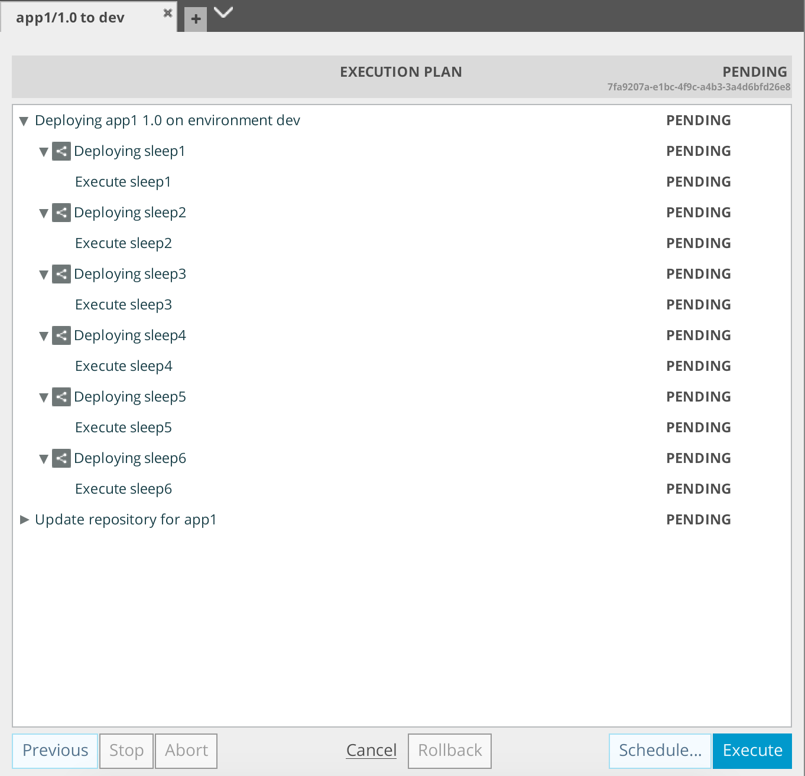
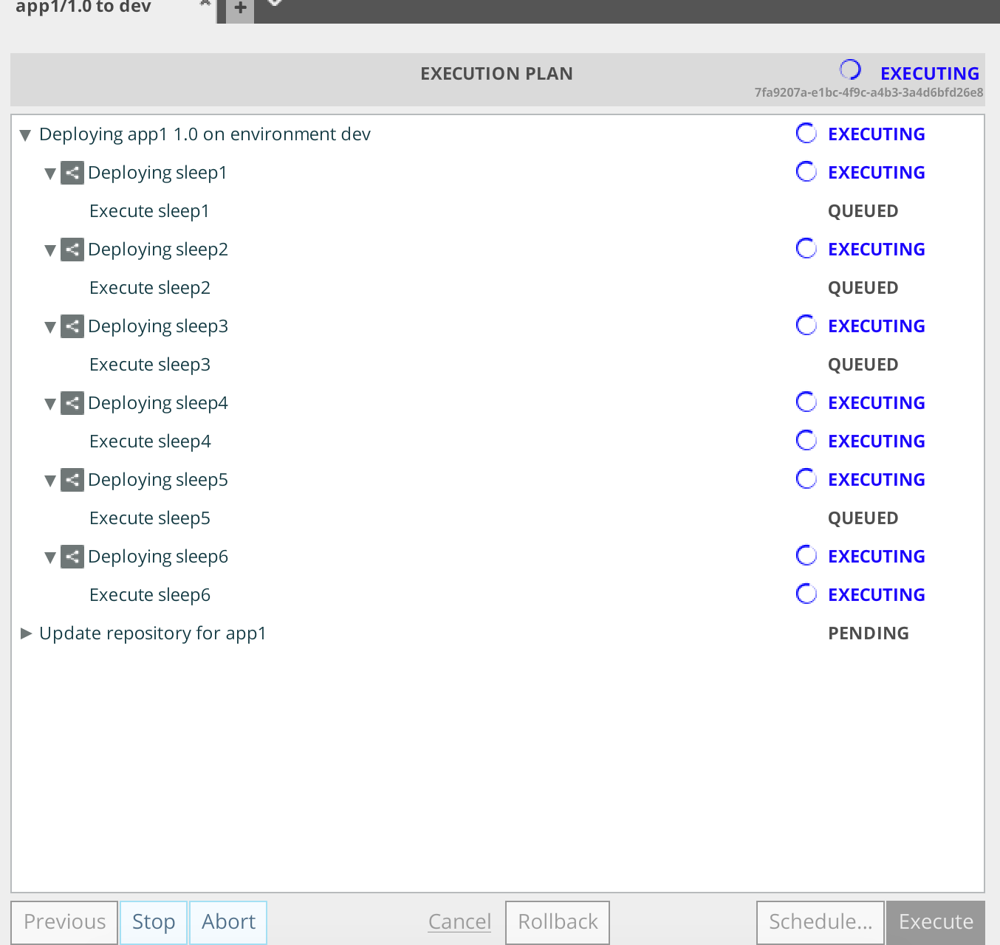

In XL Deploy, deployment tasks are executed by the task execution engine. Based on your deployment task, the task execution engine generates a deployment plan that contains steps that XL Deploy will cary out to deploy an application.

## Tuning the task execution engine in XL Deploy 6.0.0 and later

In XL Deploy 6.0.0 and later, you can tune the XL Deploy task execution engine with the following settings in `XL_DEPLOY_SERVER_HOME/conf/system.conf`:

{:.table .table-striped}
| Setting | Description | Default |
| ------| ----------| ------|
| `task.shutdown-timeout` | Time to wait for the task engine to shut down. | 1 minute |
| `task.max-active-tasks` | Maximum number of simultaneous running tasks allowed in the system. If this number is reached, the tasks will appear as `QUEUED` in the Task Monitor. Each `QUEUED` task will automatically start after a running task completes. | 100 |
| `task.recovery-dir` | Name of the directory in `XL_DEPLOY_SERVER_HOME` where task recovery files are stored. | `work` |
| `task.step.retry-delay` | Time to wait before rerunning a step that returned a `RETRY` exit code. | 5 seconds |

 You can configure the thread pool that is available for step execution in `XL_DEPLOY_SERVER_HOME/conf/system.conf`:

{:.table .table-striped}
| Setting | Description | Default |
| ------| ----------| ------|
| `task.step.execution-threads` | Amount of threads in the pool. | 32 |

**Important:** Threads are shared by all running tasks in the system; they are not created per deployment.

### Task execution example

To understand how these values impact task execution, consider a simple example. Assume there is an application that contains six deployables, all of type `cmd.Command`. Each one is configured with a command to sleep for 15 seconds.

In `XL_DEPLOY_SERVER_HOME/conf/system.conf`, set the `step.execution-threads` property to `2`:

    task.step.execution-threads=2

Restart the XL Deploy server so the settings take effect.

After the server starts, set up a deployment of the application to an environment. In the **Deployment Properties**, set the orchestrator to `parallel-by-deployed`. This ensures that the deployment steps will be executed in parallel. Your deployment will look like:

Click **Execute** to start the execution. Because the core pool size is `2`, only two threads will be created and used for step execution. The XL Deploy execution engine will start executing two steps and the rest of the steps will be in a queued state:

After the two executing steps are done, the next two steps will be picked for execution. So, two steps are executed at a time. Note that in order for this example to work, no other tasks can be executing at the same time.

**Important:** This simple example assumes that there is only one task running in the system at a time. Keep in mind that threads are shared among all tasks in the system; they are not created per deployment.

## Tuning the task execution engine prior to XL Deploy 5.0.0

Prior to XL Deploy 5.0.0, you could configure the following advanced threading settings in `XL_DEPLOY_SERVER_HOME/conf/deployit.conf`:

{:.table .table-striped}
| Setting | Description | Default |
| ------| ----------| ------|
| `taskThreadPool.corePoolSize` | Minimum number of threads allocated to execute tasks (setting has no effect in XL Deploy 5.5.x) | 10 |
| `taskThreadPool.maxPoolSize` | Maximum number of threads allocated to execute tasks (setting has no effect in XL Deploy 5.5.x) | 2147483647 |
| `taskThreadPool.keepAliveSeconds` | Number of seconds a task thread is kept alive before destroying it if the number of allocated threads exceeds | |
| `taskThreadPool.queueCapacity` | Capacity of the queue that holds tasks to be executed if no threads are available | 2147483647 |

You must restart the XL Deploy server after changing these settings.
