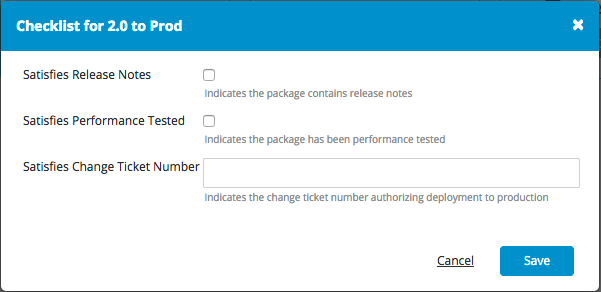
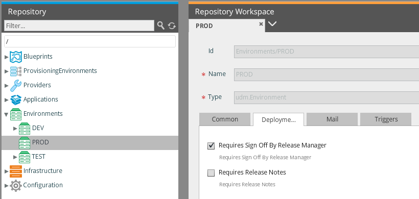

To ensure the quality of a deployment pipeline, you can optionally associate environments in the pipeline with a checklist that each deployment package must satisfy before being deployed to the environment. This topic describes how to create a deployment checklist for an environment.

**Tip:** For an application to appear on the release dashboard, it must be associated with a [deployment pipeline](/xl-deploy/how-to/create-a-deployment-pipeline.html).

## Step 1 Define checklist items on `udm.Environment`

Start by defining all of the items that you want to be able to add to a deployment checklist as type modifications on configuration item (CI) types in the `synthetic.xml` file.

First, add each checklist item as a property on the `udm.Environment` CI. The property `name` must start with `requires`, and the `kind` must be `boolean`. The `category` can be used to group items.

For example:


<type-modification type="udm.Environment">
  <property name="requiresReleaseNotes" description="Release notes are required" kind="boolean" required="false" category="Deployment Checklist" />
  <property name="requiresPerformanceTested" description="Performance testing is required" kind="boolean" required="false" category="Deployment Checklist" />
  <property name="requiresChangeTicketNumber" description="Change ticket number authorizing deployment is required" kind="boolean" required="false" category="Deployment Checklist" />
</type-modification>


## Step 2 Define corresponding properties on `udm.Version`

Then, add a corresponding property to the `udm.Version` CI type. This means that all deployment packages will have a property that can satisfy the checklist item you created. The property `name` must start with `satisfies`. The `kind` can be `boolean`, `integer`, or `string`. In the case of an integer or string, the check will be satisfied if the field in the checklist is not empty.

For example:


<type-modification type="udm.Version">
  <property name="satisfiesReleaseNotes" description="Indicates the package contains release notes" kind="boolean" required="false" category="Deployment Checklist"/>
  <property name="rolesReleaseNotes" kind="set_of_string" hidden="true" default="senior-deployer" />
  <property name="satisfiesPerformanceTested" description="Indicates the package has been performance tested" kind="boolean" required="false" category="Deployment Checklist"/>
  <property name="satisfiesChangeTicketNumber" description="Indicates the change ticket number authorizing deployment to production" kind="string" required="false" category="Deployment Checklist">
    <rule type="regex" pattern="^[a-zA-Z]+-[0-9]+$" message="Ticket number should be of the form JIRA-[number]" />
  </property>
</type-modification>


Repeat this process for each checklist item that you want to be available for deployment checklists. Then, save the `synthetic.xml` file and restart the XL Deploy server.

### Assign security roles to checks

You can optionally assign security roles to checks. Only users with the specified role can satisfy the checklist item. You can specify multiple roles in a comma-separated list.

Roles are defined as extensions of the `udm.Version` CI type. The property name must start with `roles`, and the `kind` must be `set_of_string`. Also, the `hidden` property should be set to `true`.

**Note:** The `admin` user is always allowed to satisfy checks in a checklist.

## Step 3 Create a deployment checklist for an environment

After you define checklist items and make it possible for deployment packages to satisfy them, you can build a checklist for a specific environment. To do so:

1. Log in to XL Deploy.
1. Click **Explorer** in the top bar.
1. Expand **Environments** and double-click the desired environment.
1. Go to the **Deployment Checklist** tab and select each item that you want to include in that environment's checklist.

    

1. Click **Save**.
1. Expand an application with a [deployment pipeline](/xl-deploy/how-to/create-a-deployment-pipeline.html) that includes the environment that you just edited, then click one of the application versions.
1. On the environment tile, you can see the **Deployment checklist** option.

    

1. Click **Deployment checklist** to see the items.    

    

## Deployment checklist verification

Deployment checklists are verified at two points during a deployment:

* When a deployment is configured
* When a deployment is executed

When configuring a deployment, XL Deploy validates that all checks for the environment have been met for the deployment package you selected. This validation happens when XL Deploy calculates the steps required for the deployment.

Any deployment of a package to an environment with a checklist contains an additional step at the start of the deployment. This step validates that the necessary checklist items are satisfied and writes confirmation of this fact to the deployment log. This allows an administrator to verify these later if necessary.

### Verification on package import

The checks in deployment checklists are stored in the `udm.Version` CI. When you import a deployment package (DAR file), checklist properties can be initially set to `true`, depending on their values in the package's manifest file.

While this may be desired behavior, you may want XL Deploy to verify checklist properties on package import and to apply the same validations that it would upon deployment. You can configure XL Deploy to do so as of the following versions: XL Deploy 4.5.7, XL Deploy 5.0.6, XL Deploy 5.1.2, and XL Deploy 5.5.0.

In the hidden property `verifyChecklistPermissionsOnCreate` on `udm.Application`, set `hidden` to `false`:


<type-modification type="udm.Application">
    <property name="verifyChecklistPermissionsOnCreate" kind="boolean" hidden="false" required="false" description="If true, permissions for changing checklist requirements will be checked on import"/>
</type-modification>


Then you can control the behavior by setting the value to `true` or `false` on the application in the repository. `false` is the default behavior, and `true` means that the validation checks are done during import. Every `udm.Application` CI can have a different value.

**Tip:** If you want to configure this behavior but you have not yet imported any applications, create a placeholder application under which deployment packages will be imported, and set the value there.

### Create a deployment checklist for an environment using the legacy GUI

After you define checklist items and make it possible for deployment packages to satisfy them, you can build a checklist for a specific environment. To do so:

1. Log in to XL Deploy.
1. Click **Repository** in the top bar.
1. Expand **Environments** and double-click the desired environment.
1. Go to the **Deployment Checklist** tab and select each item that you want to include in that environment's checklist.

    

1. Click **Save**.
1. Click **Release Dashboard** in the top bar.
1. Expand an application with a [deployment pipeline](/xl-deploy/how-to/create-a-deployment-pipeline.html) that includes the environment that you just edited, then click one of the application versions.
1. Click the environment. You will see the checklist item is available.

    
