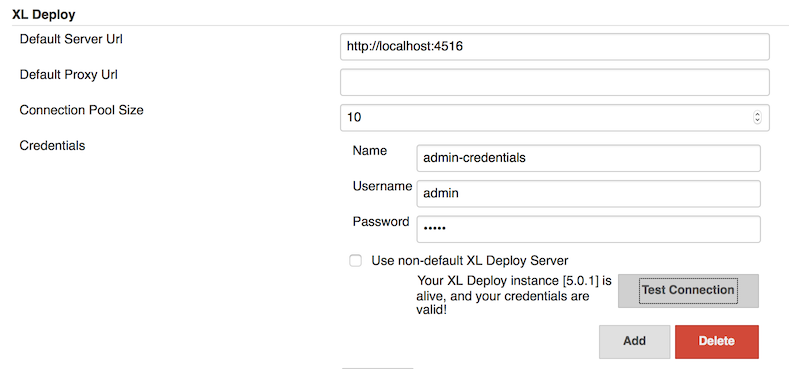
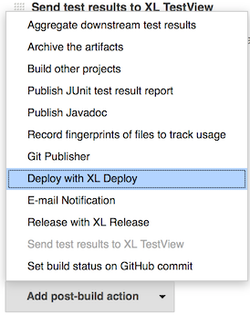
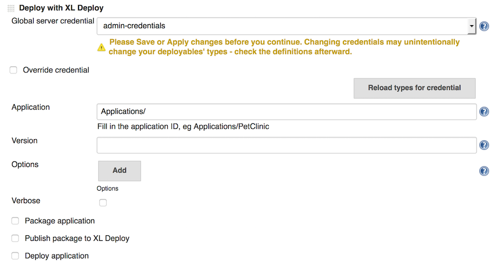
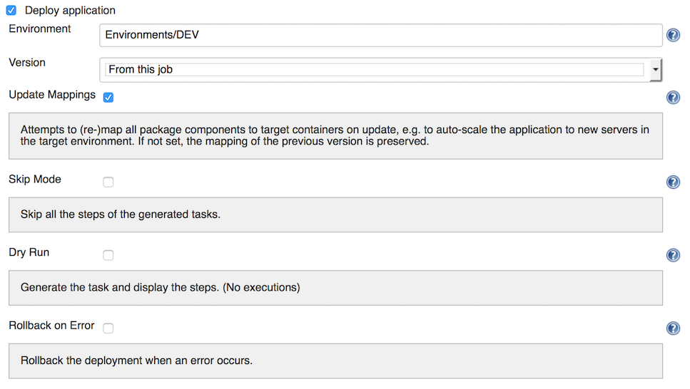

To enable continuous integration, XL Deploy can work with [Jenkins CI server](https://jenkins-ci.org/) through the [Jenkins XL Deploy plugin](https://wiki.jenkins-ci.org/display/JENKINS/XL+Deploy+Plugin). The plugin supports:

* Creating a deployment package containing artifacts from a build
* Publishing the package to an XL Deploy server
* Performing a deployment of the package to a target environment

## Configure the Jenkins plugin

After you install the XL Deploy plugin in Jenkins:

1. Go to **Manage Jenkins** > **Configure System**.
2. In the **XL Deploy** section, enter credentials for your XL Deploy server and test the connection.

    

    Note that you can add multiple XL Deploy credentials.

## Build a deployment package

In XL Deploy, a [deployment package](/xl-deploy/concept/preparing-your-application-for-xl-deploy.html#whats-in-an-application-deployment-package) contains the components that form your application; for example, web content, web server configuration, database scripts, compiled binaries such as .NET applications and Java Enterprise Edition (JEE) Enterprise Archive (EAR) files, and so on.

The XL Deploy Jenkins plugin allows you to provide the contents of your deployment package, and therefore define your application. This is done as a post-build action. Select the **Deploy with XL Deploy** post-build action:

The XL Deploy post-build action can create an XL Deploy Deployment ARchive (DAR file). First, provide basic information about the application. You can use Jenkins variables in the fields; for example, the version is typically linked to the Jenkins `$BUILD_TAG` variable, as in `1.0.$BUILD_TAG`.

**Note:** The Jenkins XL Deploy plugin cannot set values for hidden CI properties.

To add deployables to the package, select **Package Application**.

For artifacts, the **Location** field indicates where the artifact resides. For example, this can be the Jenkins workspace, a remote URI, or coordinates in a Maven repository.

You can add additional properties that are required for each artifact or resource.

**Tip:** For properties of type `MAP_STRING_STRING`, enter a single property value in the format `key1=value1`. You can enter multiple values using the format `key1=value1&key2=value2`.

### Updating configuration item types

If you modify existing configuration item (CI) types or add new ones in XL Deploy (for example, by installing a new plugin), be sure to click **Reload types for credential** in the post-build action. This reloads the CI types for the XL Deploy server that you have selected for the action. This prevents errors by ensuring that the most up-to-date CI types are available to the Jenkins job.

## Publish the deployment package to XL Deploy

To publish the package to XL Deploy, select **Publish package to XL Deploy**. You can can select the generated package or a package from another location (that is, from the file system or from an artifact repository). Note that the application must exist in XL Deploy before you can publish a package.

## Deploy the application

To deploy the application with XL Deploy, select the target environment and deployment options.

