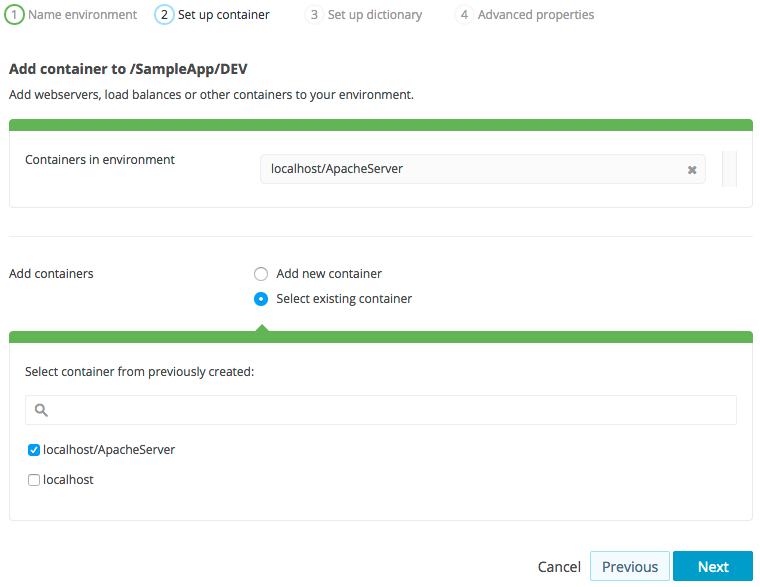
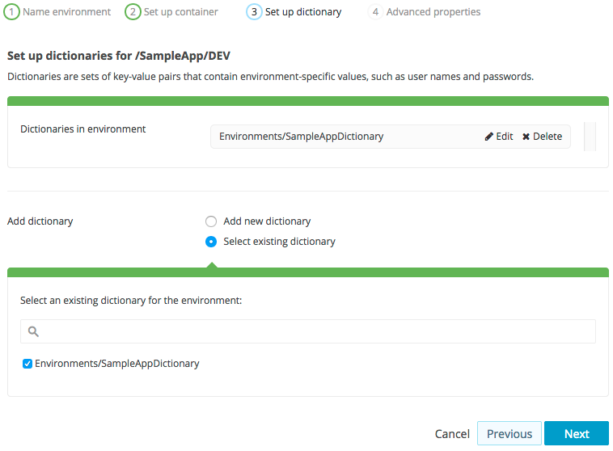
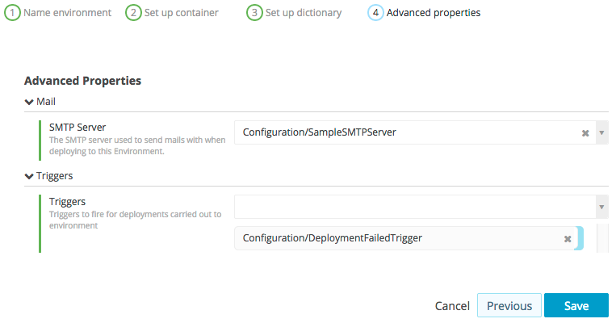

An environment is a grouping of infrastructure and middleware items such as hosts, servers, clusters, and so on. An environment is used as the target of a deployment, allowing you to map deployables to members of the environment.

You can associate dictionaries to environments; these are sets of key-value pairs that contain environment-specific information such as user names, passwords, and file paths.

To create an environment:

1. In the top menu, click **Deployment**.
1. Click . The XL Deploy Environments screen appears.
1. Click **Create environment**. The Name environment screen appears.
1. In the **Environment name** box, enter the name of the environment. If you want to create the environment in a new or existing directory, include it in the name.

    

1. Click **Next**. The Set up container screen appears.
1. To add a middleware container that has not already been set up in XL Deploy:
    1. Select **Add new container**.
    1. From the **Select type** list, select the type of container that you want to add. If the type depends on other container types, XL Deploy automatically adds them for you.
    1. To create a new container of this type, click . A new window in which you can specify the container's properties appears.
    1. To select a container that has already been set up in XL Deploy, click .

        

1. To add a middleware container that has already been set up in XL Deploy:
    1. Select **Select existing container**.
    1. Select the containers that you want to add. Use the search bar to search for containers.

        

1. After you have added the desired containers to the environment, click **Next**. The Set up dictionary screen appears.
1. To add a new dictionary:
    1. Select **Add new dictionary**.
    1. In the **Dictionary name** box, enter a unique name for the dictionary.
    1. In the **New key** and **New value** boxes, enter a key and its corresponding value. Click **Add** to add the key-value pair to the dictionary. Repeat this process for all key-value pairs that you want to add.
    1. Click **Add to environment** to add the dictionary to the environment.

        To add another new dictionary to the environment, repeat the same steps.

        

1. To add a dictionary that has already been defined in XL Deploy:
    1. Select **Select existing dictionary**.
    1. Select the dictionaries that you want to add. Use the search bar to search for dictionaries.

        

        **Tip:** The order of the dictionaries in an environment matters, because if the same entry exists in multiple dictionaries, then XL Deploy uses the first entry that it finds.

1. After you have added the desired dictionaries to the environment, click **Next**. The Advanced properties screen appears.
1. Optionally select an **SMTP Server** for the environment.

    XL Deploy uses this server to send an email notification when it reaches a manual process step in a deployment plan that involves this environment. A manual process step is a step that pauses the deployment so that you can take manual actions. When the manual actions are finished, you can resume the deployment.

1. Optionally select **Triggers** to add to the environment.

    You can use triggers to send email notifications for events that happen in this environment. For example, XL Deploy can send an email when a deployment to this environment completes successfully or when a step in the deployment plan fails. The email will be sent using the SMTP server that is assigned to the trigger.

    

1. Click **Save** to save the environment.
