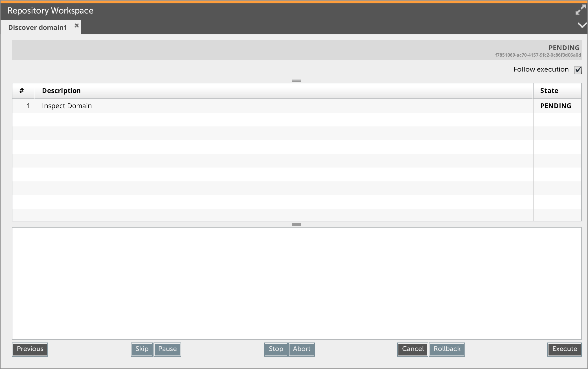
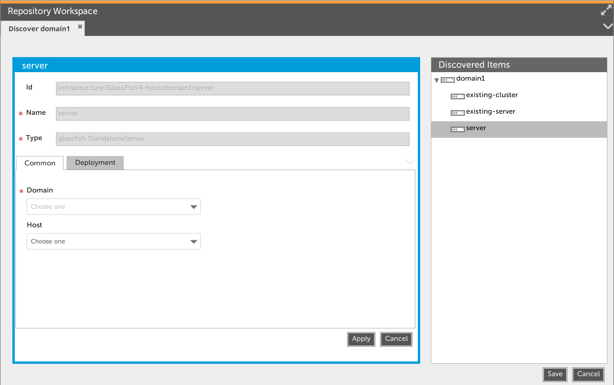
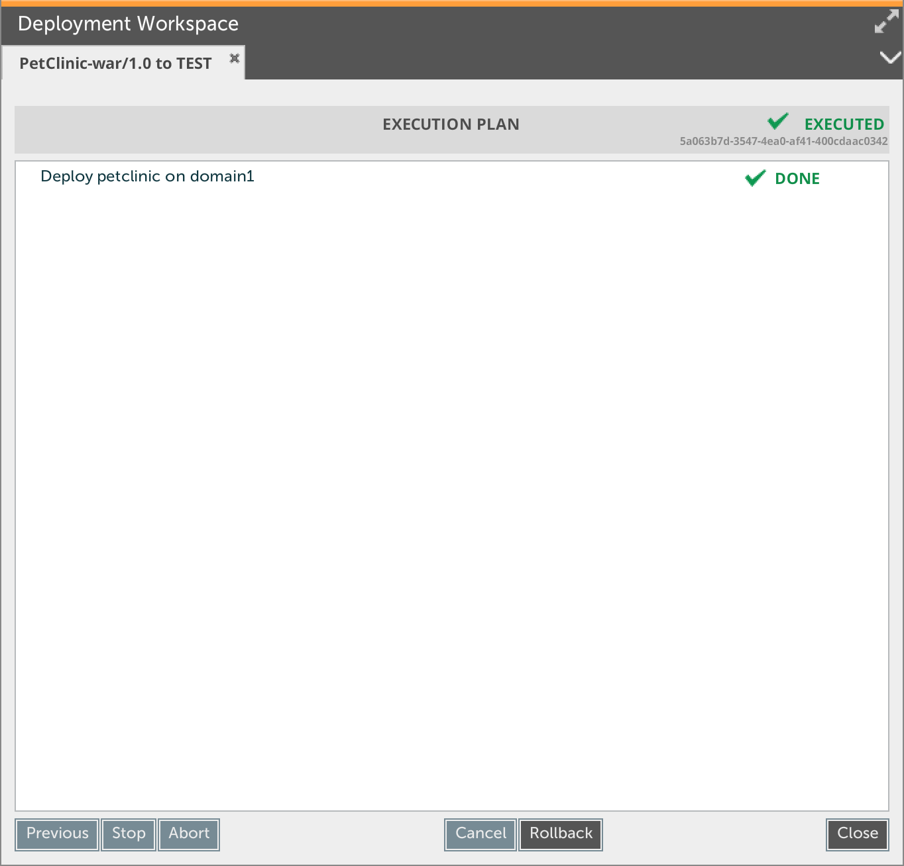
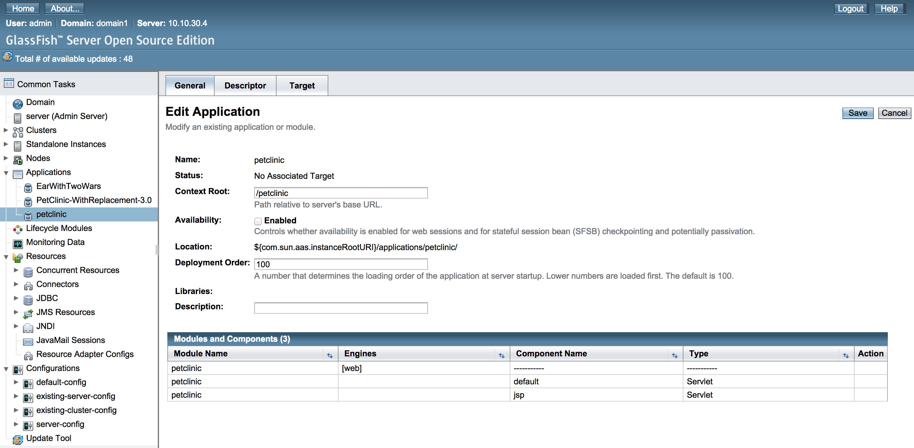

After you have installed [XL Deploy](http://xebialabs.com/products/xl-deploy) and the [Oracle GlassFish plugin](/xl-deploy/latest/glassfishPluginManual.html), log in to XL Deploy and follow these instructions to:

After you have [installed XL Deploy](/xl-deploy/how-to/install-xl-deploy.html) and logged in for the first time, follow these instructions to:

1. Connect XL Deploy to a GlassFish installation running on Unix
1. Discover your GlassFish middleware containers
1. Create an environment where you can deploy applications
2. Import a sample application into XL Deploy
3. Deploy the sample application to the environment that you created

## Connect to your infrastructure

First, you need to connect XL Deploy to the host on which GlassFish is running. Follow the instructions for the host's operating system and the connection protocol that you want XL Deploy to use:

* [Unix and SSH](/xl-deploy/how-to/connect-xl-deploy-to-your-infrastructure.html#connect-to-a-unix-host-using-ssh)
* [Windows and WinRM](/xl-deploy/how-to/connect-xl-deploy-to-your-infrastructure.html#connect-to-a-windows-host-using-winrm)

## Add your middleware

Once XL Deploy can communicate with your host, it can scan for middleware containers and automatically add them to the Repository for you.

To add a GlassFish domain:

1. Right-click the host that you created and select **Discover** > **glassfish** > **Domain**.
 
    **Tip:** If you do not see the **glassfish** option in the menu, verify that the GlassFish plugin is installed.

1. In the **Name** box, enter the name of the domain. This must match the domain name in your GlassFish installation.
1. In the **Home** box, enter the path to `bin/asadmin`; for example, `/opt/glassfish4`.
1. In the **Administrative port** and **Administrative Host** boxes, optionally set the port and host used to log in to the Domain Administration Server (defaults to 4848 and `localhost`).
1. In the **Administrative username** box, enter the user name that XL Deploy should use to log in to the DAS.
1. In the **Administrative password** box, enter the password for the user.
1. If the connection to the DAS should use HTTPS, select **Secure**.
1. Click **Next**. A plan appears with the steps that XL Deploy will execute to discover the middleware on the host.

      

1. Click **Execute**. XL Deploy executes the plan. If it succeeds, the state of the steps will be **DONE**.
1. Click **Next**. XL Deploy shows the items that it discovered.

      

1. You can click each item to view its properties. If an item is missing a property value that is required, a red triangle appears next to it. Provide the missing value and click **Apply** to save your changes.
1. When you are finished, click **Save**. XL Deploy saves the items in the Repository.

## Create an environment

An environment is a grouping of infrastructure and middleware items such as hosts, servers, clusters, and so on. An environment is used as the target of a deployment, allowing you to map deployables to members of the environment.

Follow [these instructions](/xl-deploy/how-to/create-an-environment-in-xl-deploy.html) to create an environment where you can deploy a sample application.

To deploy to GlassFish, select **glassfish.Domain** when creating the environment.

## Import the sample application

XL Deploy includes two versions of a sample application called *PetClinic-war*, already packaged in XL Deploy's deployment package format (DAR).

Follow [these instructions](/xl-deploy/how-to/add-a-package-to-xl-deploy.html#import-a-package) to import **PetClinic-war/1.0**.

## Deploy the sample application

Now you can deploy the sample application to the environment that you created.

Follow [these instructions](/xl-deploy/how-to/deploy-an-application.html) to deploy the application.

If the deployment succeeds, the state of the deployment plan is **EXECUTED**.

If the deployment fails, click the failed step to see information about the failure. In some cases, you can correct the error and try again. For example, in the deployment shown below, XL Deploy could not deploy the application because the GlassFish domain is not running. After starting the domain, click **Continue** and XL Deploy will try the deployment again.

## Verify the deployment

To verify the deployment, log in to the GlassFish Administration Console and check the list of applications for the PetClinic application.

## Learn more

After you've connected XL Deploy to your middleware and deployed a sample application, you can start thinking about how to package and deploy your own applications with XL Deploy. To learn more, see:

* [Introduction to the GlassFish plugin](/xl-deploy/concept/introduction-to-the-xl-deploy-glassfish-plugin.html)
* [XL Deploy for developers](/xl-deploy/concept/xl-deploy-for-developers.html)
* [Getting started with XL Deploy: Understanding packages](https://www.youtube.com/watch?v=dqeL45WGcKU)
* [Preparing your application for XL Deploy](/xl-deploy/concept/preparing-your-application-for-xl-deploy.html)
* [Understanding deployables and deployeds](/xl-deploy/concept/understanding-deployables-and-deployeds.html)

## Get help

You can always ask questions and connect with other users at [our forums](https://support.xebialabs.com/).
