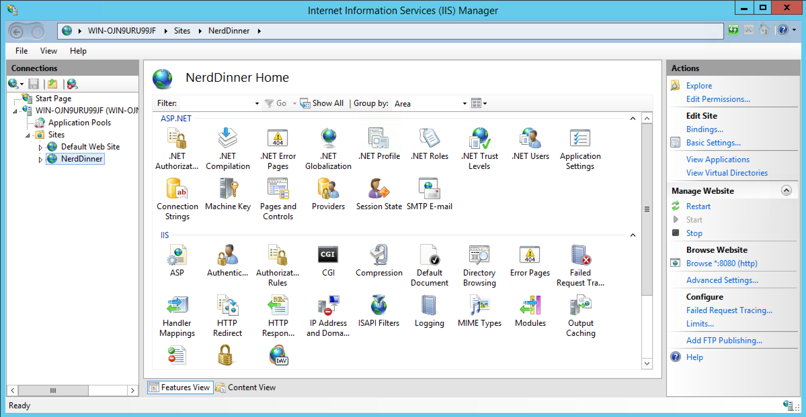

After you have installed [XL Deploy](http://xebialabs.com/products/xl-deploy) and the [Microsoft IIS plugin](/xl-deploy-iis-plugin/latest/iisPluginManual.html), log in to XL Deploy and follow these instructions to:

1. Create an environment and add Microsoft Internet Information Services (IIS) middleware containers to it
1. Import a sample application into XL Deploy
1. Deploy the sample application to the environment that you created

## Create an environment

An environment is a grouping of infrastructure and middleware items such as hosts, servers, clusters, and so on. An environment is used as the target of a deployment, allowing you to map deployables to members of the environment.

To create an environment:

1. Click **Deployment** in the top navigation bar.
2. Click **New environment**. The XL Deploy Environments window appears.
3. Click **Create environment**.
4. Enter a unique name for the environment in the **Environment name** box.
5. Click **Next**.
6. From the **Container type** list, select:
    * **iis.Server** for IIS 7.0 or later
    * **iis6.Server** for IIS 6.0

    **Tip:** If you do not see the **iis** options in the menu, verify that the IIS plugin is installed.

7. The first item that you need to create is a connection to the host on which IIS is running. To do so, click **Create new** next to **connection (overthere.Host)**. A new window appears.
8. Enter a unique name for the connection in the **Container name** box.
9. From the **Container type** list, select the type of connection that XL Deploy should use. If the host is the same computer on which XL Deploy is running, choose **overthere.LocalHost**. Otherwise, choose **overthere.CifsHost**.

    For detailed information about the information that is required for each connection type, refer to [Choose an Overthere host type and connection type](/xl-platform/how-to/choose-a-host-type-and-connection-type.html).

10. Click **Create** to create the connection.
11. To add your IIS server, click **Create new** next to **iis.Server**. A new window appears.
12. Enter a unique name for the server in the **Container name** box.
13. Fill in the required fields (marked with a red asterisk).
14. Click **Create** to create the server.
15. Click **Add to environment**.
16. Click **Next**.
17. Click **Next**.
18. Click **Save**. XL Deploy saves the environment and the middleware containers.

## Import the sample application

XL Deploy includes two versions of a sample application called *NerdDinner*, already packaged in XL Deploy's deployment package format (DAR).

Follow [these instructions](/xl-deploy/how-to/add-a-package-to-xl-deploy.html#import-a-package) to import **NerdDinner/2.0** from the XL Deploy server.

## Deploy the sample application

Now you can deploy the sample application to the environment that you created.

Follow [these instructions](/xl-deploy/how-to/deploy-an-application.html) to deploy the application.

If the deployment succeeds, the state of the deployment plan is **EXECUTED**.

If the deployment fails, click the failed step to see information about the failure. In some cases, you can correct the error and try again. For example, in the deployment shown below, XL Deploy could not copy files to the IIS server because remote management is not enabled. If we enable remote management on the server and click **Continue**, XL Deploy will try to start the application again.

## Verify the deployment

To verify the deployment, use the <a href="http://msdn.microsoft.com/en-us/library/vstudio/bb763170(v=vs.100).aspx" target="_blank">IIS Manager</a> to connect to the IP address that you provided when you created the connection. NerdDinner will appear as a new site on the server. Click the link under **Browse Website** to visit the site.

## What's next

After you've connected XL Deploy to your middleware and deployed a sample application, you can start thinking about how to package and deploy your own applications with XL Deploy. To learn more, see:

* [Introduction to the IIS plugin](/xl-deploy/concept/introduction-to-the-xl-deploy-iis-plugin.html)
* [XL Deploy for developers](/xl-deploy/concept/xl-deploy-for-developers.html)
* [Getting started with XL Deploy: Understanding packages](https://www.youtube.com/watch?v=dqeL45WGcKU)
* [Preparing your application for XL Deploy](/xl-deploy/concept/preparing-your-application-for-xl-deploy.html)
* [Understanding deployables and deployeds](/xl-deploy/concept/understanding-deployables-and-deployeds.html)

## Get help

You can always ask questions and connect with other users at [our forums](https://support.xebialabs.com/).
