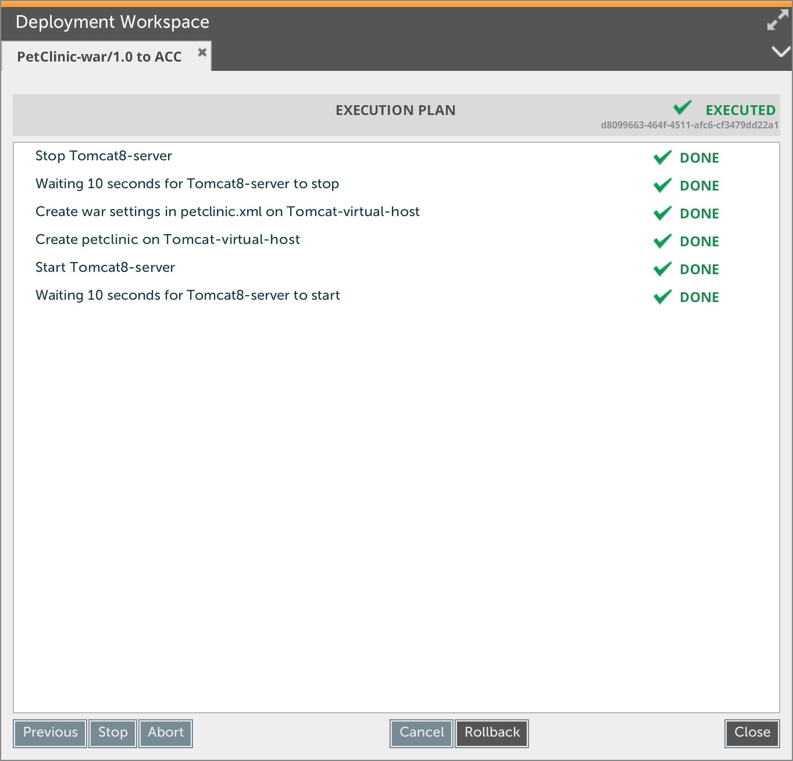

After you have installed [XL Deploy](http://xebialabs.com/products/xl-deploy) and the [Apache Tomcat plugin](/xl-deploy/latest/tomcatPluginManual.html), log in to XL Deploy and follow these instructions to:

1. Create an environment and add Apache Tomcat 6.x, 7.x, or 8.x containers to it
1. Import a sample application into XL Deploy
1. Deploy the sample application to the environment that you created

## Required Tomcat setup

Tomcat must be configured to run in the background. On Unix, Tomcat should be installed as a daemon or the Tomcat startup script should start Tomcat in the background. On Windows, you must install Tomcat as a service.

Refer to the [documentation for your version of Tomcat](http://tomcat.apache.org/) for information about running Tomcat in the background.

## Create an environment

An environment is a grouping of infrastructure and middleware items such as hosts, servers, clusters, and so on. An environment is used as the target of a deployment, allowing you to map deployables to members of the environment.

To create an environment:

1. Click **Deployment** in the top navigation bar.
2. Click **New environment**. The XL Deploy Environments window appears.
3. Click **Create environment**.
4. Enter a unique name for the environment in the **Environment name** box.
5. Click **Next**.
6. From the **Container type** list, select **tomcat.Server**.

    **Tip:** If you do not see the **tomcat** option in the menu, verify that the Tomcat plugin is installed.

7. The first item that you need to create is a connection to the host on which Tomcat is running. To do so, click **Create new** next to **connection (overthere.Host)**. A new window appears.
8. Enter a unique name for the connection in the **Container name** box.
9. From the **Container type** list, select the type of connection that XL Deploy should use. If the host is:
    * The same computer on which XL Deploy is running, choose **overthere.LocalHost**
    * Running a Unix-based operating system, choose **overthere.SshHost**
    * Running Microsoft Windows, choose **overthere.CifsHost**

    For detailed information about the information that is required for each connection type, refer to [Choose an Overthere host type and connection type](/xl-platform/how-to/choose-a-host-type-and-connection-type.html).

10. Click **Create** to create the connection.
11. To add your Tomcat server, click **Create new** next to **tomcat.Server**. A new window appears.
12. Enter a unique name for the server in the **Container name** box.
13. In the **Home** box, enter Tomcat home directory; for example, `/opt/apache-tomcat-8.0.9/` on Unix or `C:\Program Files\Tomcat\` on Windows.
1. In the **Start Command** box, enter the home directory, followed by the OS-specific command to start Tomcat. For example:
      * `service tomcat8 start` on Unix
      * `net start tomcat8` on Windows

    **Note:** XL Deploy expects the Tomcat start command to return and to leave Tomcat running. If the start command does not return, XL Deploy will not be able to complete a deployment to Tomcat.

1. In the **Stop Command** box, enter the home directory, followed by the 0S-specific command to stop Tomcat. For example:
      * `service tomcat8 stop` on Unix
      * `net stop tomcat8` on Windows
1. In the **Start Wait Time** box, enter the number of seconds that XL Deploy should wait after executing the start command and before continuing with the deployment plan.
1. In the **Stop Wait Time** box, enter the number of seconds that XL Deploy should wait after executing the stop command and before continuing with the deployment plan.

    **Note:** If your startup and shutdown scripts only return after the server has fully started or stopped, you can set the wait time to 0.

1. Click **Create** to create the server.
1. To add your Tomcat [virtual host](http://tomcat.apache.org/tomcat-8.0-doc/virtual-hosting-howto.html), click **Create new** next to **tomcat.VirtualHost**. A new window appears.
1. In the **Name** box, enter a name for the virtual host.
1. Optionally change the **App Base** and **Host Name** (defaults are `webapps` and `localhost`).
1. Click **Create** to create the virtual host.
1. Click **Add to environment**.
1. Click **Next**.
1. Click **Next**.
1. Click **Save**. XL Deploy saves the environment and the middleware containers.

## Import the sample application

XL Deploy includes two versions of a sample application called *PetClinic-war*, already packaged in XL Deploy's deployment package format (DAR).

Follow [these instructions](/xl-deploy/how-to/add-a-package-to-xl-deploy.html#import-a-package) to import **PetClinic-war/1.0**.

## Deploy the sample application

Now you can deploy the sample application to the environment that you created.

Follow [these instructions](/xl-deploy/how-to/deploy-an-application.html) to deploy the application.

If the deployment succeeds, the state of the deployment plan is **EXECUTED**.

If the deployment fails, click the failed step to see information about the failure. In some cases, you can correct the error and try again. For example, in the deployment shown below, XL Deploy could not stop the Tomcat server because the shutdown script is set to `/opt/apache-tomcat-8.0.1/bin/startup`. You should abort the deployment and correct the **Stop Command** in the Tomcat server configuration in the Repository, then try the deployment again.

## Verify the deployment

To verify the deployment, go to `http://IP:8080/petclinic`, where `IP` is the IP address of the Tomcat server.

## Learn more

After you've connected XL Deploy to your middleware and deployed a sample application, you can start thinking about how to package and deploy your own applications with XL Deploy. To learn more, see:

* [Introduction to the Tomcat plugin](/xl-deploy/concept/introduction-to-the-xl-deploy-tomcat-plugin.html)
* [XL Deploy for developers](/xl-deploy/concept/xl-deploy-for-developers.html)
* [Getting started with XL Deploy: Understanding packages](https://www.youtube.com/watch?v=dqeL45WGcKU)
* [Preparing your application for XL Deploy](/xl-deploy/concept/preparing-your-application-for-xl-deploy.html)
* [Understanding deployables and deployeds](/xl-deploy/concept/understanding-deployables-and-deployeds.html)

## Get help

You can always ask questions and connect with other users at [our forums](https://support.xebialabs.com/).
