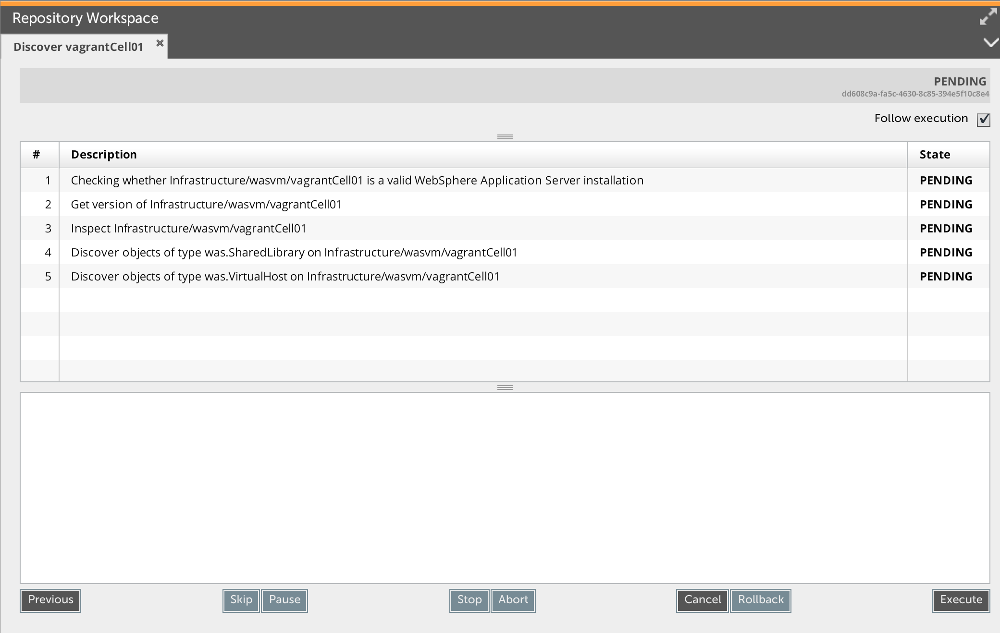
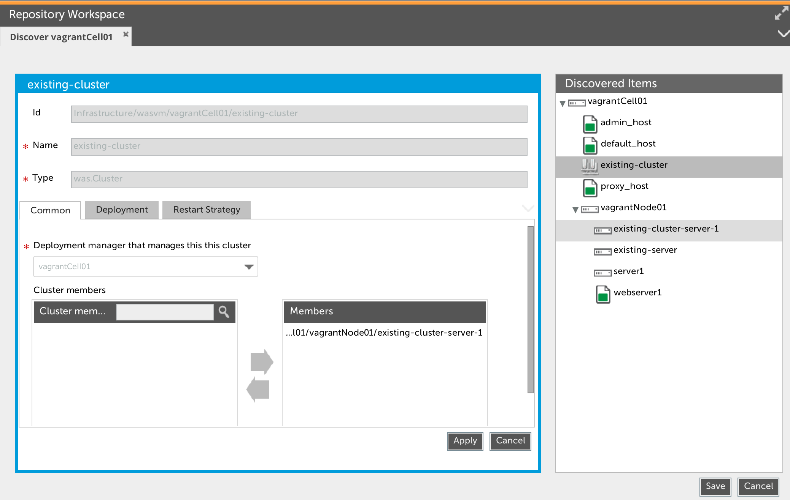
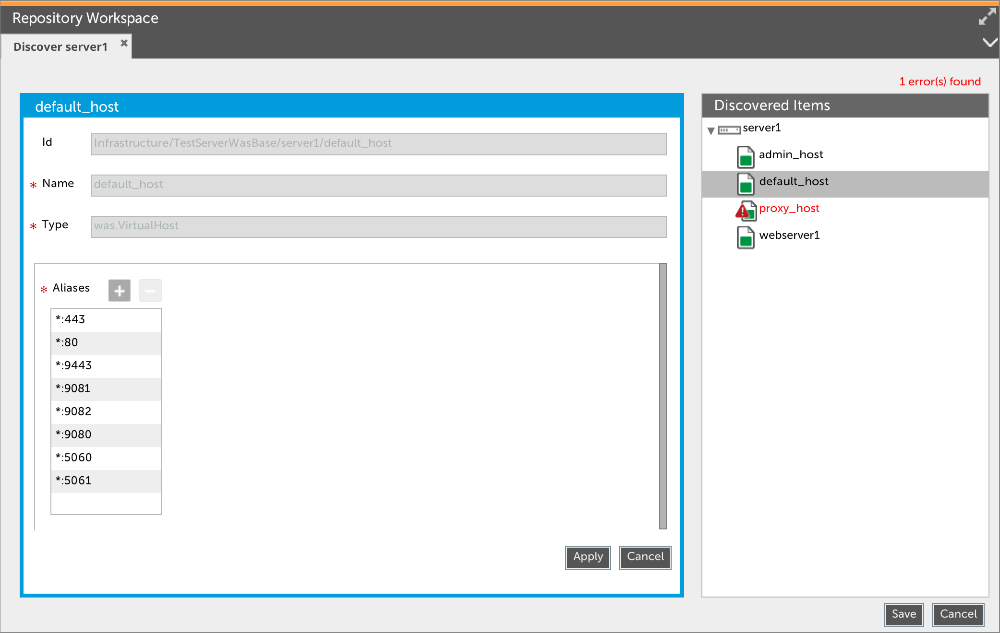
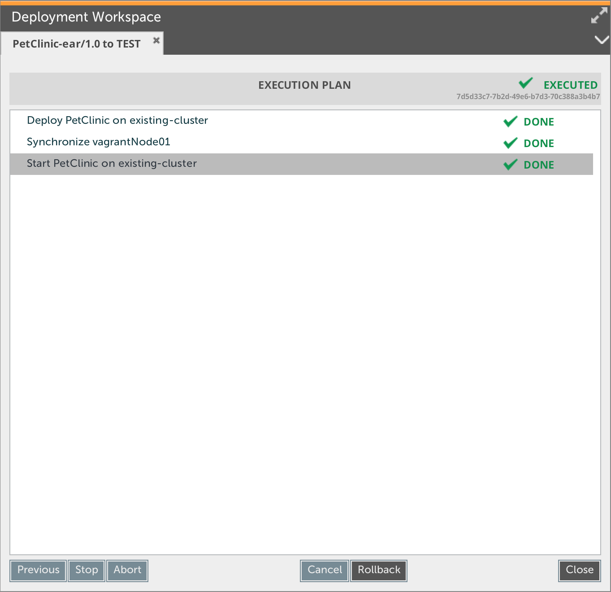
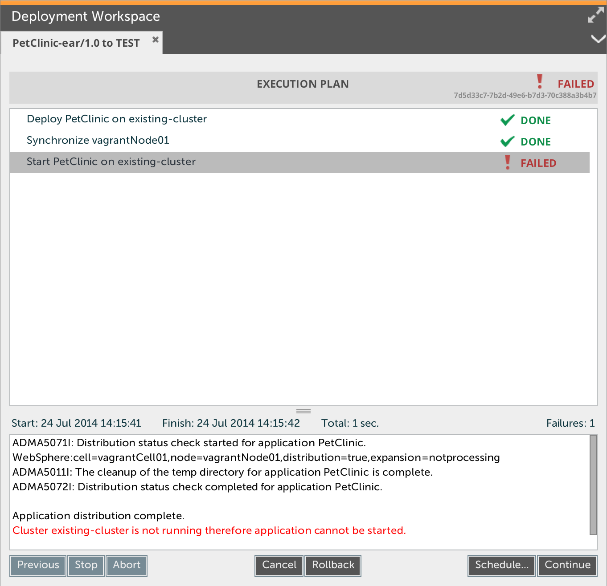

After you have installed [XL Deploy](http://xebialabs.com/products/xl-deploy) and the [IBM WebSphere plugin](https://docs.xebialabs.com/xl-deploy-was-plugin/latest/wasPluginManual.html), log in to XL Deploy and follow these instructions to:

1. Connect XL Deploy to your IBM WebSphere Application Server (WAS) Network Deployment (ND) or Base installation
1. Discover your WAS middleware containers
1. Create an environment where you can deploy applications
1. Import a sample application into XL Deploy
1. Deploy the sample application to the environment that you created

## Connect to your infrastructure

First, you need to connect XL Deploy to the host on which `wsadmin` is running. Usually, this is:

* The host where the WebSphere Deployment Manager is running, if you use WebSphere ND
* The WebSphere server, if you use WebSphere Base

Follow the instructions for the host's operating system and the connection protocol that you want XL Deploy to use:

* [Unix and SSH](/xl-deploy/how-to/connect-xl-deploy-to-your-infrastructure.html#connect-to-a-unix-host-using-ssh)
* [Windows and WinRM](/xl-deploy/how-to/connect-xl-deploy-to-your-infrastructure.html#connect-to-a-windows-host-using-winrm)

## Accept WebSphere trusted certificate

If `wsadmin` has not been used on your WebSphere Deployment Manager or unmanaged server before, you or your system administrator must set up a trusted certificate. If the trusted certificate is not configured, then XL Deploy will not be able to deploy to WebSphere. Refer to [Troubleshoot a WAS connection](/xl-deploy/how-to/troubleshoot-a-was-connection.html) for more information.

## Add your middleware

Once XL Deploy can communicate with your host, it can scan for middleware containers and automatically add them to the Repository for you. You can:

* [Add a WebSphere Network Deployment (ND) cell](#add-a-websphere-nd-cell)
* [Add an unmanaged server for WebSphere Base](#add-an-unmanaged-server-for-websphere-base)

### Add a WebSphere ND cell

To add a WebSphere ND cell:

1. Right-click the host that you created and select **Discover** > **was** > **DeploymentManager**.

    **Tip:** If you do not see the **was** option in the menu, verify that the WebSphere plugin is installed.

2. In the **Name** box, enter a name for the cell.
3. In the **WebSphere Installation Path** box, enter the path to the deployment manager profile; for example, `/opt/ws/6.1/appserver/profiles/AppSrv01`.
4. In the **Administrative port**, **Administrative username**, and **Administrative password** boxes, optionally enter the TCP port, user name, and password to use when connecting to WebSphere using `wsadmin`.
6. Click **Next**. A plan appears with the steps that XL Deploy will execute to discover the middleware on the host.

      

7. Click **Execute**. XL Deploy executes the plan. If it succeeds, the state of the steps will be **DONE**.
8. Click **Next**. XL Deploy shows the items that it discovered.

      

9. You can click each item to view its properties. If an item is missing a property value that is required, a red triangle appears next to it. Provide the missing value and click **Apply** to save your changes.
9. When you are finished, click **Save**. XL Deploy saves the items in the Repository.

### Add an unmanaged server for WebSphere Base

To add an unmanaged server for WebSphere Base:

1. Right-click the host that you created and select **Discover** > **was** > **UnmanagedServer**.
2. In the **Name** box, enter a name for the server.
3. In the **WebSphere Installation Path** box, enter the path to the WebSphere profile; for example, `/opt/IBM/WebSphere/AppServer/profiles/AppSrv01`
4. Click **Next**. A plan appears with the steps that XL Deploy will execute to discover the middleware on the host.

      

5. Click **Execute**. XL Deploy executes the plan. If it succeeds, the state of the steps will be **DONE**.

      

9. Click each item to view its properties. If an item is missing a property value that is required, a red triangle appears next to it, as shown above. Provide the missing value and click **Apply** to save your changes.

9. When you are finished, click **Save**. XL Deploy saves the items in the Repository.

## Create an environment

An environment is a grouping of infrastructure and middleware items such as hosts, servers, clusters, and so on. An environment is used as the target of a deployment, allowing you to map deployables to members of the environment.

Follow [these instructions](/xl-deploy/how-to/create-an-environment-in-xl-deploy.html) to create an environment where you can deploy a sample application.

To deploy to WebSphere ND, you must add a **was.Cluster** and a **was.NodeAgent** to the environment. To deploy to WebSphere Base, you must add a **was.UnmanagedServer** to the environment.

## Import the sample application

XL Deploy includes two versions of a sample application called *PetClinic-ear*, already packaged in XL Deploy's deployment package format (DAR).

Follow [these instructions](/xl-deploy/how-to/add-a-package-to-xl-deploy.html#import-a-package) to import **PetClinic-ear/1.0**.

## Deploy the sample application

Now you can deploy the sample application to the environment that you created.

Follow [these instructions](/xl-deploy/how-to/deploy-an-application.html) to deploy the application.

**Note:** If the deployment appears to hang on a step, XL Deploy may have encountered an issue with the SSL certificate. See [Accept WebSphere trusted certificate](#accept-websphere-trusted-certificate) for more information. If this is the case, click **Abort** to abort the operation and stop the deployment.

If the deployment succeeds, the state of the deployment plan is **EXECUTED**.

If the deployment fails, click the failed step to see information about the failure. In some cases, you can correct the error and try again. For example, in the deployment shown below, XL Deploy could not start the application because the WebSphere cluster was not running. If we start the cluster and click **Continue**, XL Deploy will try to start the application again.

## Verify the deployment

To verify the deployment, go to `http://IP:PORT/petclinic`, where `IP` and `PORT` are the IP address and port of the server where the application was deployed; for example, the *node* in a WebSphere ND environment or the *server* in a WebSphere Base environment.

## What's next

After you've connected XL Deploy to your middleware and deployed a sample application, you can start thinking about how to package and deploy your own applications with XL Deploy. To learn more, see:

* [Introduction to the IBM WebSphere Application Server plugin](/xl-deploy/concept/introduction-to-the-xl-deploy-websphere-application-server-plugin.html)
* [XL Deploy for developers](/xl-deploy/concept/xl-deploy-for-developers.html)
* [Getting started with XL Deploy: Understanding packages](https://www.youtube.com/watch?v=dqeL45WGcKU)
* [Preparing your application for XL Deploy](/xl-deploy/concept/preparing-your-application-for-xl-deploy.html)
* [Understanding deployables and deployeds](/xl-deploy/concept/understanding-deployables-and-deployeds.html)

## Get help

You can always ask questions and connect with other users at [our forums](https://support.xebialabs.com/).
