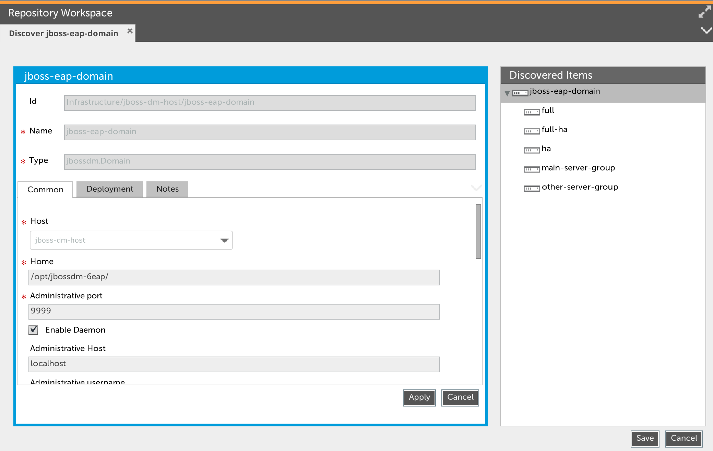
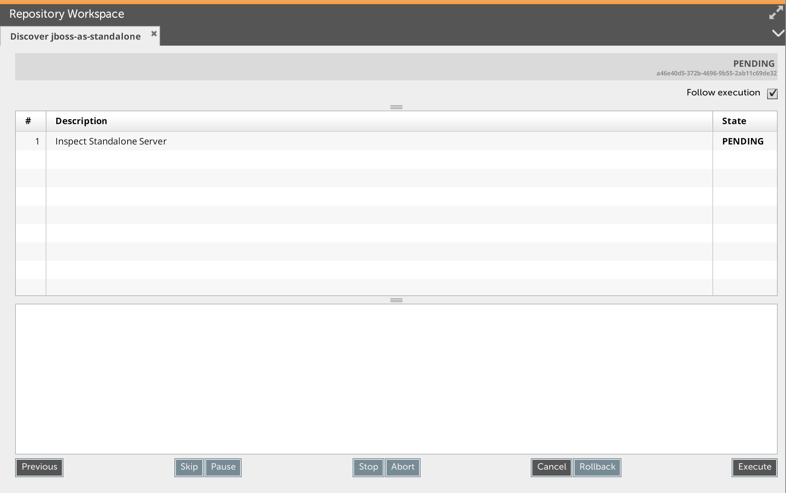
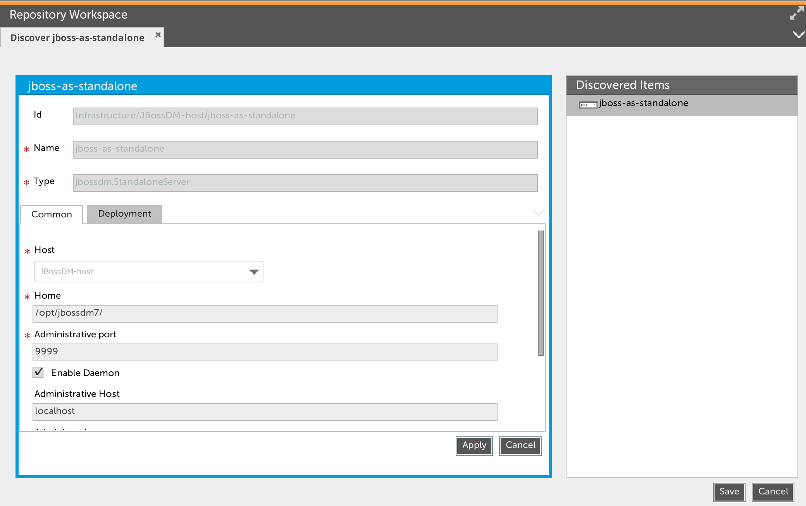
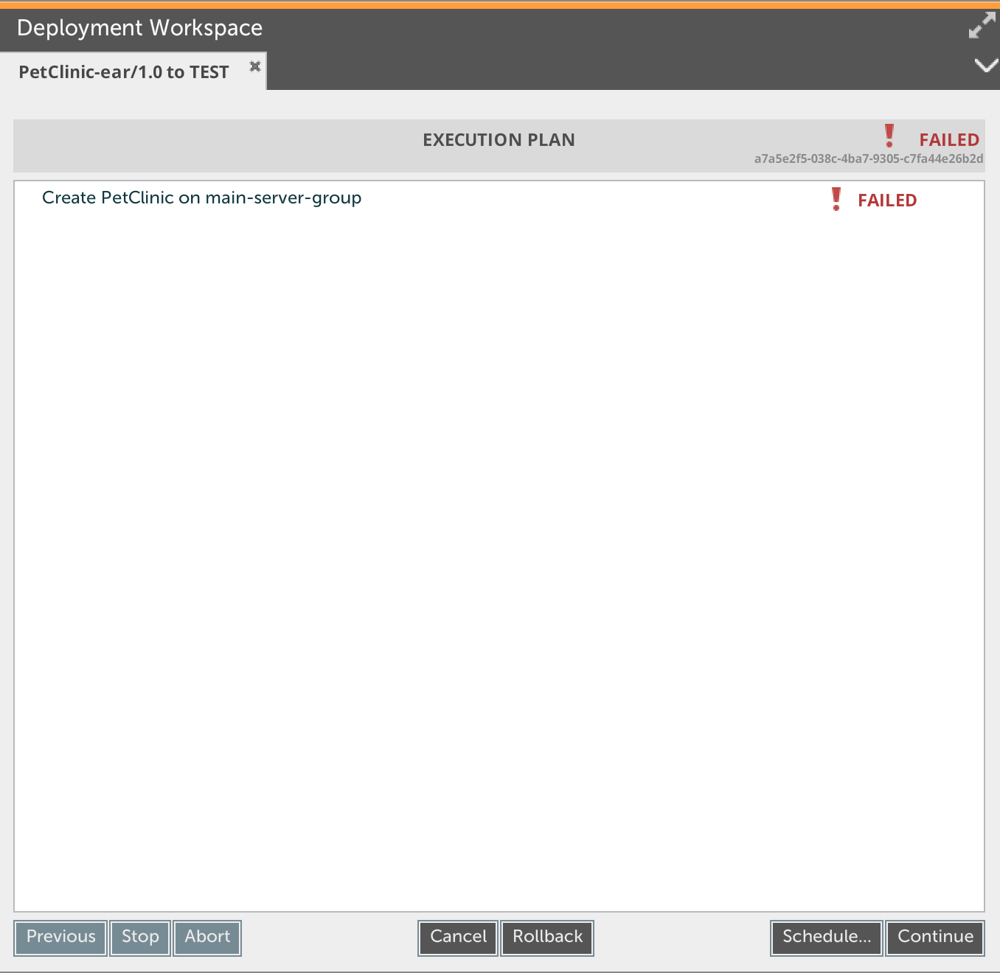

After you have installed [XL Deploy](http://xebialabs.com/products/xl-deploy) and the [JBoss Domain plugin](/xl-deploy/latest/jbossDomainPluginManual.html), log in to XL Deploy and follow these instructions to:

1. Connect XL Deploy to a JBoss Enterprise Application Platform (EAP) 6 or JBoss Application Server (AS)/WildFly 7.1+ installation
1. Discover your JBoss/WildFly middleware containers
1. Create an environment where you can deploy applications
1. Import a sample application into XL Deploy
1. Deploy the sample application to the environment that you created

## Connect to your infrastructure

First, you need to connect XL Deploy to the host on which JBoss is running. Follow the instructions for the host's operating system and the connection protocol that you want XL Deploy to use:

* [Unix and SSH](/xl-deploy/how-to/connect-xl-deploy-to-your-infrastructure.html#connect-to-a-unix-host-using-ssh)
* [Windows and WinRM](/xl-deploy/how-to/connect-xl-deploy-to-your-infrastructure.html#connect-to-a-windows-host-using-winrm)

## Add your middleware

Once XL Deploy can communicate with your host, it can scan for middleware containers and automatically add them to the Repository for you. You can:

* [Add containers in a JBoss Domain](#add-containers-in-a-jboss-domain)
* [Add a stand-alone JBoss server](#add-a-stand-alone-jboss-server)

### Add containers in a JBoss Domain

To add containers in a JBoss Domain:

1. Right-click the host that you created and select **Discover** > **jbossdm** > **Domain**.

    **Tip:** If you do not see the **jbossdm** option in the menu, verify that the JBoss Domain plugin is installed.

1. In the **Name** box, enter a name for the domain.
1. In the **Home** box, enter the JBoss home directory; for example, `/opt/jbossdm-6eap/`
1. In the **Administrative username** and **Administrative password** boxes, enter the user name and password used to log in to your [JBoss administration](https://access.redhat.com/documentation/en-US/JBoss_Enterprise_Application_Platform/6/html-single/Administration_and_Configuration_Guide/index.html#chap-Management_Interfaces).
1. Click **Next**. A plan appears with the steps that XL Deploy will execute to discover the middleware on the host.

      

1. Click **Execute**. XL Deploy executes the plan. If it succeeds, the state of the steps will be DONE.
2. Click **Next** to see the middleware containers that XL Deploy discovered. You can click each item to view its properties.

      

1. Click **Save**. XL Deploy saves the items in the Repository.

### Add a stand-alone JBoss server

To add a stand-alone JBoss server:

1. Right-click the host that you created and select **Discover** > **jbossdm** > **StandaloneServer**.
1. In the **Name** box, enter a name for the server.
1. In the **Home** box, enter the JBoss home directory; for example, `/opt/jbossdm7/`
1. In the **Administrative username** and **Administrative password** boxes, enter the user name and password used to log in to JBoss Native Administration.
1. Click **Next**. A plan appears with the steps that XL Deploy will execute to discover the middleware on the host.

      

1. Click **Execute**. XL Deploy executes the plan. If it succeeds, the state of the steps will be DONE.
2. Click **Next** to see the middleware containers that XL Deploy discovered. You can click each item to view its properties.

      

1. Click **Save**. XL Deploy saves the items in the Repository.

## Create an environment

An environment is a grouping of infrastructure and middleware items such as hosts, servers, clusters, and so on. An environment is used as the target of a deployment, allowing you to map deployables to members of the environment.

Follow [these instructions](/xl-deploy/how-to/create-an-environment-in-xl-deploy.html) to create an environment where you can deploy a sample application.

To deploy to a JBoss Domain, you must add a **jbossdm.ServerGroup** to the environment. To deploy to a stand-alone JBoss server, you must add the **jbossdm.StandaloneServer** to the environment.

## Import the sample application

XL Deploy includes two versions of a sample application called *PetClinic-ear*, already packaged in XL Deploy's deployment package format (DAR).

Follow [these instructions](/xl-deploy/how-to/add-a-package-to-xl-deploy.html#import-a-package) to import **PetClinic-ear/1.0**.

## Deploy the sample application

Now you can deploy the sample application to the environment that you created.

Follow [these instructions](/xl-deploy/how-to/deploy-an-application.html) to deploy the application.

If the deployment succeeds, the state of the deployment plan is **EXECUTED**.

If the deployment fails, click the failed step to see information about the failure. In some cases, you can correct the error and try again.

## Verify the deployment

To verify the deployment, go to `http://IP:PORT/petclinic`, where `IP` and `PORT` are the IP address and port of the server where the application was deployed.

## Learn more

After you've connected XL Deploy to your middleware and deployed a sample application, you can start thinking about how to package and deploy your own applications with XL Deploy. To learn more, see:

* [Introduction to the JBoss Application Server 7+ plugin](/xl-deploy/concept/introduction-to-the-xl-deploy-jboss-domain-plugin.html)
* [Introduction to the JBoss Application Server 5 and 6 plugin](/xl-deploy/concept/introduction-to-the-xl-deploy-jboss-application-server-plugin.html)
* [XL Deploy for developers](/xl-deploy/concept/xl-deploy-for-developers.html)
* [Getting started with XL Deploy: Understanding packages](https://www.youtube.com/watch?v=dqeL45WGcKU)
* [Preparing your application for XL Deploy](/xl-deploy/concept/preparing-your-application-for-xl-deploy.html)
* [Understanding deployables and deployeds](/xl-deploy/concept/understanding-deployables-and-deployeds.html)

## Get help

You can always ask questions and connect with other users at [our forums](https://support.xebialabs.com/).
