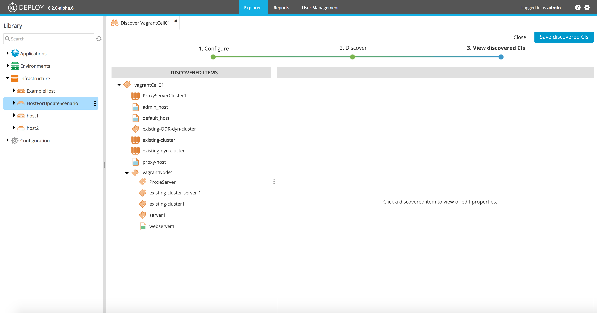
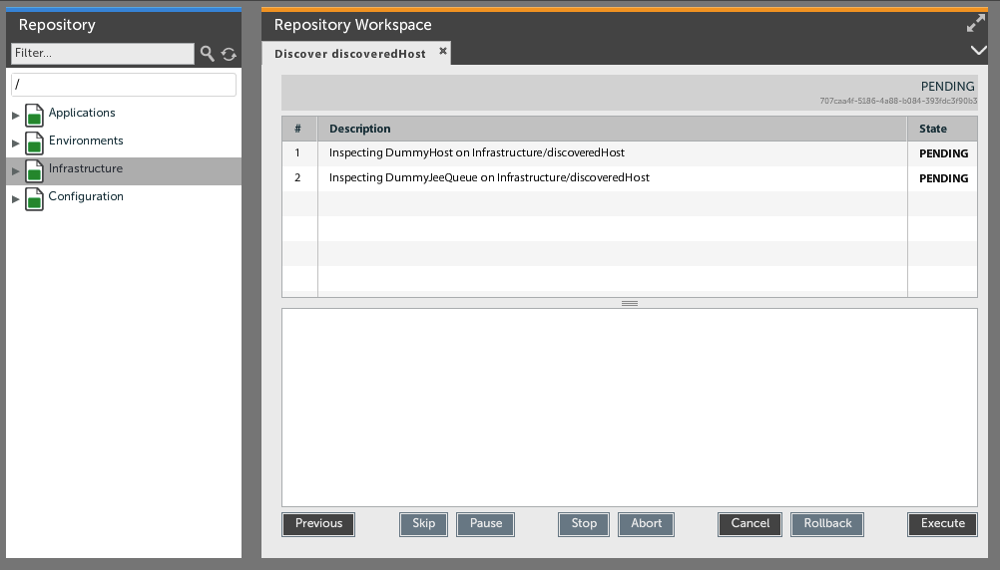

The discovery feature allows you to import an existing infrastructure topology into the XL Deploy repository as configuration items (CIs). You must have the `discovery` [global permission](/xl-deploy/concept/roles-and-permissions-in-xl-deploy.html#global-permissions) to use the discovery feature.

## Discovery option using the default GUI

To discover a CI, follow these steps:

**Select the type of CI to discover**. Navigate the menu in the left pane to find the CI you want to inspect. Hover over the CI, click , and select **Discover**. A list will appear that will allow you to choose one or more CIs. Select the CI type you want to discover. Note that CIs of a certain type need to support discovery in order to show up in this menu.

**Configure the required properties**. The selected CI type will be opened in a Discovery Tab so you can configure the properties that are required for discovery. Click on the **Next** button to generate the Discovery step list.

**Discovery steps**. Click on the **Discover** button to initiate discovery. This will start the process that inspects the actual middleware. More steps can be dynamically added as a result of execution of some discovery steps. Note that you can skip steps; however, the discovery process may not give correct results when steps are disabled. When the execution finishes click on the **View discovered CIs** button to view and edit the discovered CIs.

**Edit and save discovered CIs**. The _Discovered CIs workspace_ will show a hierarchical list of discovered CIs on the left. Clicking on a discovered CI will open it in the editor. The discovered CIs are not saved into the XL Deploy repository just yet, giving you the opportunity to review the results and change them when necessary. Validations errors will be marked, and will need to be resolved manually before saving.
Properties can be entered and applied individually on each CI before saving the complete list to the repository by clicking the **Save discovered CIs** button.

## Discovery option using the legacy GUI

To discover a CI, follow these steps:

**Select the type of CI to discover**. In the Repository Browser navigate the repository to find the CI you want to inspect. Right-click on the CI and select **Discover**. A list will appear that will allow you to choose one or more CIs. Select the CI type you want to discover. Note that CIs of a certain type need to support discovery in order to show up in this menu.

**Fill in the required properties**. The selected CI type will be opened in a CI Editor Tab so you can enter the properties that are required for discovery. Click on the **Next** button to generate the Discovery step list.

**Discovery steps**. Click on the **Execute** button to initiate discovery. This will start the process that inspects the actual middleware. More steps can be dynamically added as a result of execution of some discovery steps. Note that you can skip steps; however, the discovery process may not give correct results when steps are disabled. When the execution finishes click on the **Next** button to edit the discovered CIs.

**Edit and save discovered CIs**. The _Discovered CIs workspace_ will show a hierarchical list of discovered CIs on the right. Clicking on a discovered CI will open it in the editor. The discovered CIs are not saved into the XL Deploy repository just yet, giving you the opportunity to review the results and change them when necessary. Validations errors will be marked, and will need to be resolved manually before saving.
Properties can be entered and applied individually on each CI before saving the complete list to the repository by clicking the **Save** button.

