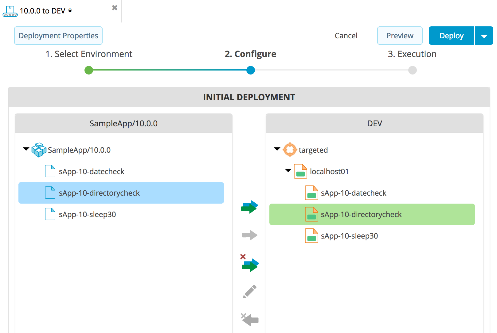
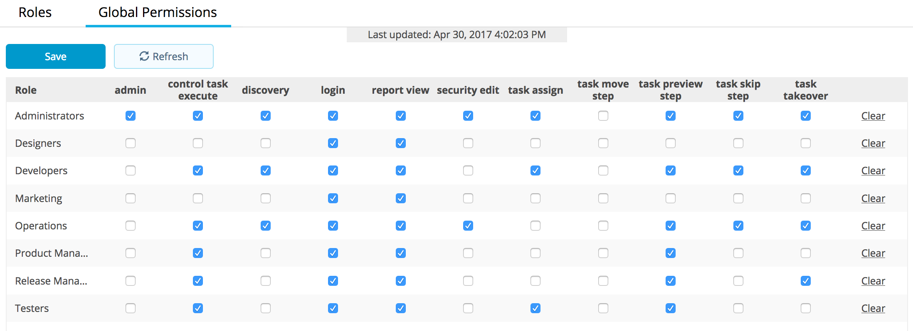
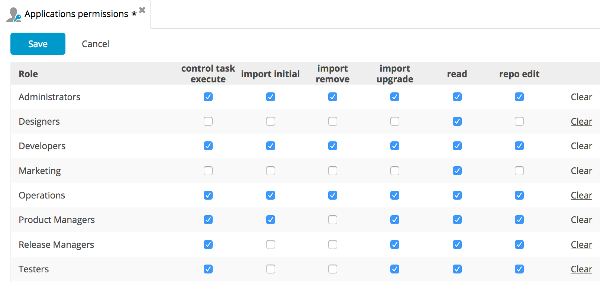

In XL Deploy 6.2.0 and later, the default user interface is a new, HTML5-based UI that allows you to use XL Deploy without installing Flash in your browser. This topic provides a brief overview of the features that are available in the default user interface.

## Deploy an application

To deploy an application:

1. Click **Explorer** in the top bar and expand **Applications**.
2. Locate and expand the application that you want to deploy or provision.
3. Click  next to the desired deployment or provisioning package and select **Deploy**. The list of available environments appears in a new tab.
4. Select the environment where you want to deploy or provision the package and then click **Continue**.

    

5. You can optionally change the mapping of deployables to containers using the buttons in the center. To edit the properties of a deployed, double-click it. To edit the deployment properties, click **Deployment Properties**.

    

6. To start the deployment immediately, click **Deploy**. If you want to skip steps or insert pauses, click the arrow next to **Deploy** and select **Modify plan**. If you want to schedule the deployment to execute at a future time, click the arrow and select **Schedule**.

    

For more information, refer to [Deploy an application](/xl-deploy/how-to/deploy-an-application.html).

### Update a deployed application

To update a deployed application, either:

* Locate the deployment or provisioning package under **Applications**, click , and select **Deploy**, or
* Locate and expand the environment under **Environments**, click  next to the deployed application, and select **Update**

For more information, refer to [Update a deployed application](/xl-deploy/how-to/update-a-deployed-application.html).

### Undeploy an application

To undeploy a deployed application, locate and expand the environment under **Environments**, click  next to the deployed application, and select **Undeploy**.

For more information, refer to [Undeploy an application](/xl-deploy/how-to/undeploy-an-application.html).

### Roll back a deployment

To roll back a deployment or undeployment task, click **Rollback**. As with deployment, you can roll back immediately, review the plan before executing it, or schedule the rollback for a later time.

### Schedule a task

To schedule an initial deployment, update deployment, undeployment, or rollback task, select **Schedule** on the task. Select the desired date and time and then click **Schedule**. After the task is scheduled, you can open it from the Task Monitor.

## Monitor active tasks

To monitor active tasks, click **Explorer** in the top bar and expand **Task Monitor**. You can view active deployment tasks or active control tasks. Click **Refresh** to see the latest information about active tasks.



### Assign tasks to users

## View deployment report

To view the deployment report, select **Reports** in the top bar. Note that this feature requires the `report#view` global permission. Click **Refresh** to see the latest report information.

To view detailed information about a specific deployment, double-click it.

## Manage roles and permissions

To work with [roles and global permissions](/xl-deploy/concept/roles-and-permissions-in-xl-deploy.html), click **User management** in the top bar. Note that this feature requires the `security#edit` global permission.

### Manage roles

To manage roles, click **User management** in the top bar and then click **Roles**.

### Assign global permissions

To assign global permissions to roles, click **User management** in the top bar and then click **Global Permissions**.

### Assign local permissions

To assign [local permissions](/xl-deploy/concept/roles-and-permissions-in-xl-deploy.html#local-permissions) to roles, click **Explorer** in the top bar, click  on a root node or directory, and then select **Edit permissions**.

## Switch to the legacy interface

To switch to the legacy Flash-based user interface, click  and select **Go to legacy interface**. Note that the `xld-legacy-interface` plugin must be installed in the `XL_DEPLOY_SERVER_HOME/plugins` directory.

**Tip:** To use the default user interface and the legacy user interface at the same time, you must open them in different browsers. The interfaces have different authentication methods, so you cannot log into both in the same browser (even in different tabs).

### Return to the default interface

To switch from the legacy user interface to the default user interface, click  and select **Go to default interface** (supported in XL Deploy 7.0.0 and later). Note that the `xld-ci-explorer` plugin must be installed in the `XL_DEPLOY_SERVER_HOME/plugins` directory.

### Configure your preferred interface

The new, HTML5-based user interface is the default user interface. However, you can configure a server-wide preferred interface by setting the `http.welcome.page` property in the `XL_DEPLOY_SERVER_HOME/conf/deployit.conf` file. This property indicates the page that users should be directed to when they go to the XL Deploy URL (supported in XL Deploy 7.0.0 and later).

For example, if you prefer to use the legacy, Flash-based user interface, you can configure it as your preferred interface.

    http.welcome.page = /legacy-interface.html

