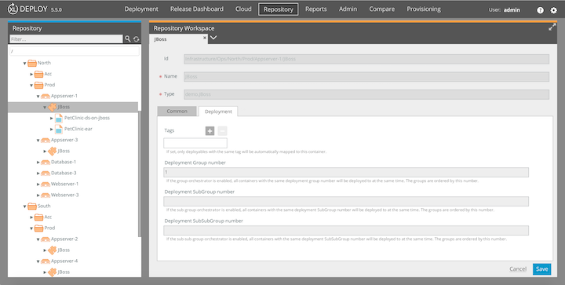

This guide explains how to perform "canary" deployments using XL Deploy. Canary deployment is a pattern in which applications or features are released to a subset of users before being rolled out across the entire user base. This is typically done to reduce the risk of releasing new features so any issues impact a smaller portion of the overall user base.

In XL Deploy, you can implement a canary deployment by:

1. Dividing your infrastructure and middleware into groups
1. Applying an orchestrator to deploy to each group sequentially
1. Inserting pauses between deployment to each group

**Note:** You can perform a canary deployment using a Canary orchestrator from the community supported `xld-custom-orchestrators-plugin`. For more information, refer to [xld-custom-orchestrators-plugin](https://github.com/xebialabs-community/xld-custom-orchestrators-plugin/blob/master/README.adoc).

## Step 1 Specify deployment groups

You maintain the model of your target infrastructure in XL Deploy's [repository](/xl-deploy/concept/the-xl-deploy-repository.html). After you have saved infrastructure items and middleware containers in XL Deploy, you can organize them in groups through a property called **Deployment Group Number**.

For example, assume you have two data centers called *North* and *South*, load balanced for geographical reasons. You assign a deployment group number to each container in each datacenter, as shown below.

## Step 2 Set up the deployment with an orchestrator

In XL Deploy, the [orchestration](/xl-deploy/concept/types-of-orchestrators-in-xl-deploy.html) feature allows a deployment plan to be generated in different ways to satisfy requirements such as rolling deployments, canary deployments, and blue/green deployments.

You can apply one or more orchestrators to an application, and you can parameterize them so you have ultimate flexibility in how a deployment to your environments is performed.

To use the deployment group feature with orchestrators:

1. [Set up the deployment](/xl-deploy/how-to/deploy-an-application.html) in the XL Deploy GUI by selecting a deployment package and an environment.
1. Click **Preview** to see a live preview of the generated deployment plan.
1. Click **Deployment Properties** and double-click the `sequential-by-deployment-group` orchestrator to select it.
1. Click **OK**.

## Step 3 Review the deployment plan

After you select an orchestrator, XL Deploy updates the preview of the deployment plan. While reviewing the plan, you will see that the application will be deployed to one group, the next group, and so on.

## Step 4 Add pauses to the plan

XL Deploy allows you to insert [pause steps](/xl-deploy/how-to/deploy-an-application.html#add-a-pause-step) in the deployment plan, so you can progress through the deployment at your own pace. Each pause step halts the deployment process, and you must click **Continue** to resume it.

To add pause steps to the deployment plan:

1. Click **Advanced**.
1. Right-click the step before which or after which you want to insert a pause (you may need to expand the blocks of steps first).
1. Select **Pause Before** or **Pause After**.

## Step 5 Execute the plan

To start the deployment, click **Execute**. Each time XL Deploy reaches a pause step, it will stop execution, giving you time to verify the results of that part of the deployment. When you are ready to resume deployment execution, click **Continue**.

## Specifying orchestrators in advance

Instead of specifying orchestrators when you set up the deployment, you can specify them as a property of the deployment package:

1. Click **Explorer** in the top bar of the XL Deploy GUI.
1. Expand **Applications**, then expand the desired application, and double-click the version you want to update.
1. Enter the exact name (case-sensitive) of an orchestrator in the **Orchestrator** box on the **Common** section. Alternatively, you can enter a placeholder that will be filled by a dictionary; for example, `{{ orchestrator }}`.

**Tip:** You can see the names of the available orchestrators by clicking **Deployment Properties** when setting up a deployment.
