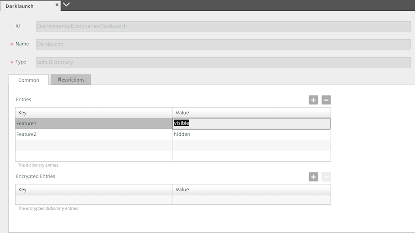

This guide explains how to perform "dark launch" deployments using XL Deploy. Dark launch is a go-live strategy in which code implementing new features is released to a subset of the production environment but is not visibly activated or is only partially, activated. This allows the code to be tested in a production setting without users being aware of it.

In XL Deploy, you can implement a dark launch deployment by:

1. Adding parameterized feature switches to your code
1. Using dictionaries to toggle each switch based on the target environment

## Step 1 Parameterize your code

To parameterize your code, use [placeholders](/xl-deploy/how-to/using-placeholders-in-xl-deploy.html) in `{{ placeholder }}` format. XL Deploy can scan many types of artifacts for placeholders, such as ZIP, JAR, EAR, and WAR files.

This is an example of web content with placeholders that will act as feature switches:

**Tip:** If needed, you can configure XL Deploy to recognize [different placeholder delimiters](/xl-deploy/how-to/using-placeholders-in-xl-deploy.html#using-different-file-placeholder-delimiters) and [scan additional types of artifacts](/xl-deploy/how-to/using-placeholders-in-xl-deploy.html#enabling-placeholder-scanning-for-additional-file-types) for placeholders.

## Step 2 Create a dictionary

In XL Deploy, [dictionaries](/xl-deploy/how-to/create-a-dictionary.html) contain the values that will replace the placeholders that you use in your artifacts. Dictionaries are assigned to environments and are applied at deployment time, during the [planning phase](/xl-deploy/concept/understanding-the-xl-deploy-planning-phase.html).

You can create as many dictionaries as you need and assign them to one or more environments. This is an example of a DarkLaunch dictionary that will be used in all environments.

First, create the dictionary:

Then, add entries that will allow you to toggle features:

Finally, assign the dictionary to an environment:

Redeploying a [deployment package](/xl-deploy/concept/key-xl-deploy-concepts.html#deployment-packages) after a dictionary parameter has been changed only affects the components that use that parameter, so this is a relatively safe operation.

## Step 3 Toggle feature switches

After a feature switch is in place, you can adjust the logic to toggle the dark launch of that feature simply by changing the value in the dictionary.

You can verify the components that will be affected by [previewing the deployment plan](/xl-deploy/how-to/preview-the-deployment-plan.html) before executing it.

### Example with features toggled off

For example, here is a dictionary with two features toggled *off*:

 

Deploying the application with these dictionary values results in:

 

### Example with a feature toggled on

To toggle one of the features *on*, update the dictionary entry:

Redeploying the application results in:

 
