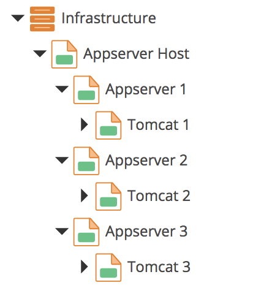
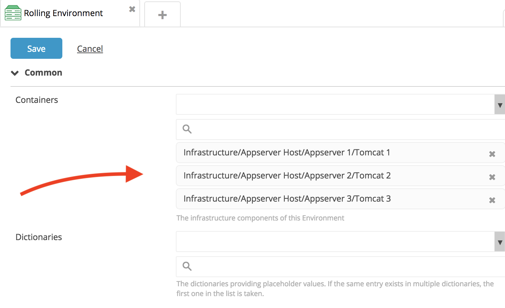
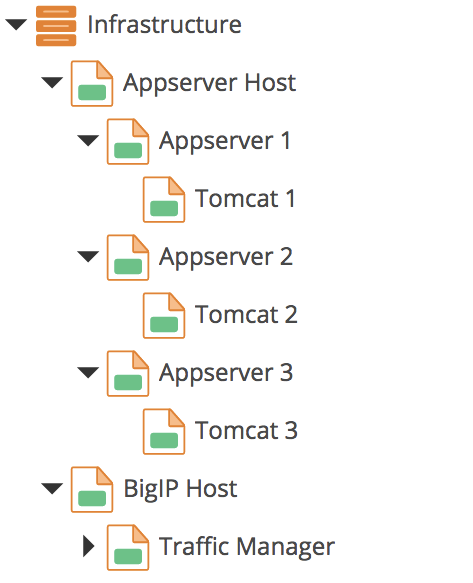
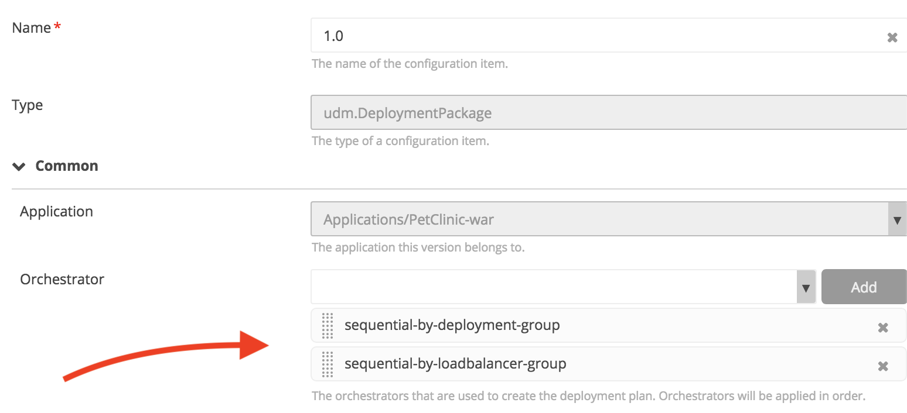

This guide describes how to perform the rolling update deployment pattern using XL Deploy. This is a scalable approach that will work for any environment or any number of applications.

XL Deploy uses the [orchestrator feature](/xl-deploy/concept/types-of-orchestrators-in-xl-deploy.html) to calculate a deployment plan and provide support for a scalable solution. With scripting not required, the environments, load balancer, and application must be configured.

To perform the rolling update deployment pattern, XL Deploy uses a load balancer plugin and orchestrators. More than one orchestrator can be added to fine-tune the generated deployment plan.

In the rolling update pattern, the application runs on several nodes. A load balancer distributes the traffic to these nodes. When updating to a new version, a node is removed from the load balancer pool and taken offline to update, one node at a time. This ensures that the application is still available because it is being served by other nodes. When the update is complete, the updated node is added to the load balancer pool again and the next node is updated, until all nodes have been updated.

**Important:** At a minimum, this pattern requires that two versions of the software are active in the same environment at the same time. This adds requirements to the software architecture. For example, both versions must be able to connect to the same database, and database upgrades must be more carefully managed. <!-This is outside the scope of this article.  ADD SOME LINK -->

**Note:** This guide was written using XL Deploy 7.6.

## Tutorial
The following tutorial takes you through the steps involved in performing a rolling update deployment pattern. It uses the PetClinic demo application that is shipped with XL Deploy.

**Note:** To complete this tutorial, you must have the XL-Deploy Tomcat and the XL-Deploy F5 BIG-IP plugins installed. For more information, see [Introduction to the XL Deploy Tomcat plugin](https://docs.xebialabs.com/xl-deploy/concept/tomcat-plugin.html) and [Introduction to the XL Deploy F5 BIG-IP plugin](https://docs.xebialabs.com/xl-deploy/concept/f5-big-ip-plugin.html).

### 1. Import a sample application

The rolling update deployment pattern can be used with any application.

Import two samples:
1. Open XL Deploy.
2. Click **Explorer**.
2. From the **Library** menu, click **Applications**.
3. Click .
4. Rollover **Import** and click **From XL Deploy server**
5. In the **Package** field, click the drop-down arrow.
6. Select **PetClinic-war/1.0**.
7. Click **Import**.
8. When the import is complete, repeat steps 2 to 5.
9. Select **PetClinic-war/2.0**.
10. Click **Import**.

    

### 2. Prepare the nodes and setup the Infrastructure

In this procedure, you will setup the nodes that will serve the application and ensure that they are updated in the correct order. You will use an application that is deployed to Apache Tomcat. This procedure applies to any setup.

The rolling update deployment pattern uses the [deployment group orchestrator](/xl-deploy/concept/types-of-orchestrators-in-xl-deploy.html#by-deployment-group-orchestrators). This orchestrator groups containers and assigns each group a number. XL Deploy will generate a deployment plan to deploy the application, group by group, in the order specified.

In this example, there are three application servers that will host our application simultaneously. You will deploy the application to **Tomcat 1**, **Tomcat 2** and **Tomcat 3**.



Step up the infrastructure:
1. In the **Explorer** tab **Library**, click **Infrastructure**.
2. Click .
3. Create an appserver host:
  1. Rollover **New**, and **overthere**, and click **SshHost**.
  2. Name this host `Appserver Host`.
  2. Configure this component to connect to the physical machine running the tomcat installations.
  3. Click **Save**.
4. Create three app servers:
  1. Click **Appserver Host**.
  2. Click .
  1. From the drop-down, rollover **New**, and **Tomcat**, and click **Server**.
  2. Name this server `Appserver 1`.
  2. Configure this server to point to the Tomcat installation directory.
  3. Click **Save**.
3. Repeat step 4 twice. Name these servers `Appserver 2` and `Appserver 3`.
3. Create three Tomcat targets:
  1. Click Appserver 1.
  2. Click .
  3. Rollover **New**, and **Tomcat**, and click **VirtualHost**.
  2. Name this target `Tomcat 1`.
3. Repeat step 6 twice. Name these targets `Tomcat 2` and `Tomcat 3`, and configure the targets to their corresponding app server.

### 3. Add the servers to a group

To deploy in sequence, each Tomcat server must have its own deployment group.

1. From the **Infrastructure** menu, double click `Tomcat 1`.
2. In the **Development** section, enter the sequence number for this rolling update into the **Deployment Group number** field.
3. Repeat steps 1 and 2 for `Tomcat 2` and `Tomcat 3`.

    **Note:** The **Deployment** section is available on all [containers](https://docs.xebialabs.com/xl-deploy/concept/key-xl-deploy-concepts.html#containers) in XL Deploy.

    

### 4. Create an environment

1. Click **Environments**.
2. Click .
3. Rollover **New**, and click **Rolling Environment**.
4. Name the environment `Rolling environment1`.
5. Go to the **Common** section.
5. Add the servers (`Tomcat 1`,`Tomcat 2`, and `Tomcat 3`) to the **Containers** section.

    

### 5. Run your first rolling deployment

1. In the **Library**, under **Applications**, and **PetClinic-war** click **1.0**.
2. Click .
3. Click **Deploy**.
4. In the **Select Environment** window, select **Rolling Environment1**.
5. Click **Continue**.
5. In the **Configure** screen, press the **Preview** button to see the deployment plan that is generated by XL Deploy.
6. From the top-left side of the screen, click **Deployment Properties**.
7. In the Orchestrator field, type `sequential-by-deployment-group`.
8. Click **Add**.

    

    **Note:** Orchestrators modify the plan automatically. In this case, the **sequential-by-deployment-group** orchestrator creates a rolling deployment plan. It is also possible to stack orchestrators to create fine-tuned, scalable deployment plans.

    

9. Click **Save** to update the plan.
10. Click **Deploy**.

The above procedure will perform any rolling update deployment, at any scale.

### 6. Add the load balancer

While one node is being upgraded, the load balancer ensures that the node does not receive any traffic, by routing traffic to the other nodes while one is down for the upgrade.

XL Deploy supports a number of load balancers that are available as plugins. In this example you will use the
[F5 BigIp plugin](https://docs.xebialabs.com/xl-deploy/concept/f5-big-ip-plugin.html). The procedure is the same for all load balancer plugins.

1. Ensure that your architecture is as described in: [2. Prepare the nodes and set up the Infrastructure](#2.-Prepare-the-nodes-and-setup-the-Infrastructure).
1. Click **Infrastructure**.
2. Rollover **New**, and **overthere**, and click **SshHost**.
3. Name this host `BigIP Host`.
3. Configure the host.
3. Click **Save**.
4. Click **BigIP Host**.
5. Click .
6. Rollover **New**, and **F5 BigIp**, and click **LocalTrafficManager**.
7. Name this item `Traffic Manager`.
7. Configure the Configuration Items (CIs) according to the load balancer plugin documentation.

  You now have the following infrastructure.

  

1. On the load balancer, add the nodes you are deploying to the **Managed Servers** field.
**Note:** You are using the F5 BigIp plugin, but this property is available on any load balancer plugin.

 

1. Add a load balancer to the environment. In this case the **Traffic Manager** is added to the **Rolling Environment**.

 

1. To trigger the load balancing behavior in the plan, add another orchestrator: `sequential-by-loadbalancer-group`.

 

 The plan now takes the load balancer into account and removes and adds the Tomcat servers from the load balancer when the node is being upgraded.

  

The plan is now ready for a rolling update deployment.

## 7. Preparing the applications for the rolling update deployment pattern

So far, you manually added the orchestrators to the deployment properties when creating the deployment.

There are two ways to configure the CIs to pick up the orchestrators automatically.
1. **Setting orchestrators on the application**  
 If the rolling update pattern applies to all environments the application is deployed to, the easiest way to configure orchestrators automatically is to configure them directly on the application that is to be deployed.

   1. Open the deployment package, double click **PetClinic/1.0**.
   1. In the **Common** section of the configuration window, add the relevant orchestrators to the **Orchestrator** field.

    

  The disadvantage of this approach is that the orchestrators are hardcoded on the application and may not be required on each environment. For example, if a rolling update is only needed in the production environment but not in the QA environment.

1. **Configuring orchestrators on the environment**    
  Define the orchestrators on the environment using dictionaries:

  1. Remove the orchestrator from the PetClinic application:
    1. Expand **PetClinic**.
    2. Double click **1.0**.
    3. In the **Common** section, delete the orchestrator.
  1. Repeat step 1 for the remaining application.
  1. Create a dictionary:
    1. Click **Environments**.
    1. Rollover **New** and click **Dictionary**.
    2. Name this dictionary `Dictionary`.
  1. In the dictionary configuration window, in the **common** section, create the following entry:
  ```
  Key                                    Value
  udm.DeployedApplication.orchestrator   sequential-by-deployment-group, sequential-by-loadbalancer-group
  ```
   

    We are using two dictionary features here:
    * The key maps to a fully quantified property of the application being deployed. If this property is left empty on the application, the value is taken from the dictionary.
    * The value is a comma-separated list and will be mapped to a list of values.
  1. Add the dictionary to **Rolling Environment**:
    1. Double click **Environment**.
    2. In the configuration window, in the **Common** section, add `Dictionary` to the **Dictionaries** field.
    3. Click `Save`.
  1. Start the deployment again.

  The orchestrators are picked up, and the plan is generated without having to configure anything directly on the application.
