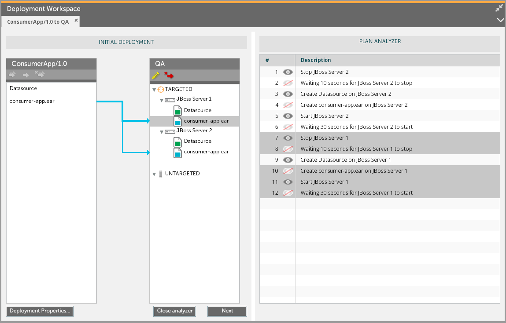
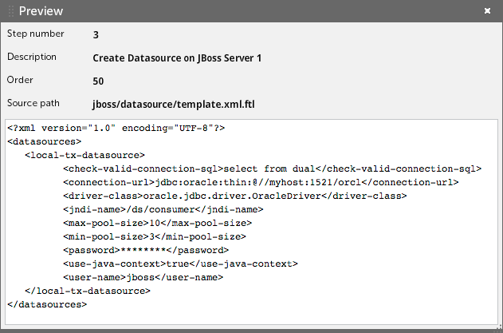

When you set up an initial deployment, an update, or an undeployment, you can use the Preview option to view the deployment plan that XL Deploy generated based on the deployment configuration. As you map deployables to containers in the deployment configuration, the Preview will update and show changes to the plan.

## Preview the deployment plan using the default GUI

To open the Preview pane from the Explorer, click **Preview**. You can view the steps in the deployment plan.


Not yet in default GUI

### Match steps in the plan to deployeds

To see which steps in the deployment plan are related to a specific [deployed], click the deployed. To see which deployed is related to a specific step, click the step.

![Highlighted deployed and steps in Plan Analyzer]

To edit the steps in the deployment plan, click **Modify plan**. You can view and edit the steps in the Execution Plan.

### Using orchestrators

The Preview option is useful when you are applying [orchestrators] to the deployment plan. Orchestrators are used to control the sequence of the generated plan. They are used mainly when dealing with more than one server.

For example, deploying an application to an environment that contains two JBoss servers results in a default deployment plan like this:

![Sample deployment plan with default orchestrator]

In this plan, both servers are stopped simultaneously. This happens because the default orchestrator treats all target middleware as a single pool, so everything is started, stopped, and updated together.

You can change this by applying a different orchestrator. Click **Deployment Properties** to see the orchestrators are available.

This is an example of the deployment plan with the `sequential-by-container` orchestrator applied:

![image]


### Preview a step in the plan

To preview information about a step, double-click it. Note that this requires the `task#preview_step` [global permission](/xl-deploy/concept/roles-and-permissions-in-xl-deploy.html#global-permissions).

The step preview shows:

* The [order](/xl-deploy/concept/steps-and-steplists-in-xl-deploy.html#steplist) of the step
* The source path of the script, relative to XL Deploy's classpath; for example, relative to `XL_DEPLOY_SERVER_HOME/ext` or packaged in the relevant plugin
* The number of the step
* The step description
* The rule the generated the step
* The script preview

### Start the deployment

When previewing the deployment plan, you can start the deployment immediately by clicking **Deploy** button. If you want to adjust the plan by skipping steps or inserting pauses, click the arrow on the **Deploy** button and select **Modify plan**.

## Preview the deployment plan using the legacy GUI

To open the Plan Analyzer from the Deployment Workspace:

* In XL Deploy 4.5.x or earlier, click **Analyze**
* In XL Deploy 5.0.0 or later, click **Preview**

**Note:** The Plan Analyzer is read-only.

### Match steps in the plan to deployeds

To see which steps in the deployment plan are related to a specific [deployed](/xl-deploy/concept/understanding-deployables-and-deployeds.html), click the deployed. To see which deployed is related to a specific step, click the step.

### Preview a step in the plan

To preview information about a step, double-click it. Note that this requires the `task#preview_step` [global permission](/xl-deploy/concept/roles-and-permissions-in-xl-deploy.html#global-permissions).

If preview is not available,  appears next to the step. To see the step order when preview is not available, hover the mouse pointer over the step and wait for the tooltip to appear.

### Start the deployment

When you are satisfied with the deployment plan as it appears in the Plan Analyzer, start the deployment by clicking:

* **Next** in XL Deploy 4.5.x or earlier
* **Execute** in XL Deploy 5.0.0 or later

This is the final plan that will be executed to perform the deployment. Here, you can adjust the plan by skipping steps or inserting pauses; right-click the plan to do so.
