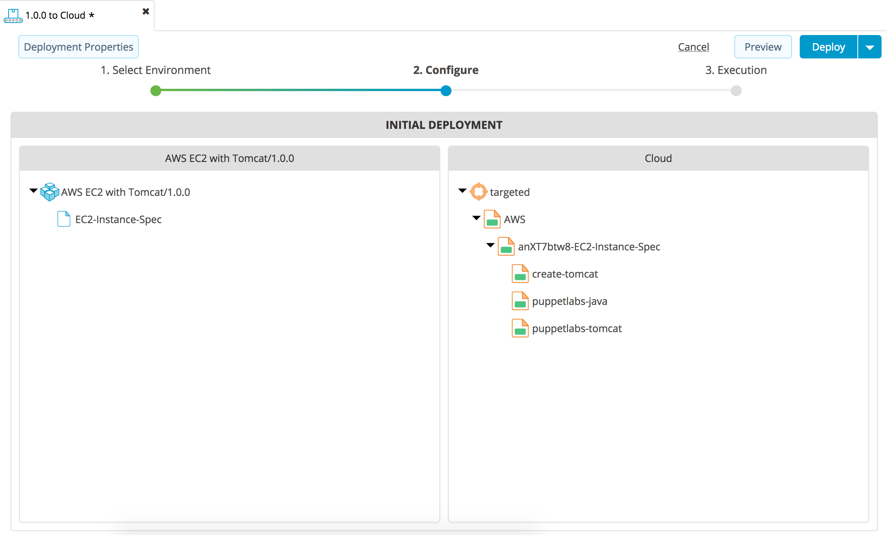

You can use XL Deploy's [provisioning feature](/xl-deploy/concept/provisioning-through-xl-deploy.html) to create cloud-based environments in a single action. The process of provisioning an environment using XL Deploy is very similar to the process of [deploying an application](/xl-deploy/how-to/deploy-an-application.html).

**Note:** A version of this topic is available for [XL Deploy 5.5.x](/xl-deploy/5.5.x/provision-an-environment-5.5.html).

## Provision an environment using the default GUI

As of version 6.2.0, the default GUI is HTML-based.

To provision an environment:

1. Expand **Applications**, and then expand the application that you want to provision.
1. Hover over the desired provisioning package, click , and then select **Deploy**. A new tab appears in the right pane.
1. In the new tab, select the target environment. You can filter the list of environments by typing in the **Search** box at the top. To see the full path of an environment in the list, hover over it with your mouse pointer.

    XL Deploy automatically maps the provisionables in the package to the providers in the environment.

1. If you are using XL Deploy 6.0.x, click **Execute** to start executing the plan immediately. Otherwise, click **Continue**.
1. You can optionally:

    * View or edit the properties of a provisioned item by double-clicking it.
    * Double-click an application to view the summary screen and click **Edit properties** to change the application properties.
    * View the relationship between provisionables and provisioneds by clicking them.
    * Click **Deployment Properties** to configure properties such as [orchestrators](/xl-deploy/concept/understanding-orchestrators.html).
    * Click the arrow icon on the **Deploy** button and select **Modify plan** if you want to adjust the provisioning plan by skipping steps or inserting pauses.

    

1. Click **Deploy** to immediately start provisioning.

    If the server does not have the capacity to immediately start executing the plan, it will be in a `QUEUED` state until the server has sufficient capacity.

    

    If a step in the provisioning fails, XL Deploy stops executing and marks the step as `FAILED`. Click the step to see information about the failure in the output log.

## Provision an environment using the legacy GUI

To provision an environment:

1. Click **Deployment** in the top bar.
1. Under **Packages**, locate the provisioning package and expand it to see its versions.
1. Drag the desired version to the left side of the Deployment Workspace.
1. Under **Environments**, locate the desired environment and drag it to the right side of the Deployment Workspace.

    XL Deploy automatically maps the provisionables in the package to the providers in the environment.

1. Click **Execute** to immediately start the provisioning.

You can also optionally:

* View or edit the properties of a mapped provisioned by double-clicking it.
* Click **Deployment Properties** to select orchestrators or enter placeholder values.
* Click **Advanced** if you want to adjust the plan by skipping steps or inserting pauses.

If the server does not have the capacity to immediately start executing the plan, the plan will be in a `QUEUED` state until the server has sufficient capacity.

If a step in the provisioning fails, XL Deploy stops executing the provisioning and marks the step as `FAILED`. Click the step to see information about the failure in the output log.

## Provision an environment using the CLI

For information about provisioning an environment using the XL Deploy command-line interface (CLI) in XL Deploy 5.5.x, refer to [Using the XL Deploy CLI provisioning extension](/xl-deploy/5.5.x/using-the-xl-deploy-cli-provisioning-extension-5.5.html).

In XL Deploy 6.0.0 and later, using the CLI to provision an environment works in the same way as using it to [deploy an application](/xl-deploy/concept/getting-started-with-the-xl-deploy-cli.html).

## The unique provisioning ID

To prevent name collisions, a unique provisioning ID is added to some configuration items (CIs) that are generated from [bound templates](/xl-deploy/how-to/create-a-provisioning-package.html#step-5-add-a-template-as-a-bound-template) in the provisioning package. This ID is a random string of characters such as `AOAFbrIEq`. In the GUI, you can see the ID by clicking **Deployment Properties** and going to the **Provisioning** tab.

If the cardinality set on the provisionable is greater than 1, then XL Deploy will append a number to the provisioned name. For example, if *apache-spec* has a cardinality of 3, XL Deploy will create provisioneds called *AOAFbrIEq-apache-spec*, *AOAFbrIEq-apache-spec-2*, and *AOAFbrIEq-apache-spec-3*.

As of XL Deploy version 7.5.0, the `cardinality` and `ordinal` properties are set to `hidden=true` by default. For more information about using the cardinality functionality, refer to [Cardinality in provisionables](/xl-deploy/how-to/create-a-provisioning-package.html#cardinality-in-provisionables).
