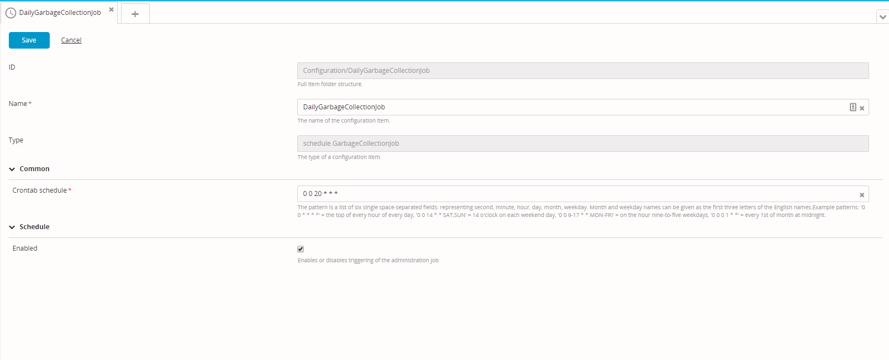

When you delete a deployment package from XL Deploy, XL Deploy initially only deletes the reference to the package. This helps optimize performance. You can reclaim disk space on an XL Deploy server by using garbage collection to delete the actual deployment package at a later time.

You do not need to run garbage collection every time you delete a package. How often you should run garbage collection depends on how many packages you delete and the buffer of free space on your disk; generally, you should not need to run garbage collection more than once per day.

## Schedule garbage collection from the CLI

To schedule garbage collection from the command-line interface (CLI), run the following command:

    deployit.runGarbageCollector()

This command requires requires admin permissions.

The garbage collector automatically stops when the task is finished. You can see the status when running `listUnfinishedTasks`.

## Automatically schedule garbage collection

The easiest way to schedule garbage collection is to create a garbage collection job (`schedule.GarbageCollectionJob`) configuration item (CI) that triggers the garbage collection based on a crontab expression.

To create a garbage collection job:

1. From the side bar, click **Configuration**
1. Click , then select **New** > **Schedule** > **GarbageCollectionJob**.
1. In the **Name** field, enter a unique policy name.
1. In the **Crontab schedule** field, define a crontab pattern for executing the garbage collection job.    

 The pattern is a list of six single space-separated fields representing second, minute, hour, day, month, and weekday. Month and weekday names can be entered as the first three letters of their English names. For example, to run the job every day at 20:00, enter `0 0 20 * * *`.

5. Click **Save**.

 

**Tip:** To trigger a garbage collection job manually, right-click it and select **Execute job now**.

## Force garbage collection to free space immediately

The algorithm used in XL Deploy's internal Jackrabbit datastore will not allow recently used files to be deleted. To delete these files immediately, the Java virtual machine (JVM) garbage collection mechanism must run. Therefore, depending on your JVM configuration, you may see a delay between the time that the XL Deploy garbage collector runs and the time that the space is actually freed by the JVM garbage collector.

There are two ways to force garbage collection to free disk space immediately.

**Method one (requires server restart)**

1. Delete the desired deployment packages.
1. Restart XL Deploy.
1. Run XL Deploy garbage collection from the CLI or from a garbage collection job.

**Method two (does not require server restart)**

1. Delete the desired deployment packages.
1. Trigger JVM garbage collection using the `jvisualvm` tool.
1. Run XL Deploy garbage collection from the CLI or from a garbage collection job.
