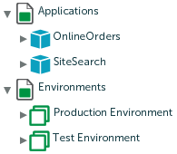
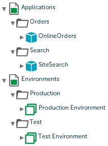
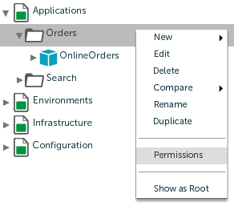
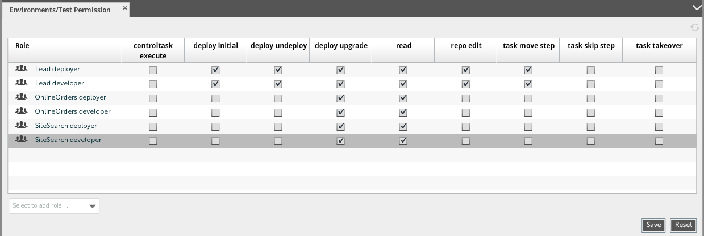
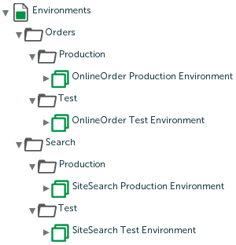

XL Deploy provides fine-grained security settings based on [roles and permissions](/xl-deploy/concept/roles-and-permissions-in-xl-deploy.html) that you can configure in the GUI and through the command-line interface (CLI).

## Using the default GUI

As of version 6.2.0, the default GUI is HTML-based.

To configure security in the default GUI, click **User Management** in the top menu bar.

### Assign principals to roles

Use the **Roles** tab to create and maintain roles in XL Deploy. To add a role, click **Add role**. To delete a role, click **Delete** next to it.

*Principals* are assigned to roles. To assign a principal to a role, click **Edit** next to the role. Type the principal name and click **Add** or press ENTER to add it. Repeat this process for all principals, and then click **Save**. To delete a principal, click **X** next to it.

### Assign global permissions to roles

Use the **Global Permissions** tab to assign global permissions to *roles* in XL Deploy. To add global permissions to a role, select the boxes next to it. To clear all permissions from a role, click **Clear**.

### Assign local permissions to roles

To assign or edit permissions:

1. In the Library menu, hover over a root node or a directory and click .
1. Select **Edit permissions**.
1. To add local permissions to a role, select the boxes next to it. To clear all permissions from a role, click **Clear**.

**Note:** To add or edit local permissions, you must have the `admin` or `security#edit` global permission.

## Using the legacy GUI

To configure security in the legacy GUI, click **Admin** in the top menu bar.

### Assign principals to roles

Use the **Roles** tab to create and maintain roles in XL Deploy. To add a role, click . To delete a role, click .

*Principals* are assigned to roles. To assign a principal to the role, double-click the **Principals** column and type the principal name. Separate principals with commas. To delete a principal, double-click the column and delete the principal name.

Be sure to click **Save** to save the roles and principals.

### Assign global permissions to roles

Use the **Global permissions** tab to assign global permissions to *roles* in XL Deploy. To add global permissions to a role:

1. Select the role from the **Select to add role** list.
2. Select the permissions that you want to assign to the role.
3. Click **Save** to save the permissions.

### Assign local permissions to roles

Use the **Repository** to assign local permissions to roles. To add local permissions to a role:

1. Right-click a root node (such as Applications or Environments) or a directory and select **Permissions**.
1. Select the role from the **Select to add role** list.
2. Select the permissions that you want to assign to the role.
3. Click **Save** to save the permissions.

## Using the CLI

For information about using the command-line interface (CLI) to set up roles and permissions refer to [Set up roles and permissions using the XL Deploy CLI](/xl-deploy/how-to/set-up-roles-and-permissions-using-the-cli.html).

## Sample security set up

This example shows how you can set up security roles using the XL Deploy Flash-based GUI. The example environment has two applications, OnlineOrders and SiteSearch. They are both deployed to a test server before going to production.

There are two teams developing and deploying the applications. One team can't see the other's team application. Also, developers can only deploy to the test environment, while deployers can deploy to the test environment and to production.

We'll set up different security roles for the different users in the organization.

This example assumes that there are already users and groups present in the system, for example, by way of LDAP integration.

This is an overview of the environment for this example:

### Create roles

The list of roles we want to have in the system are:

* OnlineOrders developer: May update the OnlineOrders application
* SiteSearch developer: May update the SiteSearch application
* Lead developer: May update and install any application on the test environment
* OnlineOrders deployer: May update OnlineOrders application in test and production
* SiteSearch deployer: May update SiteSearch application in test and production
* Lead deployer: May install any application on any environment

### Create directories

Now let's add some directories. In **Repository**:

1. Right-click **Applications** and select **New** > **Directory**.
2. Name the new directory "Orders".
3. Drag-and-drop the OnlineOrder package into the Order directory.
4. Repeat this procedure to create a directory for the SiteSearch application and for the Production and Test environments.

### Assign roles for applications

To assign roles, right-click a directory and select **Permissions**.

Assign roles to the **Orders** directory:

This means that the lead developer and the lead deployer are allowed to add and remove applications in the Orders directory, but regular developers and deployers assigned to the project may only upgrade an existing deployment, say from OnlineOrders 1.0 to 2.0.

You can do a similar setup for the **Search** directory, substituting the OnlineOrders developer and deployer roles with the corresponding SiteSearch roles.

Note that if a role is not added to this screen, it effectively has no permissions. To remove a role, simply deselect all of its permissions and click **Save**.

### Assign roles for environments

Now, set permissions for the test environment. This environment is can be accessed by both development and operations teams. Simply add all roles and grant all permissions to the lead developers and deployers. Regular developers and deployers have more restricted access.

For production, only deployers should have access. Only the lead deployer may alter the environment from XL Deploy.

### Refine security levels

In the current setup, the test and production environments are shared for the OnlineOrders and SiteSearch applications. That means that the OnlineOrders deployers can see the SiteSearch application and vice versa.

To avoid this, you must split the environments into application-specific environments. So the production environment will be split into an "Online Order Production environment" and "SiteSearch Production environment". Note that they will still refer to the same physical servers. But, by splitting them up, you can effectively hide them from different sets of users in XL Deploy.

This is the new setup:

The permissions for **Environment** > **Orders** > **Production** look like:

And the permissions for **Environments** > **Orders** look like:

