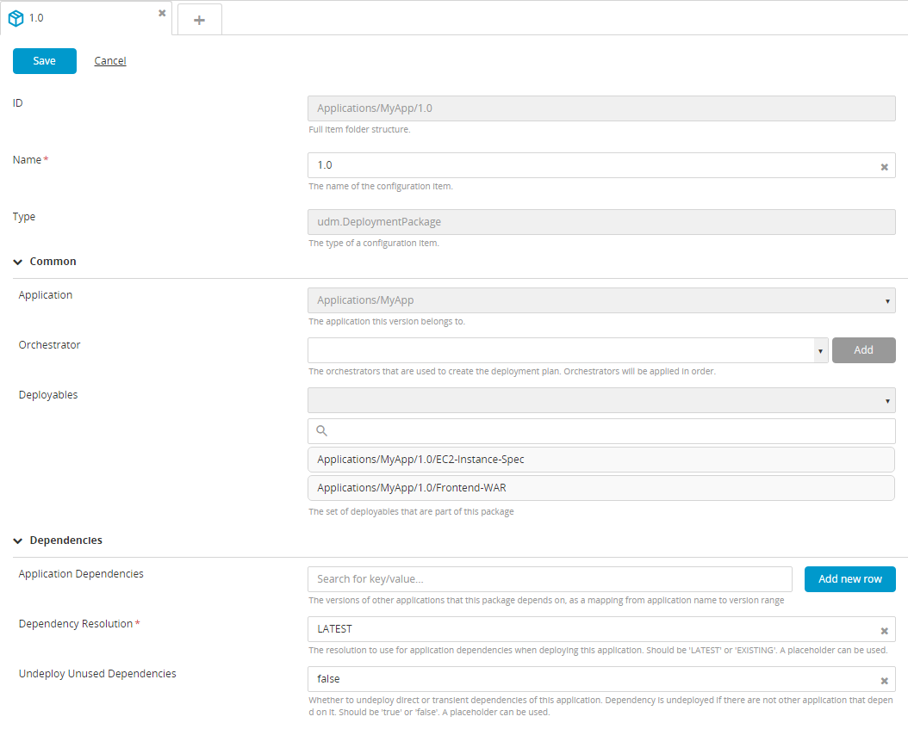
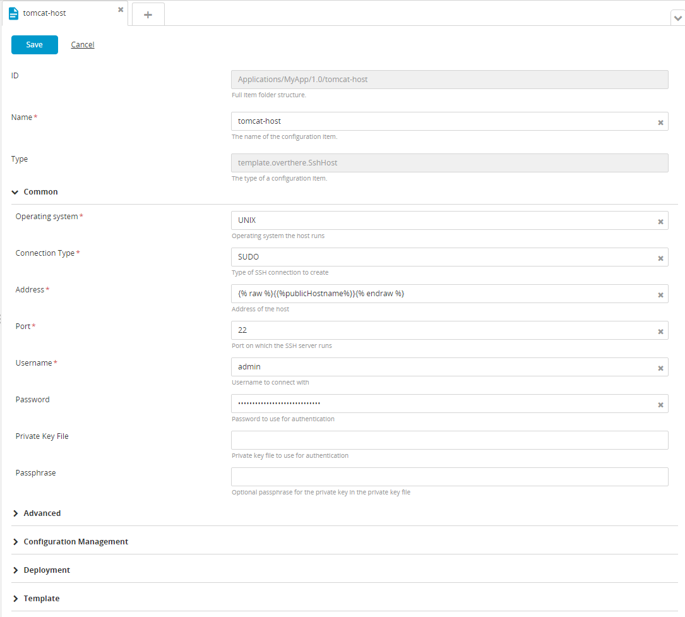
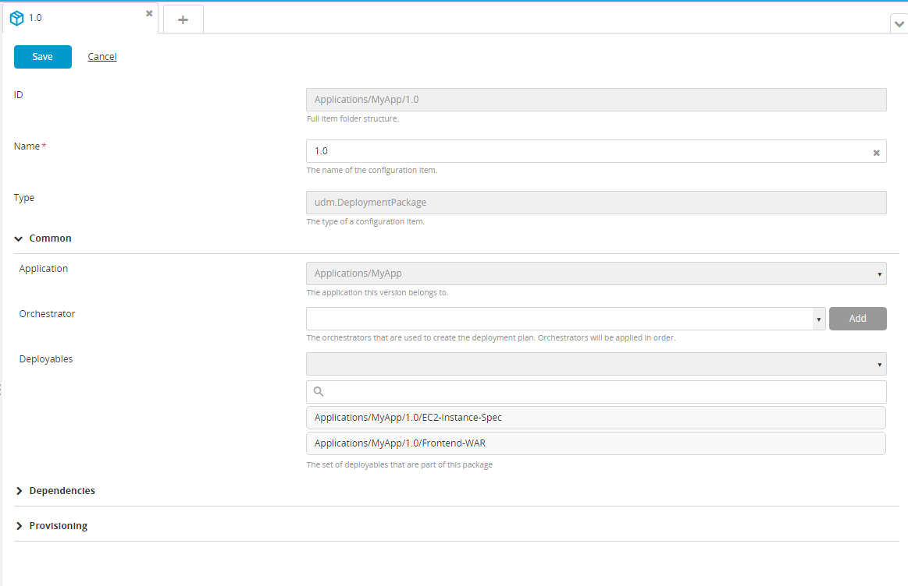
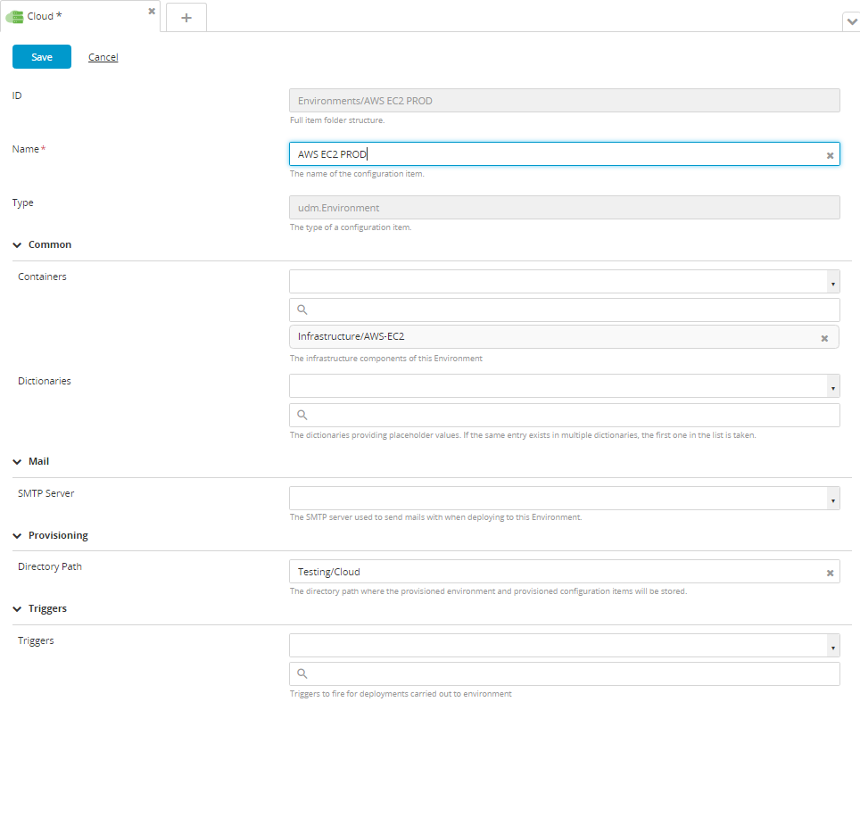

In XL Deploy, a [*provisioning package*](/xl-deploy/how-to/create-a-provisioning-package.html) is a collection of:

* **Provisionables:** which contain settings that are needed to provision a cloud-based environment.
* **Provisioners:** which execute actions in the environment after it is set up.
* **Templates:** which create configuration items (CIs) in XL Deploy during the provisioning process.

When you map a provisioning package to an environment, XL Deploy creates *provisioneds*. These are the actual properties, manifests, scripts, and so on that XL Deploy will use to provision the environment.

You may want to use a provisioned property such as the IP address or host name of a provisioned server in a template, but the property will not have a value until provisioning is done. XL Deploy allows you to use *contextual placeholders* for these types of properties. Contextual placeholders can be used for all properties of provisioneds. The format for contextual placeholders is `{}`.

You can also use contextual placeholders for output properties of some CI types. XL Deploy can automatically populate output property values after provisioning is complete. For example, after you provision an [Amazon Elastic Compute Cloud (EC2)](https://aws.amazon.com/ec2/) AMI, the `aws.ec2.Instance` configuration item (CI) will contain its instance ID, public IP address, and public host name. Refer to the [AWS Plugin Reference](/xl-deploy-xld-aws-plugin/latest/awsPluginManual.html) for information about properties.

## Sample provisioning output usage

Say you want to provision an Amazon EC2 AMI and then apply a [Puppet manifest](https://puppetlabs.com/) to it. The Puppet manifest requires a host, but you will not know the host's address until the AMI is provisioned, so you need to use a contextual placeholder for it. To do so:

1. In the top bar, Click **Explorer**.
1. Expand **Applications**, then expand the application.   
**Note:** In XL Deploy 5.5.x, expand **Blueprints**, then expand the desired blueprint.
1. Hover over the application, click  and select **New** > **aws** > **ec2** > **InstanceSpec**.
1. In the **Name** field, enter `EC2-Instance-Spec`
1. Fill in the required fields and save the CI.

  

1. Hover over the application, click  and select **New** > **template** > **overthere** > **SshHost**.
1. In the **Name** field, enter `tomcat-host`.
1. Fill in the required properties, setting the **Address** property to `{}`.
1. Click **Save**.

  

1. Double-click the package.
1. Under **Provisioning**, click the **Bound Templates** field, and add `tomcat-host` to the list.     

 **Note:** This ensures that XL Deploy will save the generated `overthere.SshHost` CI in the Repository.

  

1. Hover over **EC2-Instance-Spec**, click , and select **New** > **puppet** > **provisioner** > **Manifest**.
2. In the **Name** field, enter `Puppet-provisioner-Manifest`.
1. In the **Host Template** field, select the `tomcat-host` CI that you created.
1. Fill in the required properties.
1. Click **Save**.

  

1. Double-click an environment that contains an Amazon EC2 [provider](/xl-deploy/how-to/create-a-provider.html).
1. Under the **Provisioning** section, click the **Directory Path** field, and enter the directory where XL Deploy should save the generated `overthere.SshHost` CI.

  

  **Note:** The directory must already exist under **Infrastructure**.

1. [Provision the package to an environment](/xl-deploy/how-to/provision-an-environment.html) that contains an Amazon EC2 [provider](/xl-deploy/how-to/create-a-provider.html).    

 **Note:** During provisioning, XL Deploy will create an SSH host, using the public host name of the provisioned AMI as its address.
