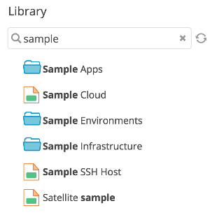

In the Explorer, you can manage the configuration items (CIs) in your repository, deploy and undeploy applications, and provision and deprovision environments.

## Requirements and installation

The Explorer is automatically included as a plugin when you install or upgrade to XL Deploy 6.0.0 or later. To use the Explorer, you must use the latest version of Firefox or Chrome, or Internet Explorer 11 or later. Internet Explorer Compatibility View is not supported.

For general information about system requirements for the XL Deploy server, refer to [Requirements for installing XL Deploy](/xl-deploy/concept/requirements-for-installing-xl-deploy.html).

## Access the Explorer in XL Deploy versions 6.0.0 and 6.1.0

To access the Explorer in XL Deploy 6.0.0 and 6.1.0, go to `XL_DEPLOY_URL:PORT/technical-preview.html`; for example, `http://xl-deploy.company.com:4516/technical-preview.html`. In XL Deploy 6.2.0 and later, simply go to `XL_DEPLOY_URL:PORT`. If you are not already logged in to XL Deploy, you must enter your XL Deploy user name and password when the browser prompts you.

## Work with CIs

In the Explorer, you'll see the the contents of your repository in the left pane. When you create or open a CI, you can edit its properties in the right pane.

### Create a CI

To create a new CI, locate the place where you want to create it in the left pane, hover over it and click , and then select **New**. A new tab opens in the right pane.

### Open and edit a CI

To open an existing CI, double-click it in the left pane. A new tab opens in the right pane with the CI properties.

To view the summary screen of an application, double-click the desired application. To edit the properties of the application, click **Edit properties** in the summary screen.

Edit the properties as desired, and then click **Save** to save your changes. To discard your changes without saving, click **Cancel**.

### Rename a CI

To copy an existing CI, locate it in the left pane, hover over it and click , and then select **Rename**. Change the name as desired, and then press ENTER to save your changes.

To cancel without saving your changes, press ESC or click another CI in the left pane.

### Duplicate a CI

To duplicate an existing CI, locate it in the left pane, hover over it and click , and then select **Duplicate**. A new CI appears in the left pane with a number appended to its name; for example, if you duplicate an application called _MyApp_, the Explorer creates an application called _MyApp (1)_. You can then rename and/or edit the new CI as desired. Double-click the duplicated application to view the summary screen and click **Edit properties** to change the application properties.

### Delete a CI

To delete an existing CI, locate it in the left pane, hover over it and click , and then select **Delete**. Finally, confirm or cancel the deletion.

## Search for CIs

To search for a CI, type a search term in the **Search** box at the top of the left pane and press ENTER. If there are search results, they appear in the left pane. To open a CI from the search results, double-click it. To clear the search results, click  in the **Search** box.

## Deploy an application

To use the Explorer to deploy an application:

1. Expand **Applications**, and then expand the application that you want to deploy.
1. Hover over the desired deployment package or provisioning package, click , and then select **Deploy**. A new tab appears in the right pane.
1. In the new tab, select the target environment. You can filter the list of environments by typing in the **Search** box at the top. To see the full path of an environment in the list, hover over it with your mouse pointer.
1. If you are using XL Deploy 6.0.x, click **Execute** to start executing the plan immediately. Otherwise, click **Continue**.
1. You can optionally:

    * View or edit the properties of a deployed item by double-clicking it
    * Click **Deployment Properties** to configure properties such as [orchestrators](/xl-deploy/concept/understanding-orchestrators.html)

    

1. Click **Execute** to start executing the plan immediately.

    If the server does not have the capacity to immediately start executing the plan, it will be in a `QUEUED` state until the server has sufficient capacity.

    

    If a step in the deployment fails, XL Deploy stops executing and marks the step as `FAILED`. Click the step to see information about the failure in the output log.

### Stop, abort, or cancel an executing deployment

You can stop or abort an executing deployment, then continue or cancel it. For information about doing so, refer to [Stopping, aborting, or canceling a deployment](/xl-deploy/how-to/stop-abort-or-cancel-a-deployment.html).

### Continue after a failed step

If a step in the deployment fails, XL Deploy stops executing the deployment and marks the step as `FAILED`. In some cases, you can click **Continue** to retry the failed step. If the step is incorrect and should be skipped, select it and click **Skip**, then click **Continue**.

### Roll back a deployment

To roll back a deployment that is in a `STOPPED` or `EXECUTED` state, click **Rollback** on the deployment plan. Executing the rollback plan will revert the deployment to the previous version of the deployed application (or applications, if the deployment involved multiple applications because of [dependencies](/xl-deploy/concept/application-dependencies-in-xl-deploy.html)). It will also revert the deployeds created on execution.

## Update a deployed application

In XL Deploy 6.1.0 and later, you can use the Explorer to update a deployed application:

1. Expand **Environments**, and then expand the environment where the application is deployed.
1. Hover over the application, click , and then select **Update**. A new tab appears in the right pane.
1. In the new tab, select the desired version. You can filter the list of versions by typing in the **Search** box at the top.
1. Click **Continue**.
1. You can optionally:

    * View or edit the properties of a deployed item by double-clicking it
    * Click **Deployment Properties** to configure properties such as [orchestrators](/xl-deploy/concept/understanding-orchestrators.html)

1. Click **Execute** to start executing the plan immediately.

    If the server does not have the capacity to immediately start executing the plan, it will be in a `QUEUED` state until the server has sufficient capacity.

    If a step in the update fails, XL Deploy stops executing and marks the step as `FAILED`. Click the step to see information about the failure in the output log.

## Undeploy an application

To use the Explorer to undeploy an application:

1. Expand **Environments**, and then expand the environment where the application is deployed.
1. Hover over the application, click , and then select **Undeploy**. A new tab appears in the right pane.
1. You can optionally configure properties such as [orchestrators](/xl-deploy/concept/understanding-orchestrators.html) for the undeployment.
1. Click **Execute** to start executing the plan immediately.

    If the server does not have the capacity to immediately start executing the plan, it will be in a `QUEUED` state until the server has sufficient capacity.

    If a step in the undeployment fails, XL Deploy stops executing and marks the step as `FAILED`. Click the step to see information about the failure in the output log.
