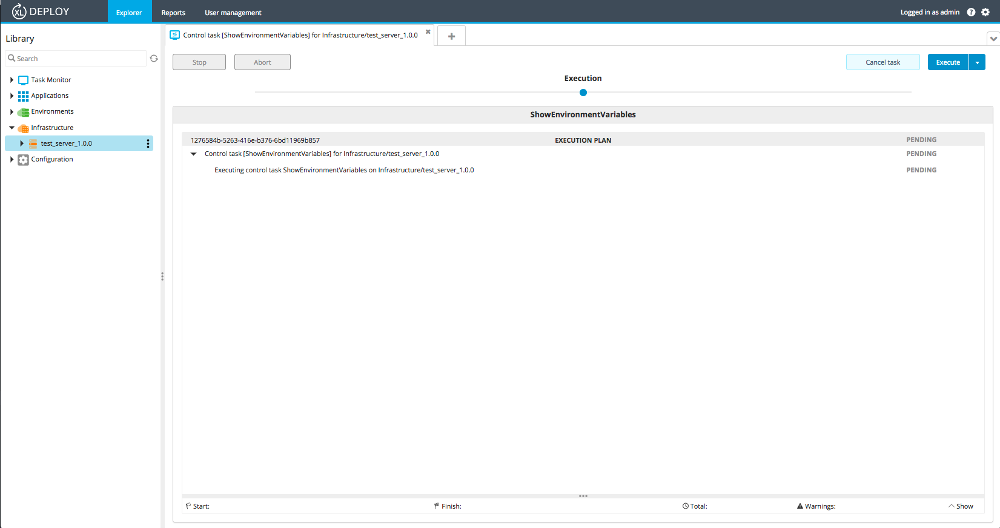

In XL Deploy, you can define [control tasks](/xl-deploy/how-to/using-control-tasks-in-xl-deploy.html) that allow you to execute actions from the XL Deploy GUI or CLI. One way to create a custom control task is to use a [delegate](/xl-deploy/how-to/create-a-custom-control-task.html). XL Deploy includes a predefined delegate called `JythonDelegate` that accepts a Jython script that it will execute. This topic describes how to use `JythonDelegate` to create a custom control task that prints all environment variables on the host.

## Define a control task

Define a control task in the `XL_DEPLOY_SERVER_HOME/ext/synthetic.xml` file. This example adds a method to `overthere.LocalHost` using a type modification. The `method` tag defines a control task named `showEnvironmentVariables`. The `delegate` parameter defines the type of delegate and the `script` parameter defines the Python script that will perform the action.


<type-modification type="overthere.LocalHost">
    <method name="ShowEnvironmentVariables"
            description="Show environment variables"
            delegate="jythonScript"
            script="scripts/env.py">
    </method>
</type-modification>


## Create a Jython script

This is an example of a Jython script that prints the environment variables that are available on a host:


import os

for env in os.environ:
    print("{0}={1}".format(env, os.environ[env]))


After defining the control task and creating the script, restart the XL Deploy server.

## Run the control task

In XL Deploy, go to the **Explorer**, hover over an `overthere.LocalHost` configuration item (CI), and click . You can see the new control task in the menu.

Click `ShowEnvironmentVariables` to see the steps of the control task. After it executes, it returns the environment variables on the host.

## Define a control task with parameters

The `showEnvironmentVariables` control task defined above prints all environment variables on a host. If you want to limit the control task results, define a method parameter that will be passed to the Jython script.

### Update the control task

Change the definition in `XL_DEPLOY_SERVER_HOME/ext/synthetic.xml` as follows:


<type-modification type="overthere.LocalHost">
    <method name="ShowEnvironmentVariables" description="Show environment variables" delegate="jythonScript" script="scripts/env.py">
        <parameters>
            <parameter name="limit" kind="integer" description="number of environment variables to expect" default="-1"/>
        </parameters>
    </method>
</type-modification>


This defines a parameter called `limit` of type _integer_. The default value of `-1` means that all environment variables will be listed.

### Update the Jython script

The Jython script can access the method parameter using the `params` object. This is an implicit object that is available to the Jython script that stores all method parameters. Other implicit objects that are available to the script are `args`, which is a dictionary that contains arguments passed to the script, and `thisCi`, which refers to the configuration item on which the control action is defined.


import os

print("Environment variables on the host with name {0}".format(thisCi.name))

limit = params["limit"]
env_var_keys = []
if limit == -1:
    env_var_keys = os.environ.keys()
else:
    env_var_keys = os.environ.keys()[:limit]

for env in env_var_keys:
    print("{0}={1}".format(env, os.environ[env]))


### Run the control task

After restarting the XL Deploy server and selecting the `ShowEnvironmentVariables`, you will be able to provide a limit for the control task results.

