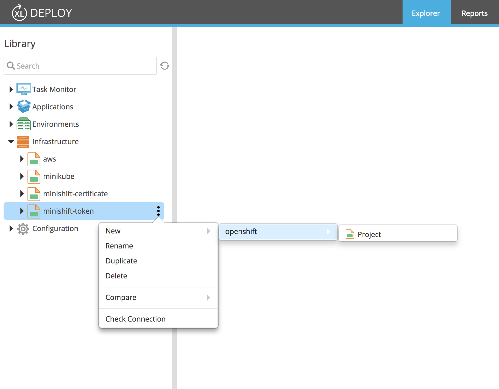

The main purpose of the XL Deploy Openshift plugin is to create or destroy Openshift resources on an Openshift server . To use the plugin:

1. Download the XL Deploy Openshift plugin ZIP from the [distribution site](https://dist.xebialabs.com/customer/xl-deploy/plugins/xld-kubernetes-plugin).
1. Unpack the plugin inside the `XL_DEPLOY_SERVER_HOME/plugins/` directory.
1. Restart XL Deploy.

With this plugin, types such as Openshift cloud and tasks specific for creating or removing Openshift resources are available to use in XL Deploy.

**Note:** Make sure that a compatible version of the [Kubernetes plugin](/xl-deploy/concept/xl-deploy-kubernetes-plugin.html) is also added to the `XL_DEPLOY_SERVER_HOME/plugins/` directory.

### Setup the `openshift.Server` with minishift

1. Under **Infrastructure**, click **New** and select `openshift.Server`.

1. Setup the `openshift.Server` authentication using one of these methods:

* Client Certificate Authentication. Specify the following required properties:

    * `serverUrl`: The URL of the OpenShift server
    * `verifyCertificates`: Validate the cerificates
    * `caCert`: Certification authority certificate for server (example `.../.minishift/ca.crt`)
    * `tlsCert`: TLS certificate for master server (example `.../.minishift/apiserver.crt`)
    * `tlsPrivateKey`: TLS private key for master server (example `.../.minishift/apiserver.key`)

* Token Authentication

    * `openshiftToken`: Token used for authentication

    

### Verify the OpenShift server connectivity

The `openshift.Server` connectivity can be verified using the control task **Check Connection**. If the task execution is successful, the connectivity is working.

### Create a new `openshift.Project` before any resource can be deployed to it

* The `openshift.Project` is the container for all the `openshift` resources. It is mandatory to have the project deployed through XL Deploy. The target project must be deployed in a separate package, different than the package containing other openshift resources such as pod, deployment.

* The `openshift.Project` CI requires only the project name. If the project name is not specified, XL Deploy uses the CI name as project name.

* The `openshift.Project` CI does not allow project name modification.

### Use an existing project provided by the `openshift` server

XL Deploy allows you to use existing projects as described here:

1. Create the `openshift.Project` in `openshift.Server` created under **Infrastruture**.
1. Provide the `default` project name when `default` project exists on the openshift server so that there is no need to have a provisioning package containing a **Project**.

### Configure `openshift` resources using the YAML-based deployables

* The `openshift` server allows you to configure the `openshift` resources and XL Deploy.

* You can configure the YAML based `openshift` resources using the `openshift.ResourcesFile` CI. This CI requires the YAML file containing the definition of the `openshift` resources that will be configured on the `openshift` server.

* Deployment order of the `openshift` resources through multiple YAML based CI

    * You can have separate YAML files for `openshift` resource.
    * Deployment order and YAML files should be in accordance with the resources dependency.
    * Deployment order across YAML-based CI is managed by Create Order, Modify Order, and Destroy Order

### Use the CI-based deployables to configure openshift resources

XL Deploy also provides CIs for `k8s` resource deployment (example: `k8s.Pod`, `k8s.Deployment`, `openshift.Route`). These CIs have some advantages over YAML-based CIs in terms of automatic deployment order: you do not need to specify the order and it also handles asynchronous create/delete operation of resources.    
