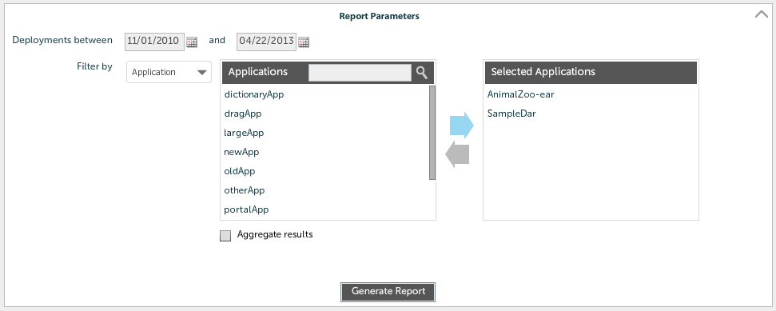
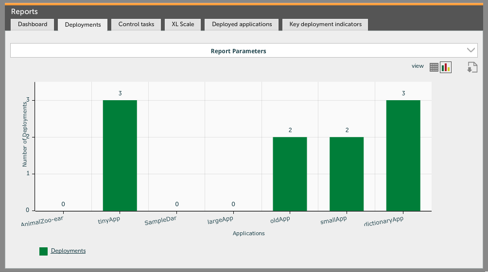
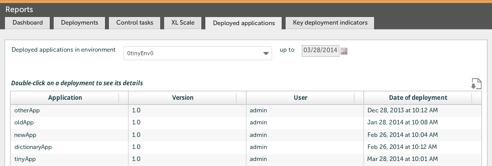
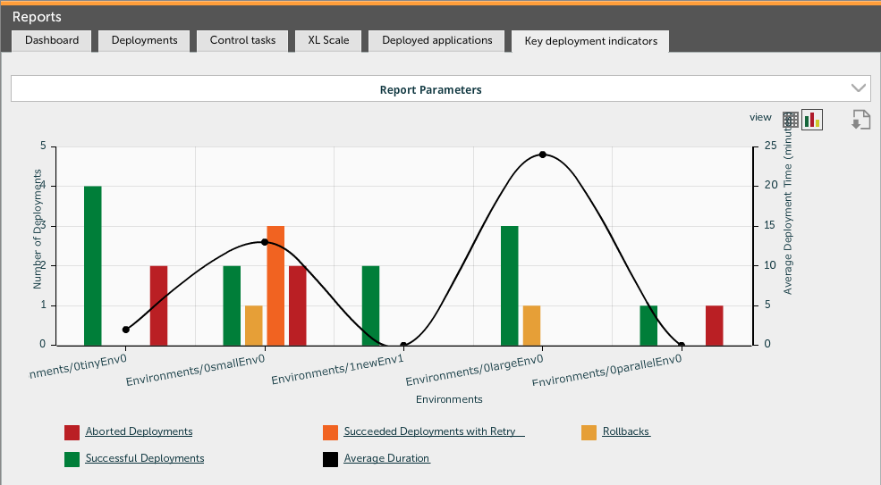

XL Deploy contains information about your environments, infrastructure, and deployments. Using the reporting functionality, you can gain insight into the state of your environments and applications. The reports are available to all users of XL Deploy.

## Reports dashboard

When opening the Reports section for the first time, XL Deploy will show a high-level overview of your deployment activity.

The dashboard consists of three sections that each give a different view of your deployment history:

{:.table .table-striped}
| Section | Description |
| ------| ----------|
| Current Month | Information about the current month and gives insight into current deployment conditions: the percentage for successful, retried, rollback, and aborted deployments. |
| Last 6 Months | Trend information about the last 6 complete months |
| Last 30 Days | Information about the past 30 days of deployments |

The following graphs appear on the dashboard:

{:.table .table-striped}
| Graph | Description |
| ----| ----------|
| Deployment status overview | The percentage for successful, retried, rollback, and aborted deployments |
| Number of deployments over time | Number of deployments divided into successful, successful with manual intervention, failed deployments, and rollbacks over the last 6 months |
| Average deployment duration over time | Average deployment duration over the last 6 months |
| Top 10 successful deployments | Top 10 applications with most successful deployments over the last 30 days |
| Top 10 retried deployments | Top 10 applications with most retries (manual intervention) during deployments over the last 30 days |
| Top 10 longest deployments | Top 10 applications with longest running deployments over the last 30 days |

**Note:** Rollbacks never count towards successful deployments, even if the rollback is executed successfully.

To refresh the dashboard, press the reload button on the top right corner.

## Deployment report

As of XL Deploy 6.2.0, the default GUI is HTML-based.

The default GUI includes the deployment report. To access the report, click **Reports** in the top menu. Note that, like other reports, this requires the [`report#view`](/xl-deploy/concept/roles-and-permissions-in-xl-deploy.html#global-permissions) permission.

The report provides a detailed log of each completed deployment. You can see the executed plan and the logged information about each step in the plan.

## Deployment report in the legacy GUI

The deployments report shows deployments done in a given date range. It also allows you to aggregate deployments by selected applications and environments.

### Report without filtering

By default, the report shows all deployments in the date range in tabular format.

The report shows the following columns:

{:.table .table-striped}
| Column | Description |
| -----| ----------|
| Package | The package and version that was deployed |
| Environment | The environment to which it was deployed |
| Deployment Type | The type of the deployment (initial, upgrade, undeployment, or rollback) |
| User | The user who performed the deployment |
| Status | The status of the deployment |
| Start Date | The date on which the deployment was started |
| Completion Date | The date on which the deployment was completed |

Double-click on a row to show the deployment steps and logs for that particular deployment.

### Filtered report

The report allows you to filter on application or environment. Simply select the appropriate filter, and then double-click the desired applications or environments to include them in the report.

### Aggregating results

Select **Aggregate results** to get the total number of deployments for the selected applications or environments. This report can be shown in a grid or a chart view.

In grid view, the report looks like this:

When selecting the chart view, the report is shown as a bar graph, for example:

**Note:** If you change the name of an application that was previously deployed, you will not be able to access detailed reports about that application.

## Reports dashboard in the legacy GUI

When opening the Reports section for the first time, XL Deploy will show a high-level overview of your deployment activity.

The dashboard consists of three sections that each give a different view of your deployment history:

{:.table .table-striped}
| Section | Description |
| ------| ----------|
| Current Month | Information about the current month and gives insight into current deployment conditions |
| Last 6 Months | Trend information about the last 6 complete months |
| Last 30 Days | Information about the past 30 days of deployments |

The following graphs appear on the dashboard:

{:.table .table-striped}
| Graph | Description |
| ----| ----------|
| Status Overview | How many of the current month's deployments were successful, successful with manual intervention (retried), failed, or is a rollback |
| Average Duration of Successful Deployments | Average duration of successful deployments as a frequency diagram; shows the duration distribution over all deployments and identifies any outliers |
| Throughput | Throughput of deployments divided into successful, successful with manual intervention, failed deployments, and rollbacks over the last 6 months; the black line indicates the percentage of successful deployments per month |
| Deployment Duration over Time | Average deployment duration over the last 6 months |
| Top 5 Successful Deployments | Top 5 applications with most successful deployments over the last 30 days |
| Top 5 Re-tried Deployments | Top 5 applications with most retries (manual intervention) during deployments over the last 30 days |
| Top 5 Longest Running Deployments | Top 5 applications with longest running deployments over the last 30 days |

**Note:** Rollbacks never count towards successful deployments, even if the rollback is executed successfully.

To refresh the dashboard, press the reload button on the top right corner.

## Deployed application report

The XL Deploy deployed applications report shows all applications that were deployed in a certain environment at a particular date. The following is an example of such a report:

{:.table .table-striped}
| Column | Description |
| -----| ----------|
| Application | The application on the environment |
| Version | The version of the application |
| User | The user who performed the deployment |
| Date of Deployment | The date on which this version of the application was deployed |

Double-click on a row to show the deployment steps and logs for that particular deployment.

**Note:** If you change the name of an application that was previously deployed, you will not be able to access detailed reports about that application.

## Key deployment indicators report

The XL Deploy key deployment indicators report shows the following indicators describing deployment performance:

{:.table .table-striped}
| Indicator | Description |
| --------| ----------|
| Number of successful deployments | Total number of deployments that ran successfully (that is, were fully automated) |
| Number of retried deployments | Total number of deployments that required manual intervention |
| Number of aborted deployments | Total number of deployments that was aborted |
| Number of rollbacks | Total number of rollbacks |
| Average deployment duration | Average duration of the shown deployments |

### Report without filtering

The report is shows all deployments in the date range in tabular format, without aggregation. This is an example of such a report:

The report shows the following columns:

{:.table .table-striped}
| Column | Description |
| -----| ----------|
| Application | The application that was deployed |
| Environment | The environment on which the application was deployed |
| Success | Number of times the deployment was successful |
| Retried | Number of times the deployment succeeded with manual intervention |
| Aborted | Number of times the deployment aborted |
| Rollbacks | Total number of rollbacks |
| Average Duration | Average duration for the deployment |

### Filtered report

The report allows you to filter on application or environment. Simply select the appropriate filter, and then double-click the desired applications or environments to include them in the report.

### Aggregating results

Select **Aggregate results** to get a summary of the key deployment indicators over the selected applications or environments. The report can be shown in a grid or a chart view.

In grid view, the report looks like this:

The report shows the following columns:

{:.table .table-striped}
| Column | Description |
| -----| ----------|
|  Application / Environment | The application being deployed or the environment being deployed to |
| Successful Deployments | Number of times the deployment has been successful |
| Rollbacks | This is the total number of rollbacks |
| Retried Deployments | Number of times the deployment succeeded with manual intervention |
| Aborted Deployments |  Number of times the deployment aborted |
| Deployment duration time | Average time for a deployment |

When selecting the chart view, the report is shown as a bar graph, for example:

The chart shows the selected applications on the x-axis. The chart has two y-axis: the left y-axis shows the number of deployments (successful, retried and aborted) and the right y-axis shows the average deployment time.

## Exporting to CSV format

If you want to reuse data from XL Deploy in your own reporting, you can download report data as a CSV file by clicking  in the legacy GUI or  in the default GUI.
