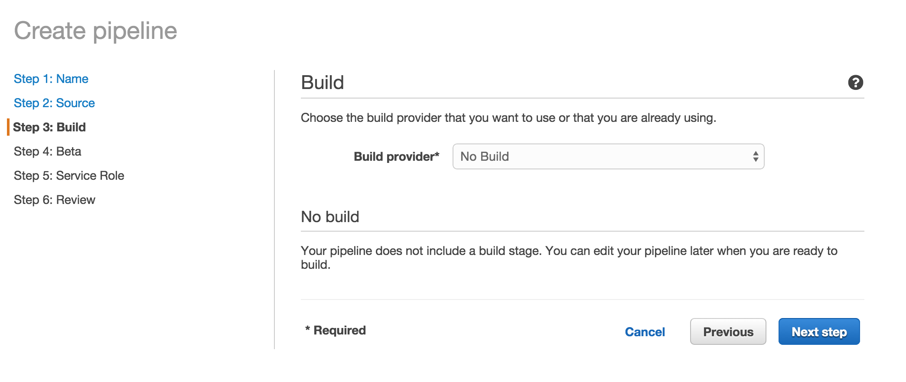
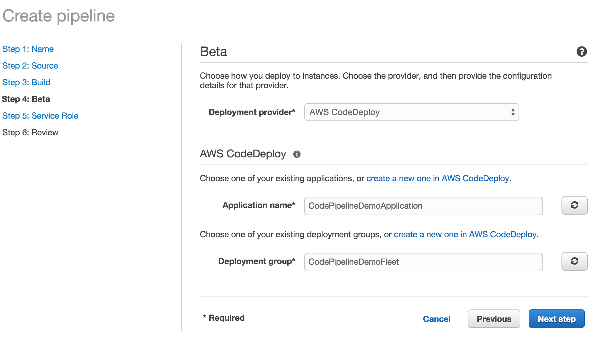
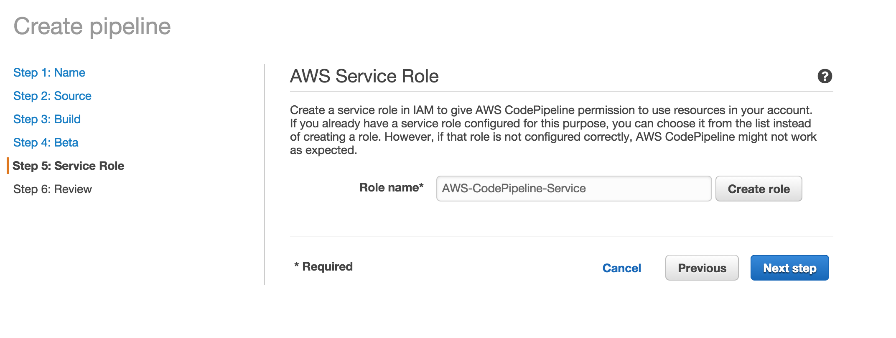
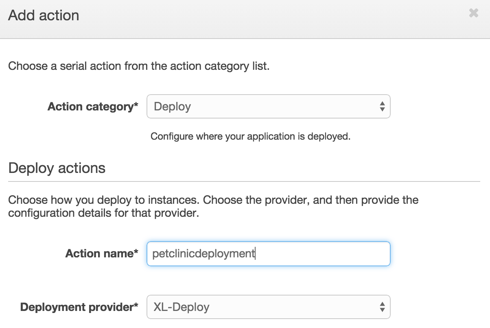
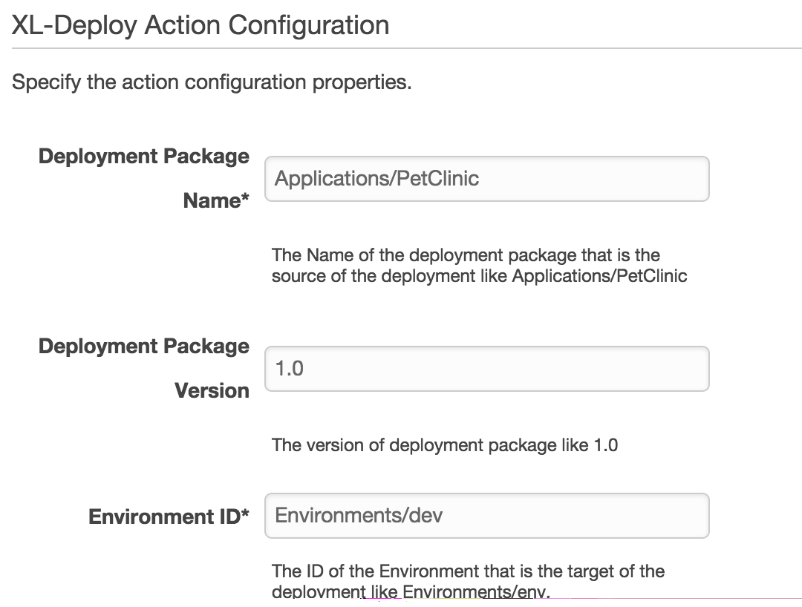
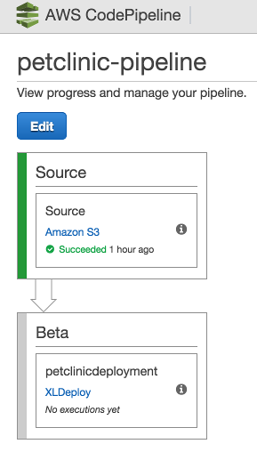
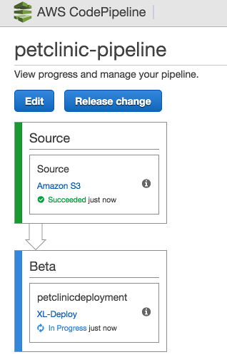
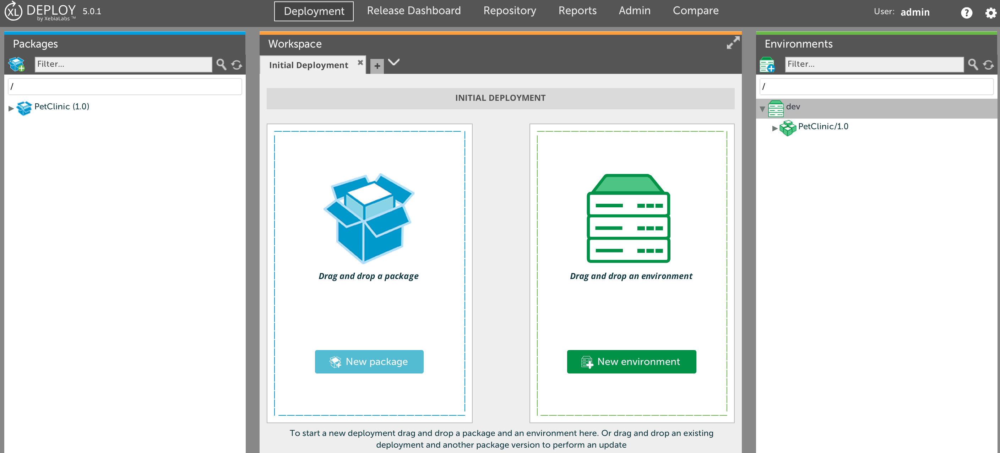
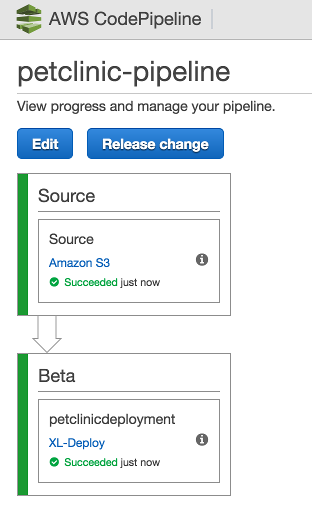

[AWS CodePipeline](http://aws.amazon.com/codepipeline/) is Amazon Web Services' continuous delivery service. It allows you to model and automate your software release process.

The AWS CodePipeline plugin for XL Deploy enables XL Deploy to function as an additional deployment option for AWS CodePipeline, allowing CodePipeline users to leverage XL Deploy's leading capabilities for deployments of existing enterprise applications to on-demand, on-premises, and hybrid cloud environments hosted in [Amazon EC2](http://aws.amazon.com/ec2/) and other clouds.

This topic describes how to use XL Deploy with AWS CodePipeline.

## Create a sample pipeline in AWS CodePipeline

This section describes how to create a sample pipeline in AWS CodePipeline to demonstrate a deployment action using XL Deploy.

### Step 1 Log in to AWS CodePipeline

Go to the [AWS Management Console](http://aws.amazon.com/console/) and select AWS CodePipeline. Click **Get started** to create a pipeline.

### Step 2 Create the sample pipeline

To create the sample pipeline:

1. In **Pipeline name**, enter *petclinic-pipeline*.

    

1. Click **Next step** to proceed.
1. Choose a source code provider.

    In a fully-fledged pipeline, you would refer to application source code here, which would be compiled and packaged in a deployable artifact during a build step. However, this example demonstrates a deployment step, so the source location points to a Deployment ARchive (DAR) file, which is XL Deploy's standard input format. To learn more about DAR files, refer to [Preparing your application for XL Deploy](/xl-deploy/concept/preparing-your-application-for-xl-deploy.html).

    For this example, select the *Amazon S3* **Source provider** and set the **Amazon S3 location** to *s3://petclinic-packages/PetClinic-1.0.dar*.

    

1. Click **Next step** to proceed.
1. Choose a build provider to build the artifact.

    In this example, the source code location already points to a deployable artifact (the DAR file), so select *No Build*.

    

1. Choose a deployment provider.

    By default, AWS CodePipeline only allows you to select AWS CodeDeploy or AWS Elastic Beanstalk.

    XL Deploy is not available during the pipeline creation stage; first, you must first create a pipeline with an AWS deployment provider, then edit the pipeline to change the provider to XL Deploy. This procedure will be described in [step 3](#step-3-add-xl-deploy-as-the-deployment-provider).

    Select the **Deployment provider** *AWS CodeDeploy*.

    

1. Click **Next step** to proceed.
1. Provide the **AWS Service Role** that you will use for AWS CodePipeline. This gives AWS CodePipeline permission to use resources in your account. You can create a new role or use an existing role.

    

1. Click **Next step** to proceed.
1. Review the AWS CodePipeline details and click **Create pipeline** to create the pipeline.

### Step 3 Create XL Deploy custom action

To use XL Deploy as a deployment provider in AWS CodePipeline, you first need to create a [custom action](http://docs.aws.amazon.com/codepipeline/latest/userguide/how-to-create-custom-action.html) for it.

To do so, install the [AWS Command Line Interface (CLI)](http://aws.amazon.com/cli/). Then, in the AWS CLI, execute the following command:

    $ aws codepipeline create-custom-action-type --cli-input-json http://git.io/vYpaN

or this command using the direct link:

    $ aws codepipeline create-custom-action-type --cli-input-json https://gist.githubusercontent.com/xlcommunity/41c394a82547af62363f/raw/2970533d229115e4f1a6e75946fe62ace2271234/aws-codepipeline-xl-deploy-action.json    

### Step 4 Add XL Deploy as the deployment provider

After the pipeline is created, you will be redirected to the *petclinic-pipeline* page. To change the deployment provider to XL Deploy:

1. Click **Edit** to edit the pipeline.

    

1. Click the **X** icon to delete the AWS deployment provider action from the **Beta** stage, then confirm the deletion.

    

1. Click **Action** to add a new action.
1. Select the *Deploy* **Action Category**.
1. Set the **Action name** to *petclinicdeployment*.
1. For the **Deployment provider**, select *XL-Deploy*.

    

1. To configure the XL Deploy action, set the **Deployment Package Name** to *Applications/PetClinic* and **Deployment Package Version** to *1.0*.

    This is the package that contains the files and resources that make up a version of the application, as well as a manifest file (`deployit-manifest.xml`) that describes the package contents.

1. For the **Environment Id**, enter *Environments/dev*.

    An environment is a grouping of infrastructure and middleware items such as hosts, servers, clusters, and so on. The environment is the target of the deployment. The environment ID must match the ID of an existing environment in XL Deploy. For more information, refer to [Create an environment in XL Deploy](https://docs.xebialabs.com/xl-deploy/how-to/create-an-environment-in-xl-deploy.html).

    

1. In **XL Deploy URL**, enter the XL Deploy installation URL. AWS CodePipeline uses this URL to provide a link to your XL Deploy server in the CodePipeline user interface.
1. In **XL Deploy Username**, enter the ID of the user that should be used to deploy the deployment package to the target environment. This user must have sufficient permissions in XL Deploy to perform this deployment. For more information, refer to [Overview of security in XL Deploy](https://docs.xebialabs.com/xl-deploy/concept/overview-of-security-in-xl-deploy.html).
1. In **XL Deploy Password**, enter the password for the user.
1. For **XL Deploy Server Key**, provide a key to identify the XL Deploy server. If you have multiple XL Deploy servers in your organization, this key will be used to identify which XL Deploy server picks up the CodePipeline task.

    

    The input artifact is optional for the XL Deploy action. If it is specified, XL Deploy will attempt to import the specified input artifact (that is, the deployment package) into its internal repository before starting the deployment.

    After a deployment package has been imported in XL Deploy, you can deploy it to other target environments without importing it again. Therefore, in a pipeline, only the first deployment action needs to import the new deployment package. For subsequent deployment actions that deploy the same package to environments further down the pipeline, no input artifact is specified.

1. Click **Add action** to add the XL Deploy action to the pipeline.
1. Click **Save pipeline changes** to save the pipeline with the XL Deploy action.

    

## Configure XL Deploy for AWS CodePipeline

This section describes how to configure XL Deploy to communicate with AWS CodePipeline and execute deployment jobs.

### Step 1 Install XL Deploy

Follow the [installation procedure](https://docs.xebialabs.com/xl-deploy/how-to/install-xl-deploy.html) to install and start XL Deploy. This procedure will also install an Apache Tomcat server that will be used with the sample CodePipeline pipeline.

### Step 2 Download and install the XL Deploy AWS CodePipeline plugin

To install the XL Deploy AWS CodePipeline plugin:

1. Download the plugin from the [XebiaLabs Software Distribution site](https://dist.xebialabs.com/).
1. Copy the plugin file to the `plugins` directory in your XL Deploy installation.
1. Restart XL Deploy.

### Step 3 Create the environment in XL Deploy

To create an environment where the application will be deployed:

1. In XL Deploy, click **Deployment** in the top menu, then click **New environment**. A pop-up window appears.
1. Click **Create environment**.
1. For the **Environment name**, enter *dev*.
1. Click **Next**.
1. Next to **Add containers**, select **Select existing container**, then select the Tomcat virtual host from the list of containers.
1. Click **Next**, then click **Next** again.
1. Click **Save** to create the *dev* environment.

### Step 4 Create an AWS CodePipeline job worker

An AWS CodePipeline job worker will poll AWS CodePipeline every minute for jobs that are assigned to this XL Deploy server (as determined by the XL Deploy server key). To create an AWS CodePipeline job worker:

1. In XL Deploy, click **Repository** in the top menu, then right-click **Configuration**.
1. Select **New** > **aws** > **CodePipelineJobWorker**.

    

1. Enter the configuration details for the job worker.

    

1. Click **Save** to save the job worker.

### Step 5 Start the pipeline

To start the AWS CodePipeline pipeline, you must execute a manual command or make a commit. To start the pipeline manually:

1. Install the [AWS command-line client](http://aws.amazon.com/cli/) on your computer.
1. Open a command line and execute:

        aws codepipeline start-pipeline-execution --name petclinic-pipeline

### Step 6 Deployment

After you start the pipeline, you will see actions in an *In Progress* state in the AWS CodePipeline interface. XL Deploy will poll for jobs with the deployment pipeline group *dev-deployments*. When a job is available, the XL Deploy action state will change to *In Progress*.

The XL Deploy AWS CodePipeline job worker will pick up the job and perform the deployment. After the application is deployed, you can see it in the Deployment Workspace under the *dev* environment.

Also, you can see the PetClinic application running on your Tomcat server at `http://<TOMCAT_SERVER_URL>/petclinic/`.

In the AWS CodePipeline interface, you can see that the XL Deploy action state is now *Succeeded*.

