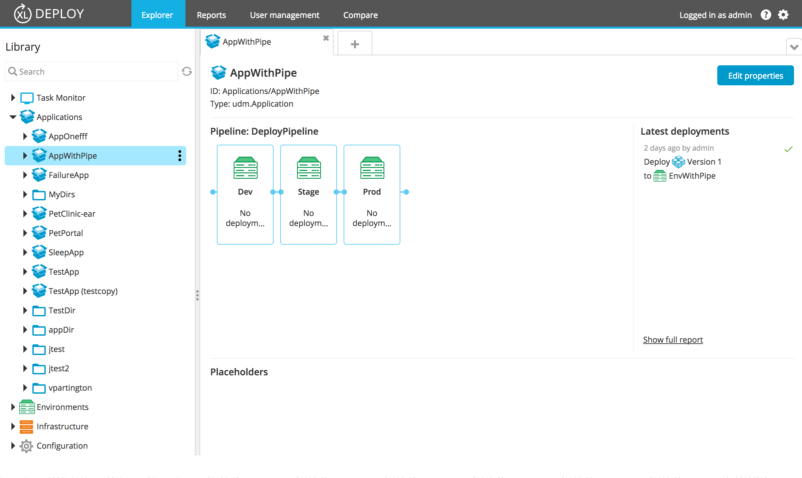

The application summary screen displays a set of basic information about the application, the deployment pipeline tile, and the latest deployments tile.

To view the summary screen of an application, expand **Applications** in the left pane and double-click the desired application.

The information displayed is read-only. To modify the application name or to set the deployment pipeline, click **Edit properties**.
To edit the application properties, you can also expand **Applications**, hover over the desired application, click , and then select **Edit properties**.

In the summary screen, you can see the application ID and the application type.

The **Pipeline** tile shows the read-only version of the [deployment pipeline](/xl-deploy/how-to/using-the-deployment-pipeline.html) and the **Latest deployments** tile shows a list of the latest 4 deployments that were performed in the last 6 months.  
