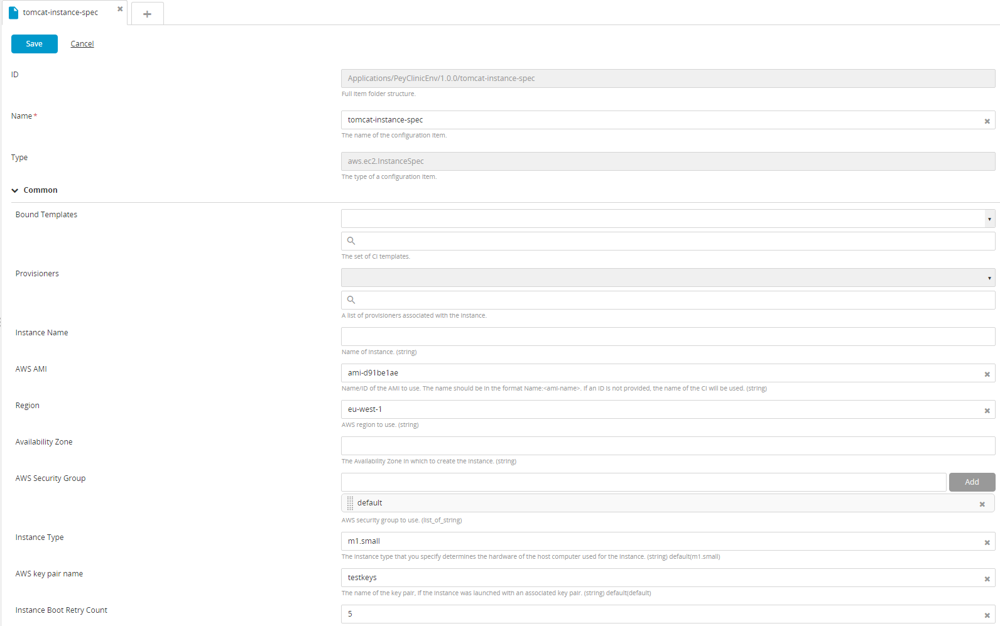
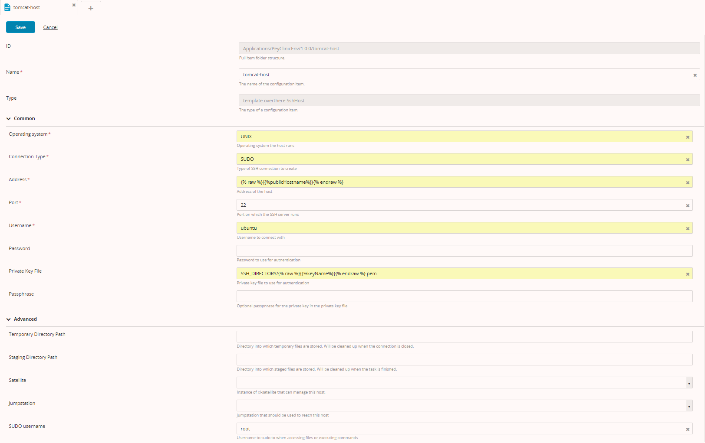
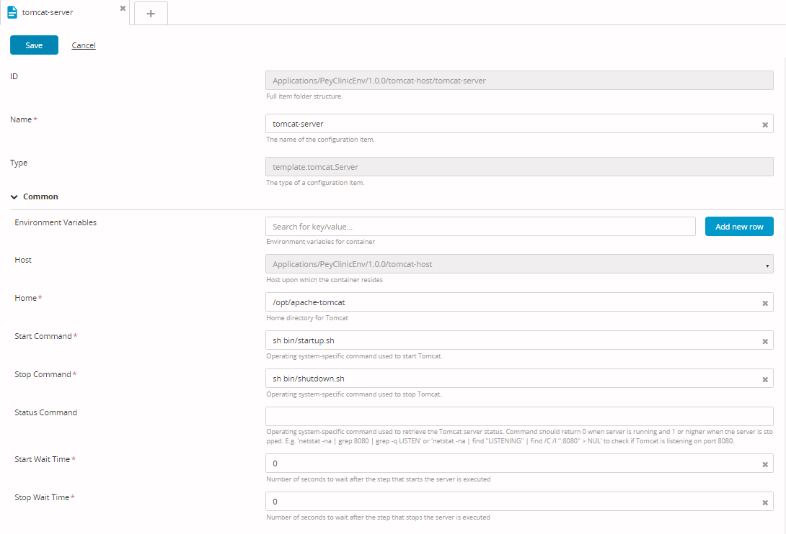
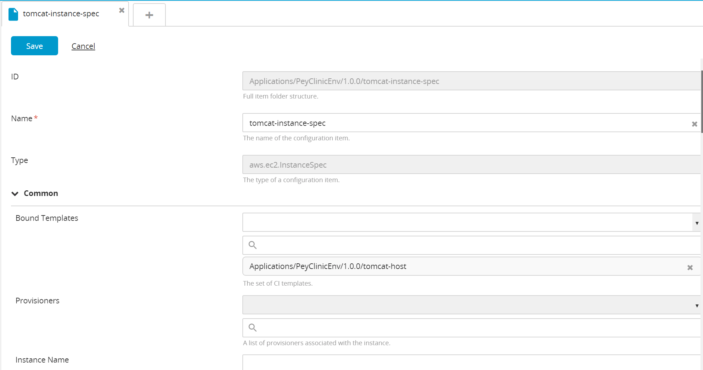
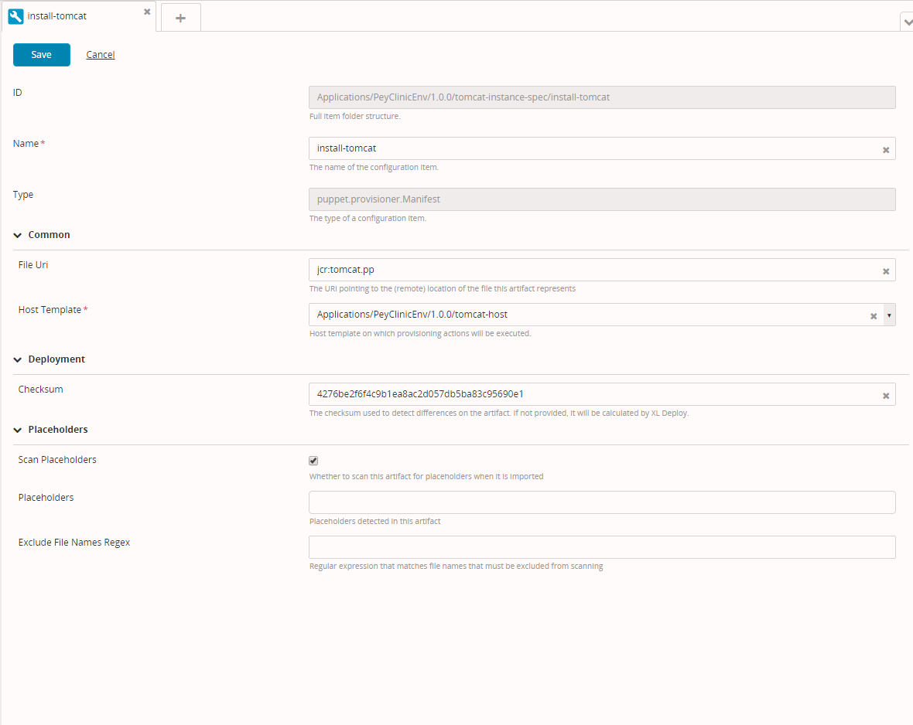
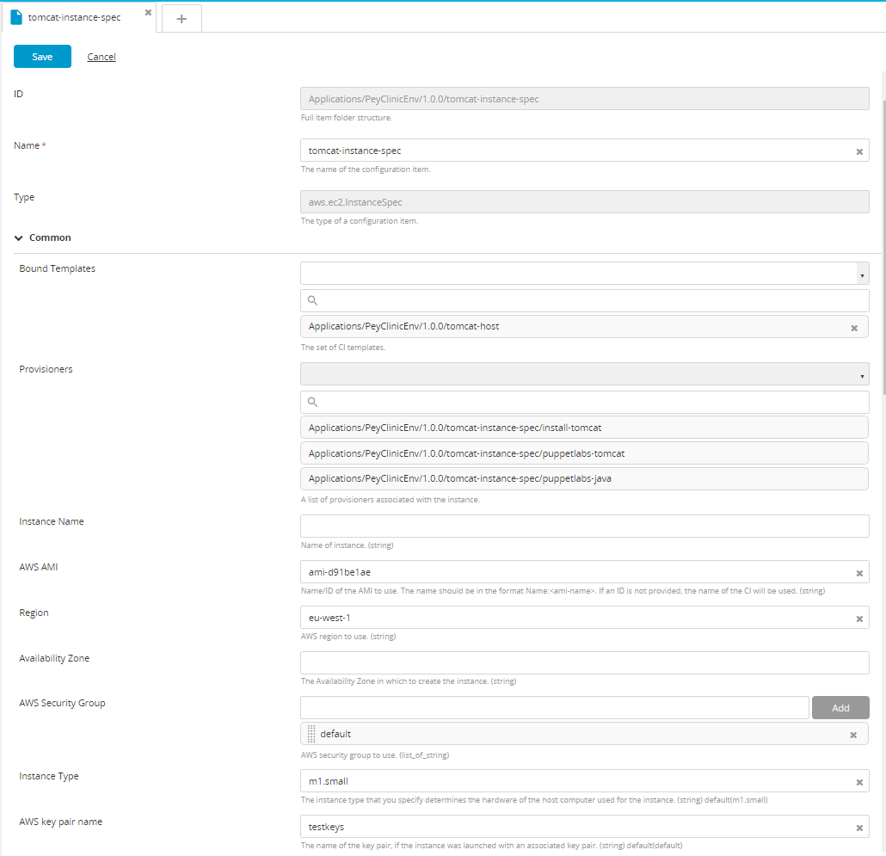
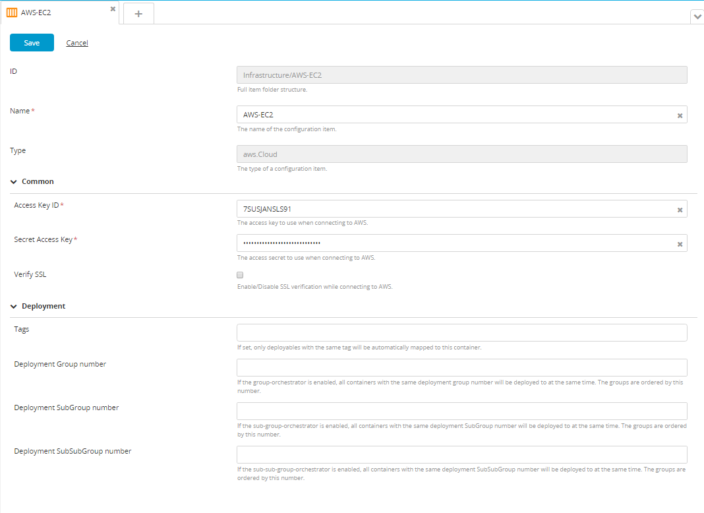
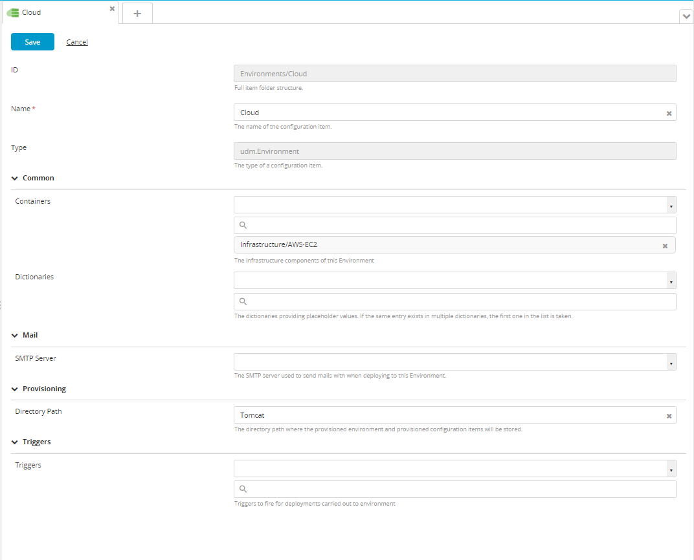
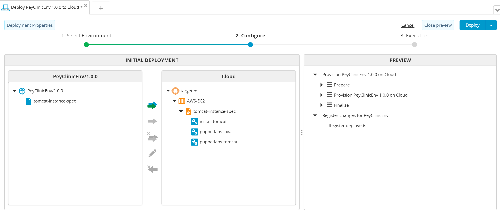
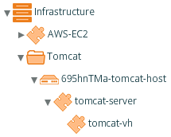

This topic provides a step-by-step example that will help you get started with the XL Deploy [provisioning feature](/xl-deploy/concept/provisioning-through-xl-deploy.html). To follow this example, you need:

* An [Amazon Web Services EC2](https://aws.amazon.com/ec2/) AMI where [Puppet](https://puppet.com/) is installed
* A Puppet manifest that will install [Apache Tomcat](http://tomcat.apache.org/) in `/opt/apache-tomcat`
* The sample PetClinic-war application provided with XL Deploy (optional)

**Important:** The instructions in this topic assume that you are using a Unix-based operating system.
**Important:** The minimum Puppet plugin version for this tutorial is 6.0.0.

**Note:** A version of this topic is available for [XL Deploy 5.5.x](/xl-deploy/5.5.x/xl-deploy-provisioning-example-5.5.html).

## Step 1 Start XL Deploy

[Install XL Deploy 6.0.0 or later](/xl-deploy/how-to/install-xl-deploy.html).     
**Note:** Java Development Kit (JDK) 8 is required top run this application.

If XL Deploy is already installed, [start the XL Deploy server](/xl-deploy/how-to/start-xl-deploy.html).

## Step 2 Create an application

XL Deploy uses the same model for deployment packages and provisioning packages, so you must first create an application that will serve as a logical grouping of provisioning packages. A provisioning package describes the infrastructure items that should be created and the details of the environment to which infrastructure items will be associated.

To create a new application:

1. In the left pane, hover over **Applications**, click , and select **New** > **Application**.
1. In the **Name** field, enter `PetClinicEnv`.
1. Click **Save**.

## Step 3 Create a provisioning package

1. Expand **Applications**.
1. Hover over **PetClinicEnv**, click , and select **New** > **Provisioning Package**.
1. In the **Name** field, enter `1.0.0`.
1. Click **Save**.

## Step 4 Create provisionables and templates

A provisioning package consists of provisionables, which are virtual machine specifications, and templates for configuration items (CIs).

### Create an instance specification

1. Hover over the **1.0.0** package, click , and select **New** > **aws** > **ec2** > **InstanceSpec**.
1. Enter the following properties:

  {:.table .table-striped}
  | Property | Value | Description |
  | -------| ----| ----------|
  | Name | `tomcat-instance-spec` | The name of the CI |
  | AWS AMI | Your AWS AMI ID (for example, `ami-d91be1ae`) | The ID of an AMI where Puppet is installed |
  | Region | The EC2 region of the AMI (for example, `eu-west-1`) | The EC2 region, which must be valid for the AMI that you selected |
  | AWS Security Group | `default` | The security group of the AMI |
  | Instance Type | `m1.small` | The size of the instance |
  | AWS key pair name | Your AWS key name | Name of your EC2 SSH key pair. If you do not have an AWS key name, log in to the Amazon EC2 console, create a new key, and download it to your local machine. |
1. Click **Save** to save the CI.

 

### Create an SSH host template

1. Hover over the **1.0.0** package, click , and select **New** > **template** > **Overthere** > **SsHost**.
1. Enter the following properties:

    {:.table .table-striped}
    | Property | Value | Description |
    | -------| ----| ----------|
    | Name | `tomcat-host` | The name of the CI |
    | Operating System | `UNIX` | Operating system of the virtual machine |
    | Connection Type | `SUDO` | Puppet requires a SUDO connection |
    | Address | `{}` | This is a placeholder that will be resolved from the provisioned |
    | Username | `ubuntu` | User name for the EC2 machine |
    | Private Key File | `SSH_DIRECTORY/{}.pem` | The location of the SSH key on your local machine to use when connecting to the EC2 instance. `SSH_DIRECTORY` is the directory where you store your SSH keys; for example, `Users/yourusername/.ssh` |
    | SUDO username | `root` | The user name to use for SUDO operations (this property is located on the **Advanced** section |

1. Click **Save** to save the CI.

 

### Create a Tomcat server template

1. Hover over the **tomcat-host** CI, click , and select **New** > **Template** > **Tomcat** > **Server**.
1. Enter the following properties:

 {:.table .table-striped}
| Property | Value | Description |
| -------| ----| ----------|
| Name | `tomcat-server` | The name of the CI |
| Home | `/opt/apache-tomcat` | Puppet will install Tomcat in this directory |
| Start Command | `sh bin/startup.sh` | The command that will start Tomcat |
| Stop Command | `sh bin/shutdown.sh` | The command that will stop Tomcat |

1. Click **Save** to save the CI.

 

### Create a Tomcat virtual host template

1. Hover over the **tomcat-server** CI, click , and select **New** > **template** > **tomcat** > **VirtualHost**.
1. In the **Name** field, enter `tomcat-vh`.
1. Click **Save** to save the CI.

### Create a directory to store generated CIs

Create a directory to store the CIs that XL Deploy will generated from the templates:

1. Hover over **Infrastructure**, click , and select **New** > **Directory**.
1. In the **Name** field, enter `Tomcat`.
1. Click **Save**.

## Step 5 Bind the SSH host template to the instance spec

To bind the *tomcat-host* template to the *tomcat-instance-spec* provisionable:

1. Double-click **tomcat-instance-spec** to open it.
1. Go to the **Common** section.
1. Under **Bound Templates**, select `Applications/PetClinicEnv/1.0.0/tomcat-host` from the drop down list.
1. Click **Save**.

 

## Step 6 Add a Puppet provisioner

1. Hover over **tomcat-instance-spec**, click , and select **New** > **Puppet** > **provisioner** > **Manifest**.
1. In the **Name** field, enter `install-tomcat`.
1. In the **Host Template** field, select `tomcat-host`.
1. In the **Choose file** field, click **Browse** and upload a Puppet manifest file that will install Tomcat. You can also specify the Artifact location in **File Uri** field.
1. Click **Save**.

 

### Add modules to the provisioner

1. Hover over the **tomcat-instance-spec** CI, click , and select **New** > **puppet** > **provisioner** > **Module**.
1. In the **Name** field, enter `puppetlabs-tomcat`.
2. In the **Host Template** field, select `tomcat-host`.
1. In the **Module Name** field, enter `puppetlabs-tomcat`.
1. Click **Save**.
1. Repeat steps 1 to 5 and enter `puppetlabs-java` for the **Name** and **Module Name** fields.

 **Note:** If you open tomcat-instance-spec CI, you will see the modules.

 

## Step 7 Create the AWS provider

Create a new provider for Amazon Web Services (AWS):

1. Hover over **Infrastructure**, click , and select **New** > **aws** > **aws** > **Cloud**.
1. In the **Name** field, enter `AWS-EC2`.
1. In the **Access Key ID** field, enter your AWS ID.  
1. In the and **Secret Access Key** field, enter AWS access key.
1. Click **Save**.

 

## Step 8 Create an environment

Create an environment where the package will be provisioned:

1. Hover over **Environments**, click , and select **New** > **Environment**.
1. In the **Name** box, enter `Cloud`.
1. In the **Containers** section, select `Infrastructure/AWS-EC2` from the drop down list.
1. In the **Provisioning** section, **Directory Path** field, enter `Tomcat`.
1. Click **Save**.

 

## Step 9 Provision the enviroment

1. Hover over **1.0.0**, click , and click **Deploy**
1. On the **Environments** page, select **Cloud**.
1. Click **Continue**.
1. Click **Preview** to view the deployment plan.
1. Click **Save**.
1. Click **Deploy**.

 

## Conclusion

You can see the generated CIs in the Repository:

In this case, the unique provisioning ID was `695hnTMa`.

You can also see that the CIs were added to the *Cloud* environment.

You can now [import](/xl-deploy/how-to/add-a-package-to-xl-deploy.html#import-a-package) the sample package *PetClinic-war/1.0* from the XL Deploy server and [deploy it](/xl-deploy/how-to/deploy-an-application.html) to the *Cloud* environment. When deployment is completed you can see the application running at `http://<instance public IP address>:8080/petclinic`. You can find the public IP address and other properties in the instance CI under the provider.
