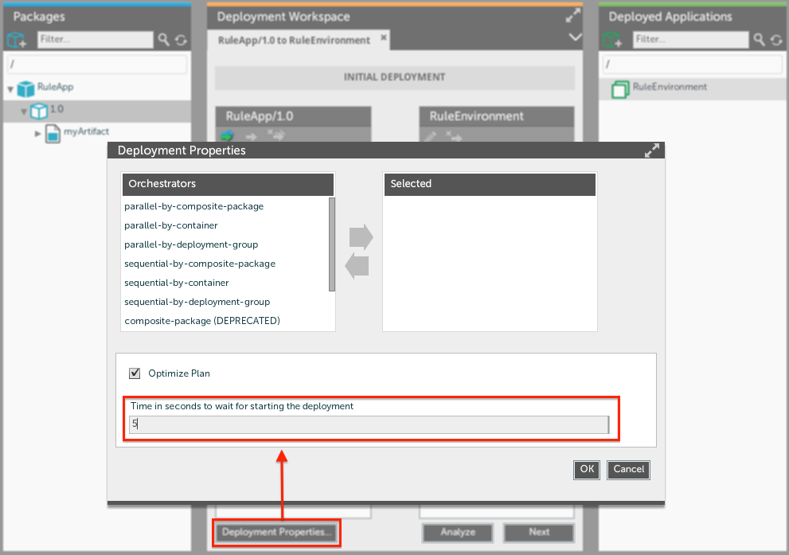
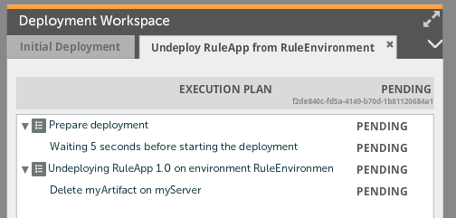
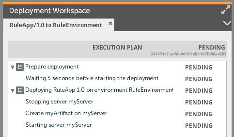

The *rules* system, introduced in XL Deploy 4.5.0, works with the XL Deploy's planning phase and allows you to use XML or Jython to specify the steps that belong in a deployment plan and how the steps are configured.

This tutorial will guide you through the process of using rules to create an XL Deploy plugin from scratch. The plugin will:

* Wait a specific interval to start the deployment
* Deploy and undeploy an artifact
* Start and stop a server

This tutorial assumes that you:

* Know how to create CI types, as described in [Customizing the XL Deploy type system](/xl-deploy/how-to/working-with-configuration-items.html)
* Understand the concepts of XL Deploy planning, as described in [Understanding XL Deploy architecture](/xl-deploy/concept/xl-deploy-architecture.html)
* Are familiar with the objects and properties available in rules, as described in [Objects and properties available in rules](/xl-deploy/concept/objects-and-properties-available-to-rules.html)

For reference, the code provided in this tutorial is available as a demo plugin in the `samples` directory of your XL Deploy installation.

## How to run the examples

To run the examples in this tutorial, you need XL Deploy 4.5.0 or later. No specific configuration or plugin is required.

### Required files

To configure XL Deploy to use the examples in this tutorial, you need to add or modify the following files in the `ext` folder of the XL Deploy server:

* `synthetic.xml`, which will contain the configuration item (CI) types that are defined
* `xl-rules.xml`, which will contain the rules that are defined

The additional scripts that you will define should also be placed in the `ext` folder.

After you finish this tutorial, the `ext` folder will look like:

    ext/
    ├── planning
    │   └── start-stop-server.py
    ├── scripts
    │   ├── deploy-artifact.bat.ftl
    │   ├── deploy-artifact.sh.ftl
    │   ├── undeploy-artifact.bat.ftl
    │   ├── undeploy-artifact.sh.ftl
    │   ├── start.bat.ftl
    │   ├── start.sh.ftl
    │   ├── stop.bat.ftl
    │   └── stop.sh.ftl
    ├── synthetic.xml
    └── xl-rules.xml

### Restarting the server

After you change `synthetic.xml`, you must restart the XL Deploy server.

By default, you must also restart the XL Deploy server after you change `xl-rules.xml` and scripts in the `ext` folder. However, you can configure XL Deploy to periodically rescan `xl-rules.xml` and the `ext` folder and apply any changes that it finds. This is useful when you are developing a plugin. Refer to [Define a rule](/xl-deploy/how-to/how-to-define-rules.html#scanning-for-rules) for information on how to do this.

### Error handling

If you make a mistake in the definition of `synthetic.xml` or `xl-rules.xml`, the server will return an error and may fail to start. Mistakes in the definition of scripts or expressions usually appear in the server log when you execute a deployment. For more information about troubleshooting the rules configuration, refer to [Best practices for rules](/xl-deploy/concept/best-practices-for-rules.html).

## Deploy an artifact

Let's start with an application that contains one artifact. We want to deploy the artifact to a server. This part of the plugin will:

* Upload the artifact
* Run a script that installs the artifact in the right place

### Add type definitions

First, in `synthetic.xml`, add a type definition called `example.ArtifactDeployed` for the application and add a container type named `example.Server`:


<type type="example.Server" extends="udm.BaseContainer" description="Example server">
    <property name="host" kind="ci" referenced-type="overthere.Host" as-containment="true"/>
    <property name="home" description="Home directory for the server"/>
</type>

<type type="example.ArtifactDeployed" extends="udm.BaseDeployedArtifact" deployable-type="example.Artifact" container-type="example.Server" description="Artifact that can be deployed to an example server">
    <generate-deployable type="example.Artifact" extends="udm.BaseDeployableFileArtifact"/>
</type>


Notice that:

* `example.Server` extends from `udm.BaseContainer` and has a `host` property that refers to a CI of type `overthere.Host`.
* The deployed `example.ArtifactDeployed` extends from `udm.BaseDeployedArtifact`, which contains a `file` property that the step uses.
* The generated deployable `example.Artifact` extends from `udm.BaseDeployableFileArtifact`.

### Define a rule for the artifact

Next, define an XML rule for the CI in `xl-rules.xml`:


<rule name="example.ArtifactDeployed.CREATE_MODIFY" scope="deployed">
    <conditions>
        <type>example.ArtifactDeployed</type>
        <operation>CREATE</operation>
        <operation>MODIFY</operation>
    </conditions>
    <steps>
        <os-script>
            
        </os-script>
    </steps>
</rule>


Notice that:

* The `name` `example.ArtifactDeployed.CREATE_MODIFY` identifies the rule in the system. It is recommended that you use a descriptive name that includes the name of the plugin and the type and operation the rule responds to.
* The `scope` is `deployed` because this rule needs to contribute a step for every instance of `example.ArtifactDeployed` in the deployment.
* The rule matches on deltas with the operations `CREATE` and `MODIFY`. Matching on `CREATE` means that this rule will fire when XL Deploy knows the application must be created (or, in other words, deployed). Also matching on `MODIFY` means that the rule will contribute the same step to the plan upon modification.
* The rule will create a step of type `os-script`, which can upload a file and run a templated script. `script` defines the path where the script template is located, relative to the plugin definition.

The following `os-script` parameters are defined automatically:

* A **description** that includes the artifact name and the name of the server it will deploy to. You can optionally override the default description.
* The **order**, which is automatically set to 70 (the default step order for artifacts). You can optionally override the default order.
* The **target-host** property gets a reference to the host of the container. The step will use this host to run the script.

### Script to deploy the artifact

The FreeMarker variable for the `deployed` object is automatically added to the `freemarker-context`. This allows the script to refer to properties of the `deployed` object such as file location.

The `script` parameter refers to scripts for Unix (`deploy-artifact.sh.ftl`) and Windows (`deploy-artifact.bat.ftl`). The step will select the correct script for the operating system that XL Deploy runs on. The scripts are actually script templates processed by FreeMarker. The template can access the variables passed in by the `freemarker-context` parameter of the step.

In XL Deploy 4.5.3, 5.0.0, and later, the Unix script `deploy-artifact.sh.ftl` contains:

    echo "Deploying file on Unix"
    mkdir -p ${deployed.container.home + "/context"}
    cp ${deployed.file.path} ${deployed.container.home + "/context"}
    echo "Done"

In XL Deploy 4.5.2 and earlier, the Unix script `deploy-artifact.sh.ftl` contains:

    echo "Deploying file on Unix"
    mkdir -p ${deployed.container.home + "/context"}
    cp ${deployed.file.name} ${deployed.container.home + "/context"}
    echo "Done"

The script accesses the variable `deployed` and uses it to find the location of the server installation and copy the file to the `context` folder. The script also prints progress information in the step log.

## Add a wait step

Additionally, we can enrich the plan with an additional step that waits a specific number of seconds before the actual deployment starts.

* While preparing the deployment, the user can set the number of seconds to wait in the deployment properties
* If the user does not set a number, XL Deploy will not add a wait step to the plan

### Add a property to type definition

First, we need to store the wait time in the deployment properties by adding the following property to `udm.DeployedApplication` in `synthetic.xml`:


<type-modification type="udm.DeployedApplication">
     <property name="waitTime" kind="integer" label="Time in seconds to wait for starting the deployment" required="false"/>
</type-modification>


### Define a rule to contribute a `wait` step

Next, we need to define a rule in `xl-rules.xml` to contribute the `wait` step to the plan:


<rule name="example.DeployedApplication.wait" scope="pre-plan">
    <conditions>
        <expression>specification.deployedOrPreviousApplication.waitTime is not None</expression>
    </conditions>
    <steps>
        <wait>
            <order>10</order>
            <description expression="true">"Waiting %i seconds before starting the deployment" % specification.deployedOrPreviousApplication.waitTime</description>
            <seconds expression="true">specification.deployedOrPreviousApplication.waitTime</seconds>
        </wait>
    </steps>
</rule>


Notice that:

* The `scope` is `pre-plan`, which means that:
    * The rule will only fire once per deployment
    * The step that the rule contributes is added to the *pre-plan*, which is a sub-plan that XL Deploy prepends to the deployment plan
* We only want to contribute a step to the plan when the user supplies a value for the wait time; therefore, there is a condition that checks if the `waitTime` property is `not None`. The expression must be defined in Jython.
* If the condition holds, XL Deploy will create the step that is defined in the `steps` section and add it to the plan. The step takes arguments that you specify in the rule definition:
    * The `order` is set to 10 to ensure that the rule will appear early in the plan. (In this case, this will be the only step in the pre-plan, so the `order` value does not matter; however, it is a required value for the wait step, so we need to provide it.) The type of `order` is integer, so if it has a value that is not an integer, planning will fail.
        * `description` is a dynamically constructed string that tells the user what the step will do. Providing a description is optional; if you do not provide one, XL Deploy will use a default description.
            * `expression="true"` means that the definition will be evaluated by Jython and the resulting value will be passed to the step. This is required because the definition contains a dynamically constructed string.
    * The `waitTime` value is retrieved from the `DeployedApplication` and passed to the step. You can access the `DeployedApplication` through the `specification` and `deployedOrPreviousApplication`. This automatically selects the correct deployed, which means that this step will work for a `CREATE` or `DESTROY` operation.

For more information about the `wait` step, refer to the [Steps Reference](/xl-deploy/latest/referencesteps.html).

### Test the deployment rules

Now you can test the rules that you created. To do so, you must:

1. Install XL Deploy and the scripts as explained in [How to run the examples](#how-to-run-the-examples).
2. Under Applications in the XL Deploy Repository, create an application that contains a deployable of type `example.Artifact` (upload a dummy file when creating the deployable CI).
3. Under Infrastructure, create a host of type `overthere.LocalHost` and a container of type `example.Server`. Set the home directory of `example.Server` to a temporary location.
4. Under Environments, create an environment that contains the `example.Server` container.
5. Go to the Deployment Workspace and start a new deployment of the application to the environment. When preparing the deployment, click **Deployment Properties** and enter a wait time (if you do not provide a value, the wait step will not appear in the plan).

      

5. Click **Next**. XL Deploy should create the following deployment plan:

      

6. Execute the plan. The steps should succeed.
7. Verify that there is a `context` folder in the directory that you set as the home directory of `example.Server`, and verify that the artifact was copied to it.

The folder structure should be similar to:

    $ tree /tmp/srv/
    /tmp/srv/
    └── context
        └── PetClinic-1.0.ear

## Undeploy an artifact

When you create rules to deploy things, you should also define rules to undeploy them. In the case of this plugin, undeployment means removing the artifact that was deployed. The rule will use the state of the deployment to determine which files must be deleted.

### Define an undeploy rule

The rule definition in `xl-rules.xml` is:


<rule name="example.ArtifactDeployed.DESTROY" scope="deployed">
    <conditions>
        <type>example.ArtifactDeployed</type>
        <operation>DESTROY</operation>
    </conditions>
    <steps>
        <os-script>
            
        </os-script>
    </steps>
</rule>


Notice that:

* The `operation` is `DESTROY`.
* XL Deploy automatically sets the `order` and `description`.
* The step is an `os-script` step. The script behind the step is responsible for deleting the file on the server.

### Undeploy script (XL Deploy 4.5.3, 5.0.0, and later)

In XL Deploy 4.5.3, 5.0.0, and later, the FreeMarker variable for the `previousDeployed` object is automatically added to the `freemarker-context`. This allows the script to refer to the properties of the previous deployed object such as file name.

The Unix script `undeploy-artifact.sh.ftl` contains:

    echo "Undeploying file on Unix"
    rm ${previousDeployed.container.home + "/context/" + previousDeployed.file.name}
    echo "Done"

### Undeploy script (XL Deploy 4.5.2 or earlier)

If you are using XL Deploy 4.5.2 or earlier, the Unix script `undeploy-artifact.sh.ftl` contains:

    echo "Undeploying file on Unix"
    rm ${deployed.container.home + "/context/" + deployed.file.name}
    echo "Done"

### Test the undeploy rule

Now, you can test the rule. After successfully deploying the artifact, roll back the deployment or undeploy the application. If you have defined undeployment rules for all deployeds or used the sample code provided by XebiaLabs, the deployment plan should look like this:

## Restart the server

Restarting the server is an advanced technique because it requires a script rule, which is written in Jython.

We already created rule that copies an artifact to the server. To correctly install the artifact, we need to stop the server at the beginning of the deployment plan and start it again in the end. This requires two more steps:

* One script that stops the server by calling the stop script
* One script that starts the server by calling the start script

Note that a full implementation would require four scripts in total:

* One script that stops the server for Unix
* One script that starts the server for Unix
* One script that stops the server for Windows
* One script that starts the server for Windows

### Define a restart rule

The script rule is defined in `xl-rules.xml` as follows:


<rule name="example.Server.startStop" scope="plan">
    <planning-script-path>planning/start-stop-server.py</planning-script-path>
</rule>


Notice that:

* The `scope` is `plan` because the script needs to inspect all deployeds of the specific sub-plan to make its decision. Also, the rule only needs to contribute one start step and stop step per sub-plan, and rules with the plan scope are only triggered once per sub-plan.
* The rule has no conditions because the script will determine if the rule will contribute steps.
* The rule refers to an external script file in a location that is relative to the plugin definition.

### Restart server script

The script `start-stop-server.py` contains:


from java.util import HashSet

def containers():
    result = HashSet()
    for _delta in deltas.deltas:
        deployed = _delta.deployedOrPrevious
        current_container = deployed.container
        if _delta.operation != "NOOP" and current_container.type == "example.Server":
            result.add(current_container)
    return result

for container in containers():
    context.addStep(steps.os_script(
        description="Stopping server %s" % container.name,
        order=20,
        script="scripts/stop",
        freemarker_context={'container': container},
        target_host=container.host)
    )
    context.addStep(steps.os_script(
        description="Starting server %s" % container.name,
        order=80,
        script="scripts/start",
        freemarker_context={'container': container},
        target_host=container.host))


Note that `freemarker_context={'container': container}` is required to make the container object available in the FreeMarker context.

The rules demo plugin also includes a dummy script called `start.sh.ftl` that contains:

    echo "Starting server on Unix"

In a real implementation, this script would need to contain the commands required to start the server.

* The script starts with:
    * An import statement of an utility class
    * The method definition of `containers()`
    * A loop that iterates all containers and creates steps; this is the starting point of the code that will be executed
* The `containers()` method determines which containers need to be restarted and collects them in a set. The set data structure prevents duplicate start and stop steps.
    * The method iterates over the `deltas` and selects the deployed with `deployedOrPrevious`, regardless of whether it is `DESTROY`, `CREATE`, and so on.
    * It retrieves the container of the deployed and stores it in `current_container`.
    * The container is added to the set of containers that need to be restarted if:
        * The `operation` is not `NOOP` (because we only perform actions when the operation is `CREATE`, `MODIFY`, or `DESTROY`).
        * The `type` of the container is `example.Server`. This rule will be triggered for *every* plan and *every* deployment, so we need to ensure that the delta is related to a relevant container.
* The script iterates over all containers that need to be restarted.
    * The `freemarker_context` map contains a reference to the container.
    * In the start and stop steps, the `steps` factory is used to construct the steps by name. Note that:
        * The `os_script` step is used to execute the script.
        * The Jython naming convention (with underscores) is used to refer to the step.
        * The orders for the stop (20) and start (80) steps will ensure that they will be run before and after the deployment of the application.
        * We use the `addStep` method to add the constructed step directly to the `context`.
* If XL Deploy does not find deltas for the sub-plan, the start and stop steps will not be created.

### Test the server restart

To test the server restart rules, set up a deployment as described in [Test the deployment rules](#test-the-deployment-rules). The deployment plan should look like:

Notice that steps to start and stop server are added even when application is undeployed:

## Roll back a deployment

The plugin that you create when following this tutorial does not require any extra work to support rollbacks. This is because XL Deploy automatically generates checkpoints for the last step of each deployed. Therefore, when a user decides to roll back a deployment that has only been partially executed, the rollback plan will contain the steps for the opposite deltas of the deployeds for which all steps have been executed.

If you have more advanced rollback requirements, refer to [Using checkpoints](/xl-deploy/how-to/writing-xml-rules.html#using-checkpoints).

## What's next

You made it through the entire tutorial, congratulations! You should now have a good understanding of rules-based planning, and you should be able to find the information you need to continue creating deployment rules.

The code discussed in this tutorial is available in the rules demo plugin, which you can find in the `samples` directory of your XL Deploy installation. Also, the demo plugin contains additional examples.

If you would like to change the behavior of an existing plugin, you can disable predefined rules and redefine the behavior with new rules. For more information about this, refer to [Disable a rule](/xl-deploy/how-to/disable-a-rule.html).
