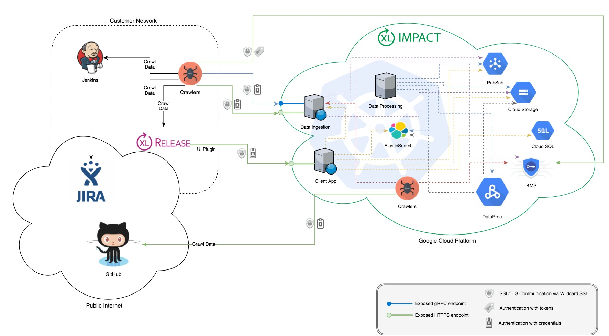

This is an overview of the data architecture of XL Impact:

**Note:** The diagram shows the data flow and infrastructure for an individual customer. The components and data are not shared between multiple customers.

Components of the infrastructure (XL Impact cloud environment):

* GCS Google Cloud Storage    
* Cloud SQL This only stores the configuration settings you set up in project definition. Does not store any data from customer data sources.
* ES Elastic Search
* Application ClientThe front-end component of XL Impact that has read/write access to the Cloud SQL and only read access to ES and GCS. The client application has access to configuration credentials, this is done through symmetric encryption.
* Data Ingestion Contains new data from the data sources and has read/write permissions to place the data in GCS.
* Data Processing Has permission to read from GCS, process the data and write to ES.
* Crawlers There are two types of crawlers: the crawlers on premises that are present in the customer network and the crawlers inside the XL Impact environment. The crawlers communicate through Remote Procedure Call (RPC) only with Data Ingestion. The crawlers require customer credentials to access the data sources (for example: Jira credentials).

There are two accounts types set up in XL Impact to be used: one for all the users and one for crawlers.

The information transfer and communication between the components is secured through the SSL protocol and with API keys. The authentication when communicating with the GCS is done using Google authentication.
