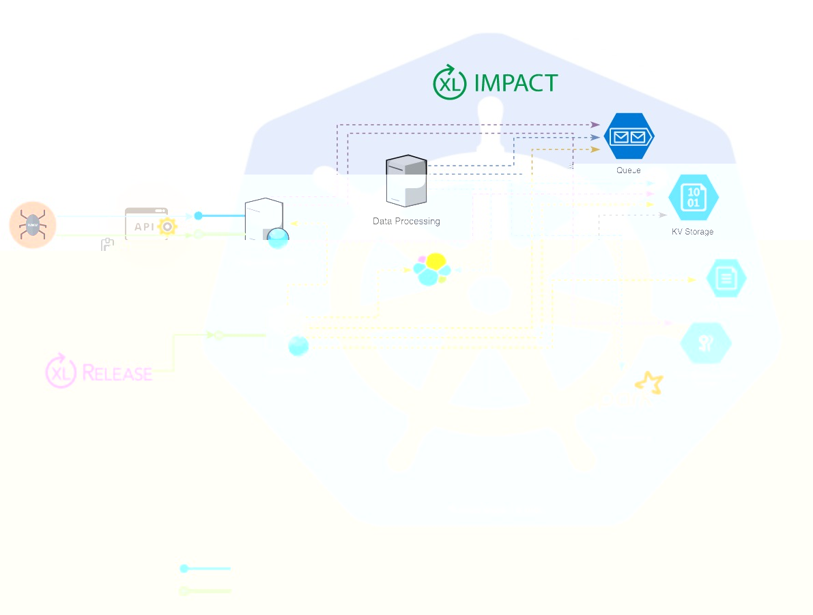

This is an overview of the data architecture of XL Impact:

**Note:** The diagram shows the data flow and infrastructure for an individual customer. The components and data are not shared between multiple customers.

Components of the infrastructure (XL Impact environment):

* KV Storage Key Value data storage used to store raw data  
* SQL Storage This only stores the configuration settings you set up in project definition. Does not store any data from customer data sources.
* ES Elastic Search for storing processed data used for rendering in charts
* Client AppThe front-end component of XL Impact that has read/write access to the SQL Storage and only read access to ES and KV Storage. The client application has access to configuration credentials, this is done through symmetric encryption.
* Data Processing Has permission to read from KV Storage, process the data and write to ES.
* Plugins (Crawlers) The crawlers that are present in the customer network. The crawlers communicate through the Integration API and require customer credentials to access the data sources (for example: Jira credentials).
* The Integration API can be used by plugin developers to create their own integrations in any language or framework they chose.

The information transfer and communication between the components is secured through the SSL protocol and with API keys.
