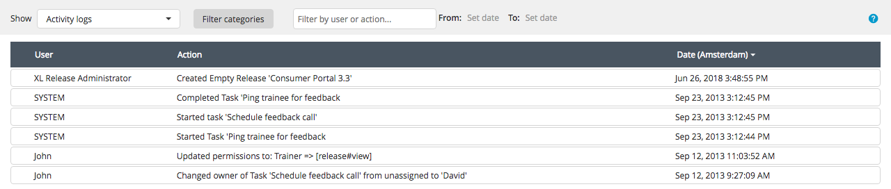

The activity log shows everything that happens in a release. It provides an audit trail of who did what, and when. To open the activity log, select **Activity logs** from the **Show** menu.

This is an example of an activity log:

## Filtering the activity logs

To filter the activity logs, click **Filter categories** and select:

* **Important** to show the most important events of all other categories (such as *release started* and *task failed*); by default, only this category is selected
* **Release life cycle** to show events for the start and end of a release, phases, and tasks
* **Release edits** to show changes that were made to a release or a template
* **Task edits** to show changes that were made to a single task
* **Task assignment** to show events where a task was assigned to a user
* **Comments** to show events where a comment was added to a task
* **Security** to show changes that were made to the release security settings

To filter on a user or action, use the **Filter by user or action** box.

To filter on dates, use the **From** and **To** options.

**Tip:** You can sort the activity logs by clicking the **Date** column header.
